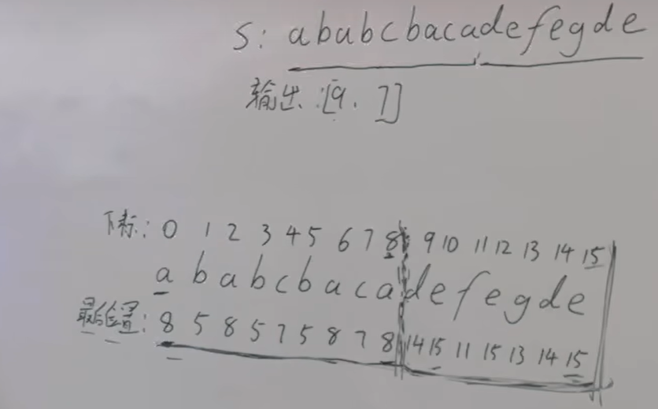

# 代码随想录

一刷开始：2024年1月8日11:18:01

一刷完结：2024年4月14日17:49:54

URL：https://programmercarl.com/

B站：https://space.bilibili.com/525438321/channel/collectiondetail?sid=180037

# Ch1.数组

## 数组理论基础

https://programmercarl.com/%E6%95%B0%E7%BB%84%E7%90%86%E8%AE%BA%E5%9F%BA%E7%A1%80.html

## 1.二分查找

https://programmercarl.com/0704.%E4%BA%8C%E5%88%86%E6%9F%A5%E6%89%BE.html

思路：确定区间（左闭右闭，左闭右开）

* O(logn)

左闭右闭：

```c++
class Solution {
public:
    int search(std::vector<int>& nums, int target) {
        int left = 0;
        int right = nums.size() - 1;
        while (left <= right)
        {
            int middle = (left + right) / 2;
            if (nums[middle] > target)
                right = middle - 1;
            else if (nums[middle] < target)
                left = middle + 1;
            else
				return middle;
        }
        return -1;
    }
};
```

## 2.移除元素

https://programmercarl.com/0027.%E7%A7%BB%E9%99%A4%E5%85%83%E7%B4%A0.html

思路：快慢指针

* O(n)

```c++
class Solution {
public:
    int removeElement(std::vector<int>& nums, int val) {
        int slow = 0;
        for (int fast = 0; fast < nums.size(); fast++)
        {
	        if (nums[fast] != val)
	        {
                nums[slow++] = nums[fast];
	        }
        }
        return slow;
    }
};
```

## 3.有序数组的平方

https://programmercarl.com/0977.%E6%9C%89%E5%BA%8F%E6%95%B0%E7%BB%84%E7%9A%84%E5%B9%B3%E6%96%B9.html

思路：左右两边各取指针向中间靠拢，选大的从数组末尾开始向前填充

```c++
#include <vector>

class Solution {
public:
	std::vector<int> sortedSquares(std::vector<int>& nums) {
		std::vector<int> result(nums.size());
		int k = nums.size() - 1;
		for (int i = 0, j = k; i <= j; )
		{
			if (nums[i] * nums[i] > nums[j] * nums[j])
			{
				result[k--] = nums[i] * nums[i];
				i++;
			}
			else
			{
				result[k--] = nums[j] * nums[j];
				j--;
			}
		}
		return result;
    }
};
```

## 4.长度最小子数组

https://programmercarl.com/0209.%E9%95%BF%E5%BA%A6%E6%9C%80%E5%B0%8F%E7%9A%84%E5%AD%90%E6%95%B0%E7%BB%84.html

思路：设j为终止位置，遍历直到和>=s，再调整起始位置

```c++
#include <vector>

class Solution {
public:
    int minSubArrayLen(int target, std::vector<int>& nums) {
        int i = 0;
        int result = std::numeric_limits<int>::max();
        int sum = 0;
        for (int j = 0; j < nums.size(); j++)
        {
            sum += nums[j];
            while(sum >= target)
            {
                int subL = j - i + 1;
                result = std::min(result, subL);
                sum -= nums[i++];
            }
        }
        if (result == std::numeric_limits<int>::max()) result = 0;
        return result;
    }
};
```

## 5.螺旋矩阵II

https://programmercarl.com/0059.%E8%9E%BA%E6%97%8B%E7%9F%A9%E9%98%B5II.html

思路：循环不变量，确保每圈处理规则一致

```c++
class Solution {
public:
	std::vector<std::vector<int>> generateMatrix(int n) {
		std::vector<std::vector<int>> result(n, std::vector<int>(n));
		int startX = 0, startY = 0, offset = 1; //循环不变量
		int count = 1;
		for (int times = 0; times < n / 2; times++)
		{
			int i = startX;
			int j = startY;
			for (j = startY ; j < n - offset; j++)
			{
				result[i][j] = count++;
			}
			for (i = startX; i < n - offset; i++)
			{
				result[i][j] = count++;
			}
			for ( ; j > startY; j--)
			{
				result[i][j] = count++;
			}
			for ( ; i > startX; i--)
			{
				result[i][j] = count++;
			}
			startX++;
			startY++;
			offset++;
		}
		if (n % 2 == 1)
		{
			result[n / 2][n / 2] = count;
		}
		return result;
    }
};
```

## 小结

https://programmercarl.com/%E6%95%B0%E7%BB%84%E6%80%BB%E7%BB%93%E7%AF%87.html

二分法：1

双指针法：2、3

滑动窗口：4

模拟行为：5

# Ch2.链表

## 1.移除链表元素

https://programmercarl.com/0203.%E7%A7%BB%E9%99%A4%E9%93%BE%E8%A1%A8%E5%85%83%E7%B4%A0.html

思路：法①原链表删除元素；法②使用虚拟头节点删除元素

```c++
//Definition for singly-linked list.
struct ListNode {
    int val;
    ListNode *next;
    ListNode() : val(0), next(nullptr) {}
    ListNode(int x) : val(x), next(nullptr) {}
    ListNode(int x, ListNode *next) : val(x), next(next) {}
};

class Solution {
public:
    ListNode* removeElements(ListNode* head, int val) {
        ListNode* virutalHead = new ListNode(0, head);
        ListNode* cur = virutalHead;
        ListNode* del = nullptr;
        while (cur->next != nullptr)
        {
	        if (cur->next->val == val)
	        {
                del = cur->next;
                cur->next = cur->next->next;
                delete(del);
	        }
            else
            {
                cur = cur->next;
            }
        }
        return virutalHead->next;
    }
};
```

## 2.设计链表

https://programmercarl.com/0707.%E8%AE%BE%E8%AE%A1%E9%93%BE%E8%A1%A8.html

```c++
/**
 * Your MyLinkedList object will be instantiated and called as such:
 * MyLinkedList* obj = new MyLinkedList();
 * int param_1 = obj->get(index);
 * obj->addAtHead(val);
 * obj->addAtTail(val);
 * obj->addAtIndex(index,val);
 * obj->deleteAtIndex(index);
 */
struct ListNode {
    int val;
    ListNode* next;
    ListNode() : val(0), next(nullptr) {}
    ListNode(int x) : val(x), next(nullptr) {}
    ListNode(int x, ListNode* next) : val(x), next(next) {}
};

class MyLinkedList {
private:
    ListNode* head;
    int length;
public:
    MyLinkedList() {
        head = new ListNode();
        length = 0;
    }

    int get(int index) {
        if (index < 0 || index > length - 1) return -1;
        ListNode* temp = head;
        for(int i = 0; i <= index; i++)
        {
            temp = temp->next;
        }
        return temp->val;
    }

    void addAtHead(int val) {
        ListNode* p = new ListNode(val, head->next);
        head->next = p;
        length++;
    }

    void addAtTail(int val) {
        ListNode* temp = head;
        while(temp->next != nullptr)
        {
            temp = temp->next;
        }
        temp->next = new ListNode(val);
        length++;
    }

    void addAtIndex(int index, int val) {
        if (index < 0 || index > length) return;
        ListNode* temp = head;
        for (int i = 0; i < index; i++)
        {
            temp = temp->next;
        }
        temp->next = new ListNode(val, temp->next);
        length++;
    }

    void deleteAtIndex(int index) {
        if (index < 0 || index > length - 1) return;
        ListNode* temp = head;
        for (int i = 0; i < index; i++)
        {
            temp = temp->next;
        }
        ListNode* del = temp->next;
        temp->next = temp->next->next;
        delete(del);
        length--;
    }
};
```

## 3.翻转链表

思路：法①双指针；法②递归

双指针：两个指针遍历，一个指针存

```c++
class Solution {
public:
    ListNode* reverseList(ListNode* head) {
        if (head == nullptr || head->next == nullptr) return head;
        ListNode* pre = nullptr;
        ListNode* cur = head;
        while(cur != nullptr)
        {
            ListNode* temp = cur->next;
            cur->next = pre;
            pre = cur;
            cur = temp;
        }
        return pre;
    }
};
```

递归

```c++
class Solution {
public:
    ListNode* reverse(ListNode* pre, ListNode* cur)
    {
        if (cur == nullptr) return pre;
        ListNode* temp = cur->next;
        cur->next = pre;
        return reverse(cur, temp);
    }

    ListNode* reverseList(ListNode* head) {
        if (head == nullptr || head->next == nullptr) return head;
        return reverse(nullptr, head);
    }
};
```

## 4.两两交换链表中的节点

https://programmercarl.com/0024.%E4%B8%A4%E4%B8%A4%E4%BA%A4%E6%8D%A2%E9%93%BE%E8%A1%A8%E4%B8%AD%E7%9A%84%E8%8A%82%E7%82%B9.html

提示：注意奇偶数

```c++
//Definition for singly-linked list.
struct ListNode {
    int val;
    ListNode *next;
    ListNode() : val(0), next(nullptr) {}
    ListNode(int x) : val(x), next(nullptr) {}
    ListNode(int x, ListNode *next) : val(x), next(next) {}
};

class Solution {
public:
    ListNode* swapPairs(ListNode* head) {
        ListNode* virtualHead = new ListNode(0, head);
        ListNode* cur = virtualHead;
        while(cur->next != nullptr && cur->next->next != nullptr)
        {
            ListNode* temp = cur->next;
            ListNode* temp1 = cur->next->next->next;
            cur->next = cur->next->next;
            cur->next->next = temp;
            temp->next = temp1;
            cur = temp;
        }
        return virtualHead->next;
    }
};
```

## 5.删除链表的倒数第N个节点

思路：快慢指针，差n+1个节点

```c++
//Definition for singly-linked list.
struct ListNode {
    int val;
    ListNode *next;
    ListNode() : val(0), next(nullptr) {}
    ListNode(int x) : val(x), next(nullptr) {}
    ListNode(int x, ListNode *next) : val(x), next(next) {}
};

class Solution {
public:
    ListNode* removeNthFromEnd(ListNode* head, int n) {
        ListNode* virtualHead = new ListNode(0, head);
        int i = n + 1;
        ListNode* fast = virtualHead;
        ListNode* slow = virtualHead;
        while (i-- > 0 && fast != nullptr)
            fast = fast->next;
        while(fast != nullptr)
        {
            fast = fast->next;
            slow = slow->next;
        }
        ListNode* temp = slow->next;
        slow->next = temp->next;
        delete(temp);
        return virtualHead->next;
    }
};
```

>题目要求1<=n<=size，故没有考虑n超过size的情况，依旧能通过

## 6.链表相交

思路：求两链表长度，利用双指针，将长链表对齐短链表做比较

```c++
//Definition for singly-linked list.
struct ListNode {
    int val;
    ListNode *next;
    ListNode(int x) : val(x), next(nullptr) {}
};

class Solution {
public:
    ListNode* getIntersectionNode(ListNode* headA, ListNode* headB) {
        if (headA == nullptr || headB == nullptr) return nullptr;
        ListNode* pA = headA, * pB = headB;
        int lenA = 0, lenB = 0;
        while(pA != nullptr)
        {
            pA = pA->next;
            lenA++;
        }
        while(pB != nullptr)
        {
            pB = pB->next;
            lenB++;
        }
        pA = headA;
        pB = headB;
        if (lenA > lenB)
        {
            for (int i = 0; i < lenA - lenB; i++)
                pA = pA->next;
        }
        else
        {
            for (int i = 0; i < lenB - lenA; i++)
                pB = pB->next;
        }
        while(pA != nullptr && pB != nullptr)
        {
            if (pA == pB)
            {
                return pA;
            }
            pA = pA->next;
            pB = pB->next;
        }
        return nullptr;
    }
};
```

## 7.环形链表||

思路：利用快慢指针先计算出相遇位置，然后分别从相遇位置和头部开始共速遍历，相遇点即为环入口


```c++
//Definition for singly-linked list.
struct ListNode {
    int val;
    ListNode *next;
    ListNode(int x) : val(x), next(nullptr) {}
};

class Solution {
public:
    ListNode* detectCycle(ListNode* head) {
        ListNode* fast = head;
        ListNode* slow = head;
        while(fast != nullptr && fast->next != nullptr)
        {
            fast = fast->next->next;
            slow = slow->next;
            if (fast == slow)
            {
                slow = head;
                while(fast != slow)
                {
                    fast = fast->next;
                    slow = slow->next;
                }
                return fast;
            }
        }
        return nullptr;
    }
};
```

# Ch3.哈希表

## 1.有效的字母异位词 array

思路：使用数组存储s每个字母的出现次数，遍历t去减，出现非0则不是异位词

https://programmercarl.com/0242.%E6%9C%89%E6%95%88%E7%9A%84%E5%AD%97%E6%AF%8D%E5%BC%82%E4%BD%8D%E8%AF%8D.html

```c++
#include <string>
using namespace std;

class Solution {
public:
    bool isAnagram(string s, string t) {
        if (s.size() != t.size()) return false;
        int hash[26] = { 0 };
        for (int i = 0; i < s.size(); i++)
        {
            hash[s[i] - 'a']++;
        }
        for (int i = 0; i < t.size(); i++)
        {
            hash[t[i] - 'a']--;
        }
        for (int i = 0; i < sizeof(hash) / sizeof(int) ; i++)
        {
            if (hash[i] != 0) return false;
        }
        return true;
    }
};
```

## 2.两个数组的交集 unorder_set

思路：利用unordered_set存储nums1，再遍历nums2，查看nums2的元素是否在set中出现，有则放入结果集（也是unordered_set）

https://programmercarl.com/0349.%E4%B8%A4%E4%B8%AA%E6%95%B0%E7%BB%84%E7%9A%84%E4%BA%A4%E9%9B%86.html

```c++
#include <unordered_set>
#include <vector>
using namespace std;

class Solution {
public:
	vector<int> intersection(vector<int>& nums1, vector<int>& nums2) {
		unordered_set<int> nums_set(nums1.begin(), nums1.end());
		unordered_set<int> result;
		for (auto iter = nums2.begin(); iter != nums2.end(); ++iter)
		{
			if (nums_set.find(*iter) != nums_set.end())
			{
				result.insert(*iter);
			}
		}
		return vector<int>(result.begin(), result.end());
    }
};
```

## 3.快乐数 unordered_set

https://programmercarl.com/0202.%E5%BF%AB%E4%B9%90%E6%95%B0.html#%E6%80%9D%E8%B7%AF

```c++
#include <iostream>
#include <unordered_set>

class Solution {
public:
    bool isHappy(int n) {
        std::unordered_set<int> result;
        while(n != 1)
        {
            n = cal(n);
            if (result.find(n) != result.end()) return false; //找到环则退出
            result.insert(n);
        }
        return true;
    }

    int cal(int n)
    {
        int sum = 0;
        while(n > 0)
        {
            int mod = n % 10;
            sum += mod * mod;
            n /= 10;
        }
        return sum;
    }
};

//int main()
//{
//    Solution solution;
//    std::cout << solution.cal(19) << std::endl;
//    std::cout << solution.cal(82) << std::endl;
//    return 0;
//}
```

## 4.两数之和 unordered_map

思路：边遍历边存map（key：元素值 value：下标）

https://programmercarl.com/0001.%E4%B8%A4%E6%95%B0%E4%B9%8B%E5%92%8C.html#%E7%AE%97%E6%B3%95%E5%85%AC%E5%BC%80%E8%AF%BE

```c++
#include <unordered_map>
#include <utility>
#include <vector>
using namespace std;

class Solution {
public:
	vector<int> twoSum(vector<int>& nums, int target) {
		unordered_map<int, int> map;
        for (int i = 0; i < nums.size(); i++)
        {
            int diff = target - nums[i];
            if (map.find(diff) != map.end())
            {
                return move(vector<int>(2) = { map[diff], i });
            }
            map.insert(make_pair(nums[i], i));
        }
        return {};
    }
};
```

## 5.四数相加||| unordered_map

https://programmercarl.com/0454.%E5%9B%9B%E6%95%B0%E7%9B%B8%E5%8A%A0II.html

```c++
class Solution {
public:
    int fourSumCount(vector<int>& nums1, vector<int>& nums2, vector<int>& nums3, vector<int>& nums4) {
        unordered_map<int, int> abMap;
        int result = 0;
        for (auto num1 : nums1)
        {
	        for (auto num2 : nums2)
	        {
                abMap[num1 + num2]++;
	        }
        }
        for (auto num3 : nums3)
        {
	        for (auto num4 : nums4)
	        {
                int target = num3 + num4;
                if (abMap.find(-target) != abMap.end())
                {
                    result += abMap[-target];
                }
	        }
        }
        return result;
    }
};
```

## 6.赎金信 unordered_map

https://programmercarl.com/0383.%E8%B5%8E%E9%87%91%E4%BF%A1.html

```c++
class Solution {
public:
    bool canConstruct(string ransomNote, string magazine) {
        unordered_map<char, int> umap;
        for (auto c : ransomNote)
        {
            umap[c]++;
        }
        for (auto c : magazine)
        {
            umap[c]--;
        }
        for (auto pair : umap)
        {
            if (pair.second > 0) return false;
        }
        return true;
    }
};
```

## 7.三数之和

https://programmercarl.com/0015.%E4%B8%89%E6%95%B0%E4%B9%8B%E5%92%8C.html

思路：排序  + 三指针（固定一个base，另外两个分别从base+1和size-1遍历）

```c++
class Solution {
public:
	vector<vector<int>> threeSum(vector<int>& nums) {
		sort(nums.begin(), nums.end());
		vector<vector<int>> result;
		for (int i = 0; i < nums.size(); i++)
		{
			if (nums[i] > 0) return result;
			if (i > 0 && nums[i] == nums[i - 1]) continue;
			int left = i + 1, right = nums.size() - 1;
			while(left < right)
			{
				int sum = nums[i] + nums[left] + nums[right];
				if (sum > 0)
				{
					right--;
				}
				else if (sum < 0)
				{
					left++;
				}
				else
				{
					result.push_back({nums[i], nums[left], nums[right]});
					while (left < right && nums[left + 1] == nums[left]) left++; //去重
					while (left < right && nums[right] == nums[right - 1]) right--; //去重
					left++;
					right--;
				}
			}
		}
		return result;
    }
};
```

## 8.四数之和

https://programmercarl.com/0018.%E5%9B%9B%E6%95%B0%E4%B9%8B%E5%92%8C.html

思路：三数之和基础上增加一层for循环

```c++
class Solution {
public:
	vector<vector<int>> fourSum(vector<int>& nums, int target) {
		sort(nums.begin(), nums.end());
		vector<vector<int>> result;
		for (int i = 0; i < nums.size(); i++)
		{
			if (nums[i] >= target && nums[i] > 0) break;
			if (i > 0 && nums[i] == nums[i - 1]) continue;
			for (int j = i+1; j < nums.size(); j++)
			{
				if (nums[i] + nums[j] >= target && nums[j] > 0) break;
				if (j > i+1 && nums[j] == nums[j - 1]) continue;
				int left = j + 1, right = nums.size() - 1;
				while(left < right)
				{
					long sum = (long) nums[i] +nums[j] + nums[left] + nums[right];
					if (sum > target) right--;
					else if (sum < target) left++;
					else
					{
						result.push_back({nums[i], nums[j], nums[left], nums[right]});
						while (left < right && nums[left] == nums[left + 1]) left++;
						while (left < right && nums[right] == nums[right - 1]) right--;
						left++;
						right--;
					}
				}
			}
		}
		return result;
    }
};
```

# Ch4.字符串

## 1.反转字符串

思路：头尾指针交换元素并向中间移动

 https://programmercarl.com/0344.%E5%8F%8D%E8%BD%AC%E5%AD%97%E7%AC%A6%E4%B8%B2.html

```c++
class Solution {
public:
    void reverseString(vector<char>& s) {
        int left = 0, right = s.size() - 1;
        while(left < right)
        {
            char temp = s[left];
            s[left] = s[right];
            s[right] = temp;
            ++left;
            --right;
        }
    }
};
```

## 2.反转字符串 II

https://programmercarl.com/0541.%E5%8F%8D%E8%BD%AC%E5%AD%97%E7%AC%A6%E4%B8%B2II.html

思路：遍历时i+=2k

```c++
#include <string>
using namespace std;

class Solution {
public:
    void reverseString(string& s, int left, int right) {
        right -= 1;
        while (left < right)
        {
            char temp = s[left];
            s[left] = s[right];
            s[right] = temp;
            ++left;
            --right;
        }
    }

	string reverseStr(string s, int k) {
		for (int i = 0; i < s.size(); i+=2*k)
		{
			if (i + k <= s.size()) //数量够k个
			{
                reverseString(s, i, i + k); //左闭右开
			}
      else //数量不够k个
      {
          reverseString(s, i, s.size());
      }
		}
    return s;
  }
};
```

## 3.替换数字

思路：先计算数字长度，扩容，从后往前利用新旧指针遍历。遇到非数字就原封不动赋值，遇到数字就替换number

https://programmercarl.com/kama54.%E6%9B%BF%E6%8D%A2%E6%95%B0%E5%AD%97.html

```c++
#include<iostream>
using namespace std;
int main() {
    string s;
    while (cin >> s) {
        int count = 0; // 统计数字的个数
        int old_size = s.size();
        for (int i = 0; i < s.size(); i++)
        {
            if (s[i] >= '0' && s[i] <= '9') count++;
        }
        s.resize(old_size + count * 5);
        int new_size = s.size();
        for (int i = new_size  - 1, j = old_size - 1; i >= 0 && j >= 0; i--, j--)
        {
	        if (s[j] >= '0' && s[j] <= '9')
	        {
                s[i] = 'r';
                s[i - 1] = 'e';
                s[i - 2] = 'b';
                s[i - 3] = 'm';
                s[i - 4] = 'u';
                s[i - 5] = 'n';
                i -= 5;
	        }
            else
            {
                s[i] = s[j];
            }
        }
        cout << s << endl;
    }
}
```

## 4.翻转字符串里的单词

思路：先去掉多余空格，接着整体翻转，最后局部翻转

https://programmercarl.com/0151.%E7%BF%BB%E8%BD%AC%E5%AD%97%E7%AC%A6%E4%B8%B2%E9%87%8C%E7%9A%84%E5%8D%95%E8%AF%8D.html

```c++
class Solution {
public:
	void reverse(string& s, int start, int end) //左闭右闭
	{
		for (int i = start, j = end; i < j; i++, j--)
		{
			swap(s[i], s[j]);
		}
	}

	string reverseWords(string s) {
		//1.去掉多余的空格
		int slow = 0;
		for (int fast = 0; fast < s.size(); fast++)
		{
			if (s[fast] != ' ')
			{
				s[slow++] = s[fast];
			}
			else
			{
				if (slow != 0 && s[slow-1] != ' ')
				{
					s[slow++] = ' ';
				}
			}
		}
		if (s[slow-1] == ' ')
		{
			slow--;
		}
		s.resize(slow);
		//2.翻转整个字符串
		reverse(s, 0, s.size() - 1);
		//3.翻转局部字符串
		slow = 0;
		for (int fast = 0; fast < s.size(); fast++)
		{
			if (s[fast] == ' ')
			{
				reverse(s, slow, fast - 1);
				slow = fast + 1;
			}
		}
		reverse(s, slow, s.size() - 1); //翻转最后一个字符串
		return s;
    }
};
```

## 5.右旋字符串

思路：整体翻转，前k翻转，k后翻转

https://programmercarl.com/kama55.%E5%8F%B3%E6%97%8B%E5%AD%97%E7%AC%A6%E4%B8%B2.html

```c++
#include <iostream>
using namespace std;

//左闭右闭
void reverse(string& s, int start, int end)
{
	while(start < end)
	{
		swap(s[start++], s[end--]);
	}
}

int main()
{
	string s;
	int k;
	cin >> k;
	cin >> s;

	reverse(s, 0, s.size() - 1);
	reverse(s, 0, k - 1);
	reverse(s, k, s.size() - 1);

	cout << s << endl;
	return 0;
}
```

## 6.找出字符串中第一个匹配项的下标 KMP*

https://programmercarl.com/0028.%E5%AE%9E%E7%8E%B0strStr.html

```c++
#include <iostream>
#include <string>
#include <vector>
using namespace std;

class Solution {
public:
    //next：发生不匹配时找前一个索引对应的next值的下标
    //a a b a a f
    //0 1 0 1 2 0
    void getNext(vector<int>& next, string& needle)
    {
        int j = 0;
        next[0] = 0;
        for (int i = 1; i < needle.size(); i++)
        {
            while (j > 0 && needle[i] != needle[j]) //当前位置不匹配
            {
                j = next[j - 1];
            }
            if (needle[i] == needle[j]) j++;
            next[i] = j;
        }
    }

    int strStr(string haystack, string needle) {
        if (needle.size() > haystack.size()) return -1;
        vector<int> next(needle.size());
        getNext(next, needle);
        int result = -1;
        int j = 0;
        for(int i = 0; i < haystack.size(); i++)
        {
	        if (haystack[i] == needle[j])
	        {
                j++;
                if (j == needle.size())
                {
                    result = i - j + 1;
                    break;
                }
	        }
            else
            {
                if (j > 0)
                {
                    j = next[j - 1];
                    i--;
                }
            }
        }
        return  result;
    }
};

//int main()
//{
//    string subString = "issip";
//    vector<int> next(subString.size());
//    Solution solution;
//    solution.getNext(next, subString);
//    for (auto val : next)
//        cout << val;
//    return 0;
//}
```

## 7.重复的子字符串*

思路1：移动匹配。s+s后去掉头和尾还能出现s，则重复【不易想】

思路2：使用next数组，如果字符串长度能整除next最后一个元素即出现重复（推荐）

```c++
#include <string>
#include <vector>
using namespace std;
class Solution {
public:
    //next：发生不匹配时找前一个索引对应的next值的下标
	//a a b a a f
	//0 1 0 1 2 0
    void getNext(vector<int>& next, string& needle)
    {
        int j = 0;
        next[0] = 0;
        for (int i = 1; i < needle.size(); i++)
        {
            while (j > 0 && needle[i] != needle[j]) //当前位置不匹配
            {
                j = next[j - 1];
            }
            if (needle[i] == needle[j]) j++;
            next[i] = j;
        }
    }

    bool repeatedSubstringPattern(string s) {
        vector<int> next(s.size());
        getNext(next, s);
        //最后一个元素找不到最长公共子串，则false
        if (next[s.size() - 1] == 0) return false;
        //找到最长公共子串，且恰好拼成s（原因详见文章或视频推导）
        int minRepeatLen = s.size() - next[s.size() - 1]; 
        if (s.size() % minRepeatLen == 0) return true;
        return false;
    }
};
```

# Ch5.栈与队列

## 1.用栈实现队列

https://programmercarl.com/0232.%E7%94%A8%E6%A0%88%E5%AE%9E%E7%8E%B0%E9%98%9F%E5%88%97.html

```c++
#include <stack>
using namespace std;

class MyQueue {
public:
    stack<int> in_stack;
    stack<int> out_stack;
    MyQueue() {

    }

    void push(int x) {
        in_stack.push(x);
    }

    int pop() {
        in2out();
        int result = out_stack.top();
        out_stack.pop();
        return result;
    }

    int peek() {
        in2out();
        return out_stack.top();
    }

    bool empty() {
        if (in_stack.empty() && out_stack.empty()) return true;
        return false;
    }

    void in2out()
    {
        if (out_stack.empty())
        {
            while (!in_stack.empty())
            {
                out_stack.push(in_stack.top());
                in_stack.pop();
            }
        }
    }
};

/**
 * Your MyQueue object will be instantiated and called as such:
 * MyQueue* obj = new MyQueue();
 * obj->push(x);
 * int param_2 = obj->pop();
 * int param_3 = obj->peek();
 * bool param_4 = obj->empty();
 */
```

## 2.用队列实现

https://programmercarl.com/0225.%E7%94%A8%E9%98%9F%E5%88%97%E5%AE%9E%E7%8E%B0%E6%A0%88.html

思路：①双队列实现栈；②单队列实现栈，弹出size-1个元素重新加回队列

```c++
#include <queue>
using namespace std;

class MyStack {
public:
	queue<int> que;
	MyStack() {

	}

	void push(int x) {
	    que.push(x);
	}

	int pop() {
		int size = que.size();
	    for (int i = 0; i < size - 1; i++)
	    {
	        que.push(que.front());
	        que.pop();
	    }
		int result = que.front();
		que.pop();
		return result;
	}

	int top() {
		return que.back();
	}

	bool empty() {
		return que.empty();
	}
};

/**
 * Your MyStack object will be instantiated and called as such:
 * MyStack* obj = new MyStack();
 * obj->push(x);
 * int param_2 = obj->pop();
 * int param_3 = obj->top();
 * bool param_4 = obj->empty();
 */
```

## 3.有效的括号

https://programmercarl.com/0020.%E6%9C%89%E6%95%88%E7%9A%84%E6%8B%AC%E5%8F%B7.html

思路：三种情况①左括号多了，遍历结束栈不为空；②右括号多了，没有遍历完栈已空；③括号不匹配

* 优化：数量不为偶数必不匹配

```c++
#include <stack>
#include <string>
#include <unordered_map>
using namespace std;

class Solution {
public:
    unordered_map<char, char> charMap = {
        {'(', ')'}, {'[', ']'}, {'{', '}'}
    };
    bool isValid(string s) {
        stack<char> charStack;
        if (s.size() % 2 == 1) return false;
        for (auto c : s)
        {
            if (charMap.find(c) != charMap.end()) charStack.push(charMap[c]);
            else
            {
                if (charStack.empty() || charStack.top() != c) return false;
                charStack.pop();
            }
        }
        return charStack.empty();
    }
};
```

## 4.删除字符串中的所有相邻重复项

https://programmercarl.com/1047.%E5%88%A0%E9%99%A4%E5%AD%97%E7%AC%A6%E4%B8%B2%E4%B8%AD%E7%9A%84%E6%89%80%E6%9C%89%E7%9B%B8%E9%82%BB%E9%87%8D%E5%A4%8D%E9%A1%B9.html

思路：空栈或非重复项就入栈，重复项就出栈

```c++
#include <string>
using namespace std;

class Solution {
public:
    string removeDuplicates(string s) {
        string result;
        for (auto c : s)
        {
            if (result.empty() || result.back() != c)
                result.push_back(c);
            else result.pop_back();
        }
        return result;
    }
};
```

## 5.逆波兰表达式求值

思路：栈

https://programmercarl.com/0150.%E9%80%86%E6%B3%A2%E5%85%B0%E8%A1%A8%E8%BE%BE%E5%BC%8F%E6%B1%82%E5%80%BC.html


> 逆波兰适合计算机求解表达式

```c++
#include <vector>
#include <string>
#include <stack>
using namespace std;

class Solution {
public:
    int evalRPN(vector<string>& tokens) {
        int result;
        stack<int> numStack;
        for (auto item : tokens)
        {
	        if (item == "+" || item == "-" || item == "*" || item == "/")
	        {
                int num1 = numStack.top();
                numStack.pop();
                int num2 = numStack.top();
                numStack.pop();
                if (item == "+")
                {
                    numStack.push(num2 + num1);
                }
                else if (item == "-")
                {
                    numStack.push(num2 - num1);
                }
                else if (item == "*")
                {
                    numStack.push(num2 * num1);
                }
                else
                {
                    numStack.push(num2 / num1);
                }
	        }
            else
            {
                numStack.push(stoi(item));
            }
        }
        return numStack.top();
    }
};
```

## 6.滑动窗口最大值

https://programmercarl.com/0239.%E6%BB%91%E5%8A%A8%E7%AA%97%E5%8F%A3%E6%9C%80%E5%A4%A7%E5%80%BC.html

思路：自定义规则的单调队列。随着滑动窗口的移动，依次push元素。

1. 滑动窗口移动，导致首元素弹出
2. 添加新元素前，要将队列内<当前元素的元素弹出（不能用=，否则会导致最大值元素提前被弹出）
3. 从队头取当前window最大值

```c++
#include <deque>
#include <vector>
using namespace std;

class Solution {
public:
    vector<int> maxSlidingWindow(vector<int>& nums, int k) {
        deque<int> window(k);
        vector<int> result;
        for (int i = 0; i < nums.size(); i++)
        {
            //1.滑动窗口移动导致元素弹出
            if (!window.empty() && i>=k && nums[i - k] == window.front())
            {
                window.pop_front();
            }
                
	        //2.添加新元素：将<=当前值的元素从队头或队尾弹出
            while (!window.empty() && window.front() < nums[i])
            {
                window.pop_front();
            }
            while (!window.empty() && window.back() < nums[i])
            {
                window.pop_back();
            }
            window.push_back(nums[i]);

            //取最大元素
            if (i>=k-1)
							  result.push_back(window.front());
        }
        return result;
    }
};
```

## 7.前k个高频元素 priority_queue

https://programmercarl.com/0347.%E5%89%8DK%E4%B8%AA%E9%AB%98%E9%A2%91%E5%85%83%E7%B4%A0.html

```c++
#include <iostream>
#include <ostream>
#include <queue>
#include <unordered_map>
#include <vector>
using namespace std;

class Solution {
public:
    // 小顶堆
    class mycomparison {
    public:
        bool operator()(const pair<int, int>& lhs, const pair<int, int>& rhs) {
            return lhs.second > rhs.second;
        }
    };
    vector<int> topKFrequent(vector<int>& nums, int k) {
        //1.统计频率
        unordered_map<int, int> countMap;
        for (auto num : nums)
            countMap[num]++;

        //2.使用优先级队列
        priority_queue<pair<int, int>, vector<pair<int, int>>, mycomparison> pri_que;
        for (auto pair : countMap)
        {
            pri_que.push(pair);
            if (pri_que.size() > k)
                pri_que.pop();
        }

        //3.返回结果
        vector<int> result;
        while(!pri_que.empty())
        {
            result.push_back(pri_que.top().first);
            pri_que.pop();
        }
        return result;
    }
};

//int main()
//{
//    Solution solution;
//    vector<int> vec = { 1, 1, 1, 2, 2, 3 };
//    for (auto item : solution.topKFrequent(vec,  2))
//    {
//        cout << item << endl;
//    }
//    return 0;
//}
```

# Ch6.二叉树

## 二叉树理论基础篇

https://programmercarl.com/%E4%BA%8C%E5%8F%89%E6%A0%91%E7%90%86%E8%AE%BA%E5%9F%BA%E7%A1%80.html

> 种类

满二叉树：全满。节点个数 2^k^ - 1

完全二叉树：除了底层，其他全满。（例如大顶堆、小顶堆）

二叉搜索树：左子树小，右子树大

平衡二叉搜索树：左子树和右子树高度差不能超过1的二叉搜索树

> 存储方式

链式存储

线性存储

>遍历方式

深度优先搜索

* 前序遍历：中左右
* 中序遍历：左中右
* 后序遍历：左右中

广度优先搜索


## 1.二叉树的递归遍历

https://programmercarl.com/%E4%BA%8C%E5%8F%89%E6%A0%91%E7%9A%84%E9%80%92%E5%BD%92%E9%81%8D%E5%8E%86.html

```c++
#include <vector>
using namespace std;

//Definition for a binary tree node.
struct TreeNode {
    int val;
    TreeNode *left;
    TreeNode *right;
    TreeNode() : val(0), left(nullptr), right(nullptr) {}
    TreeNode(int x) : val(x), left(nullptr), right(nullptr) {}
    TreeNode(int x, TreeNode *left, TreeNode *right) : val(x), left(left), right(right) {}
};

class Solution {
public:
    //前序遍历
    vector<int> preorderTraversal(TreeNode* root) {
        vector<int> result;
        preorderTraversal(root, result);
        return result;
    }

    void preorderTraversal(TreeNode* root, vector<int>& result)
    {
        if (root == nullptr) return;
        result.push_back(root->val);
        preorderTraversal(root->left, result);
        preorderTraversal(root->right, result);
    }

    //中序遍历
    vector<int> inorderTraversal(TreeNode* root) {
        vector<int> result;
        inorderTraversal(root, result);
        return result;
    }

    void inorderTraversal(TreeNode* root, vector<int>& result) {
        if (root == nullptr) return;
        inorderTraversal(root->left, result);
        result.push_back(root->val);
        inorderTraversal(root->right, result);
    }

    //后序遍历
    vector<int> postorderTraversal(TreeNode* root) {
        vector<int> result;
        postorderTraversal(root, result);
        return result;
    }

    void postorderTraversal(TreeNode* root, vector<int>& result)
    {
        if (root == nullptr) return;
        postorderTraversal(root->left, result);
        postorderTraversal(root->right, result);
        result.push_back(root->val);
    }
};
```

## 2.二叉树的迭代遍历（前+后序）

https://programmercarl.com/%E4%BA%8C%E5%8F%89%E6%A0%91%E7%9A%84%E8%BF%AD%E4%BB%A3%E9%81%8D%E5%8E%86.html

思路：

* 前序遍历：根先入栈，再入栈右孩子，再入栈左孩子（中左右）
* 后序遍历：根先入栈，再入栈左孩子，再入栈右孩子，结果翻转（中右左->左右中）
* 中序遍历：一路向左，放入左节点，直到无节点可放。弹出栈顶元素访问，如果有右孩子，则继续一路向左，然后依次弹出访问。直到栈为空，遍历结束。

```c++
#include <stack>
#include <vector>
using namespace std;

//Definition for a binary tree node.
struct TreeNode {
    int val;
    TreeNode* left;
    TreeNode* right;
    TreeNode() : val(0), left(nullptr), right(nullptr) {}
    TreeNode(int x) : val(x), left(nullptr), right(nullptr) {}
    TreeNode(int x, TreeNode* left, TreeNode* right) : val(x), left(left), right(right) {}
};

class Solution {
public:
    //前序遍历
    vector<int> preorderTraversal(TreeNode* root) {
        stack<TreeNode*> st;
        vector<int> result;
        st.push(root);
        while (!st.empty())
        {
            TreeNode* node = st.top();
            st.pop();
            if (node != nullptr) result.push_back(node->val);
            else continue;

            //先入栈右孩子，这样才能先遍历左孩子
            st.push(node->right);
            st.push(node->left);
        }
        return result;
    }

    //后序遍历
    vector<int> postorderTraversal(TreeNode* root) {
        stack<TreeNode*> st;
        vector<int> result;
        st.push(root);
        while (!st.empty())
        {
            TreeNode* node = st.top();
            st.pop();
            if (node != nullptr) result.push_back(node->val);
            else continue;

            st.push(node->left);
            st.push(node->right);

        }
        reverse(result.begin(), result.end());
        return result;
    }

    //中序遍历
    vector<int> inorderTraversal(TreeNode* root) {
        vector<int> result;
        stack<TreeNode*> st;
        TreeNode* cur = root;
        while(cur != nullptr || !st.empty()) //||确保首次可进入
        {
            //把所有左孩子入栈（包括根）
	        if (cur != nullptr)
	        {
                st.push(cur);
                cur = cur->left;
	        }
            else //所有左孩子遍历结束，开始取元素访问
            {
                cur = st.top();
                st.pop();
                result.push_back(cur->val);
                cur = cur->right; //指向右孩子（如果存在，后续会先将右孩子及右孩子的所有左孩子入栈）
            }
        }
        return result;
    }
};
```

## 3.二叉树的层序遍历

https://programmercarl.com/0102.%E4%BA%8C%E5%8F%89%E6%A0%91%E7%9A%84%E5%B1%82%E5%BA%8F%E9%81%8D%E5%8E%86.html

```c++
#include <queue>
#include <vector>
using namespace std;

//Definition for a binary tree node.
struct TreeNode {
    int val;
    TreeNode *left;
    TreeNode *right;
    TreeNode() : val(0), left(nullptr), right(nullptr) {}
    TreeNode(int x) : val(x), left(nullptr), right(nullptr) {}
    TreeNode(int x, TreeNode *left, TreeNode *right) : val(x), left(left), right(right) {}
};

class Solution {
public:
    vector<vector<int>> levelOrder(TreeNode* root) {
        if (root == nullptr) return {};
        vector<vector<int>> result;
        queue<TreeNode*> q;
        //规则：入队列不访问，出队列访问
        q.push(root);
        while (!q.empty())
        {
            int size = q.size();
            result.push_back({});
            int idx = result.size() - 1;
            for (int i = 0; i < size; i++)
            {
                TreeNode* cur = q.front();
                q.pop();
                result[idx].push_back(cur->val);
                if (cur->left != nullptr)
                {
                    q.push(cur->left);
                }
                if (cur->right != nullptr)
                {
                    q.push(cur->right);
                }
            }
        }
        return result;
    }
};
```

### 二叉树的层序遍历||

https://leetcode.cn/problems/binary-tree-level-order-traversal-ii/description/

需求：给你二叉树的根节点 `root` ，返回其节点值 **自底向上的层序遍历** 。 （即按从叶子节点所在层到根节点所在的层，逐层从左向右遍历）

```c++
#include <queue>
#include <vector>
using namespace std;

//Definition for a binary tree node.
struct TreeNode {
    int val;
    TreeNode* left;
    TreeNode* right;
    TreeNode() : val(0), left(nullptr), right(nullptr) {}
    TreeNode(int x) : val(x), left(nullptr), right(nullptr) {}
    TreeNode(int x, TreeNode* left, TreeNode* right) : val(x), left(left), right(right) {}
};

class Solution {
public:
    vector<vector<int>> levelOrderBottom(TreeNode* root) {
        if (root == nullptr) return {};
        vector<vector<int>> result;
        queue<TreeNode*> q;
        //规则：入队列不访问，出队列访问
        q.push(root);
        while (!q.empty())
        {
            int size = q.size();
            result.push_back({});
            int idx = result.size() - 1;
            for (int i = 0; i < size; i++)
            {
                TreeNode* cur = q.front();
                q.pop();
                result[idx].push_back(cur->val);
                if (cur->left != nullptr)
                {
                    q.push(cur->left);
                }
                if (cur->right != nullptr)
                {
                    q.push(cur->right);
                }
            }
        }
        reverse(result.begin(), result.end());
        return result;
    }
};
```

### 二叉树的右视图

https://leetcode.cn/problems/binary-tree-right-side-view/description/

需求：给定一个二叉树的 **根节点** `root`，想象自己站在它的右侧，按照从顶部到底部的顺序，返回从右侧所能看到的节点值。

```c++
#include <queue>
#include <vector>
using namespace std;
//Definition for a binary tree node.
struct TreeNode {
    int val;
    TreeNode *left;
    TreeNode *right;
    TreeNode() : val(0), left(nullptr), right(nullptr) {}
    TreeNode(int x) : val(x), left(nullptr), right(nullptr) {}
    TreeNode(int x, TreeNode *left, TreeNode *right) : val(x), left(left), right(right) {}
};

class Solution {
public:
    vector<int> rightSideView(TreeNode* root) {
        if (root == nullptr) return {};
        vector<int> result;
        queue<TreeNode*> q;
        //规则：入队列不访问，出队列访问
        q.push(root);
        while (!q.empty())
        {
            int size = q.size();
            for (int i = 0; i < size; i++)
            {
                TreeNode* cur = q.front();
                q.pop();
                if (i == size - 1) result.push_back(cur->val);
                if (cur->left != nullptr)
                {
                    q.push(cur->left);
                }
                if (cur->right != nullptr)
                {
                    q.push(cur->right);
                }
            }
        }
        return result;
    }
};
```

### 二叉树的平均值

https://leetcode.cn/problems/average-of-levels-in-binary-tree/description/

思路：给定一个非空二叉树的根节点 `root` , 以数组的形式返回每一层节点的平均值。与实际答案相差 `10-5` 以内的答案可以被接受。

```c++
#include <queue>
#include <vector>
using namespace std;
//Definition for a binary tree node.
struct TreeNode {
    int val;
    TreeNode* left;
    TreeNode* right;
    TreeNode() : val(0), left(nullptr), right(nullptr) {}
    TreeNode(int x) : val(x), left(nullptr), right(nullptr) {}
    TreeNode(int x, TreeNode* left, TreeNode* right) : val(x), left(left), right(right) {}
};

class Solution {
public:
    vector<double> averageOfLevels(TreeNode* root) {
        if (root == nullptr) return {};
        vector<double> result;
        queue<TreeNode*> q;
        //规则：入队列不访问，出队列访问
        q.push(root);
        while (!q.empty())
        {
            int size = q.size();
            double sum = 0;
            for (int i = 0; i < size; i++)
            {
                TreeNode* cur = q.front();
                q.pop();
                sum += cur->val;
                if (cur->left != nullptr)
                {
                    q.push(cur->left);
                }
                if (cur->right != nullptr)
                {
                    q.push(cur->right);
                }
            }
            result.push_back(sum / size);
        }
        return result;
    }
};
```

### N叉树的层序遍历

https://leetcode.cn/problems/n-ary-tree-level-order-traversal/description/

需求：给定一个 N 叉树，返回其节点值的*层序遍历*。（即从左到右，逐层遍历）。树的序列化输入是用层序遍历，每组子节点都由 null 值分隔（参见示例）。

```c++
#include <vector>
#include <queue>

using namespace std;

// Definition for a Node.
class Node {
public:
    int val;
    vector<Node*> children;

    Node() {}

    Node(int _val) {
        val = _val;
    }

    Node(int _val, vector<Node*> _children) {
        val = _val;
        children = _children;
    }
};

class Solution {
public:
    vector<vector<int>> levelOrder(Node* root) {
        if (root == nullptr) return {};
        vector<vector<int>> result;
        queue<Node*> q;
        //规则：入队列不访问，出队列访问
        q.push(root);
        while (!q.empty())
        {
            int size = q.size();
            result.push_back({});
            int idx = result.size() - 1;
            for (int i = 0; i < size; i++)
            {
                Node* cur = q.front();
                q.pop();
                result[idx].push_back(cur->val);
                for (int j = 0; j < cur->children.size(); j++)
                {
                    q.push(cur->children[j]);
                }
            }
        }
        return result;
    }
};
```

### 在每个树中找最大值

https://leetcode.cn/problems/find-largest-value-in-each-tree-row/desc

需求：给定一棵二叉树的根节点 `root` ，请找出该二叉树中每一层的最大值。

```c++
#include <queue>
#include <vector>
#include <algorithm>
using namespace std;

//Definition for a binary tree node.
struct TreeNode {
    int val;
    TreeNode* left;
    TreeNode* right;
    TreeNode() : val(0), left(nullptr), right(nullptr) {}
    TreeNode(int x) : val(x), left(nullptr), right(nullptr) {}
    TreeNode(int x, TreeNode* left, TreeNode* right) : val(x), left(left), right(right) {}
};

class Solution {
public:
    vector<int> largestValues(TreeNode* root) {
        if (root == nullptr) return {};
        vector<int> result;
        queue<TreeNode*> q;
        //规则：入队列不访问，出队列访问
        q.push(root);
        while (!q.empty())
        {
            int size = q.size();
            int maxNum = std::numeric_limits<int>::min();
            for (int i = 0; i < size; i++)
            {
                TreeNode* cur = q.front();
                q.pop();
                maxNum = max(maxNum, (cur->val));
                if (cur->left != nullptr)
                {
                    q.push(cur->left);
                }
                if (cur->right != nullptr)
                {
                    q.push(cur->right);
                }
            }
            result.push_back(maxNum);
        }
        return result;
    }
};
```

### 填充每个节点的下一个右侧节点指针

https://leetcode.cn/problems/populating-next-right-pointers-in-each-node/description/

```c++
#include <vector>
#include <queue>
using namespace std;
// Definition for a Node.
class Node {
public:
    int val;
    Node* left;
    Node* right;
    Node* next;

    Node() : val(0), left(nullptr), right(nullptr), next(nullptr) {}

    Node(int _val) : val(_val), left(nullptr), right(nullptr), next(nullptr) {}

    Node(int _val, Node* _left, Node* _right, Node* _next)
        : val(_val), left(_left), right(_right), next(_next) {}
};

class Solution {
public:
    Node* connect(Node* root) {
        if (root == nullptr) return {};
        queue<Node*> q;
        //规则：入队列不访问，出队列访问
        q.push(root);
        while (!q.empty())
        {
            Node* pre = nullptr;
            int size = q.size();
            for (int i = 0; i < size; i++)
            {
                Node* cur = q.front();
                q.pop();
                if (pre != nullptr)
                {
                    pre->next = cur;
                }
                pre = cur;
                if (cur->left != nullptr)
                {
                    q.push(cur->left);
                }
                if (cur->right != nullptr)
                {
                    q.push(cur->right);
                }
            }
        }
        return root;
    }
};
```

### 填充每个节点的下一个右侧节点指针 II

https://leetcode.cn/problems/populating-next-right-pointers-in-each-node-ii/description/

解法同上题

### 二叉树的最大深度

```c++
/**
 * Definition for a binary tree node.
 * struct TreeNode {
 *     int val;
 *     TreeNode *left;
 *     TreeNode *right;
 *     TreeNode() : val(0), left(nullptr), right(nullptr) {}
 *     TreeNode(int x) : val(x), left(nullptr), right(nullptr) {}
 *     TreeNode(int x, TreeNode *left, TreeNode *right) : val(x), left(left), right(right) {}
 * };
 */
class Solution {
public:
    int maxDepth(TreeNode* root) {
        if (root == nullptr) return 0;
        int maxDepth = 0;
        queue<TreeNode*> q;
        //规则：入队列不访问，出队列访问
        q.push(root);
        while (!q.empty())
        {
            maxDepth++;
            int size = q.size();
            for (int i = 0; i < size; i++)
            {
                TreeNode* cur = q.front();
                q.pop();
                if (cur->left != nullptr)
                {
                    q.push(cur->left);
                }
                if (cur->right != nullptr)
                {
                    q.push(cur->right);
                }
            }
        }
        return maxDepth;
    }
};
```

### 二叉树的最小深度

```c++
#include <queue>
#include <vector>
using namespace std;
//Definition for a binary tree node.
struct TreeNode {
    int val;
    TreeNode *left;
    TreeNode *right;
    TreeNode() : val(0), left(nullptr), right(nullptr) {}
    TreeNode(int x) : val(x), left(nullptr), right(nullptr) {}
    TreeNode(int x, TreeNode *left, TreeNode *right) : val(x), left(left), right(right) {}
};

class Solution {
public:
    int minDepth(TreeNode* root) {
        if (root == nullptr) return 0;
        int minDepth = 0;
        queue<TreeNode*> q;
        //规则：入队列不访问，出队列访问
        q.push(root);
        while (!q.empty())
        {
            int size = q.size();
            minDepth++;
            for (int i = 0; i < size; i++)
            {
                TreeNode* cur = q.front();
                q.pop();
                if (cur->left == nullptr && cur->right == nullptr)
                {
                    return minDepth;
                }
                if (cur->left != nullptr)
                {
                    q.push(cur->left);
                }
                if (cur->right != nullptr)
                {
                    q.push(cur->right);
                }
            }
        }
        return minDepth;
    }
};
```

## 4.翻转二叉树

https://programmercarl.com/0226.%E7%BF%BB%E8%BD%AC%E4%BA%8C%E5%8F%89%E6%A0%91.html

```c++

#include <deque>

//Definition for a binary tree node.
struct TreeNode {
    int val;
    TreeNode *left;
    TreeNode *right;
    TreeNode() : val(0), left(nullptr), right(nullptr) {}
    TreeNode(int x) : val(x), left(nullptr), right(nullptr) {}
    TreeNode(int x, TreeNode *left, TreeNode *right) : val(x), left(left), right(right) {}
};

class Solution {
public:
    TreeNode* invertTree(TreeNode* root) {
        if (root == nullptr) return root;
        std::swap(root->left, root->right);
        invertTree(root->left);
        invertTree(root->right);
        return root;
    }
};
```

## 5.对称二叉树

https://programmercarl.com/0101.%E5%AF%B9%E7%A7%B0%E4%BA%8C%E5%8F%89%E6%A0%91.html

```c++
#include <vector>
using namespace std;
 //Definition for a binary tree node.
 struct TreeNode {
     int val;
     TreeNode *left;
     TreeNode *right;
     TreeNode() : val(0), left(nullptr), right(nullptr) {}
     TreeNode(int x) : val(x), left(nullptr), right(nullptr) {}
     TreeNode(int x, TreeNode *left, TreeNode *right) : val(x), left(left), right(right) {}
 };

class Solution {
public:
    bool isSymmetric(TreeNode* root) {
        return isSymmetric(root->left, root->right);
    }

    bool isSymmetric(TreeNode* left, TreeNode* right)
    {
        if (left == nullptr && right != nullptr) return false;
        else if (left != nullptr && right == nullptr) return false;
        else if (left == nullptr && right == nullptr) return true;
        else if (left->val != right->val) return false;

        bool outside = isSymmetric(left->left, right->right);
        bool inside = isSymmetric(left->right, right->left);
        return outside && inside;
    }
};
```

## 6.二叉树的最大深度

https://programmercarl.com/0104.%E4%BA%8C%E5%8F%89%E6%A0%91%E7%9A%84%E6%9C%80%E5%A4%A7%E6%B7%B1%E5%BA%A6.html

思路：后序遍历

```c++
#include <vector>
#include <queue>
using namespace std;
//Definition for a binary tree node.
struct TreeNode {
    int val;
    TreeNode *left;
    TreeNode *right;
    TreeNode() : val(0), left(nullptr), right(nullptr) {}
    TreeNode(int x) : val(x), left(nullptr), right(nullptr) {}
    TreeNode(int x, TreeNode *left, TreeNode *right) : val(x), left(left), right(right) {}
};

class Solution {
public:
    int maxDepth(TreeNode* root) {
        if (root == nullptr) return 0;
        int leftHeight = maxDepth(root->left);
        int rightHeight = maxDepth(root->right);
        return 1 + max(leftHeight, rightHeight);
    }
};
```

## 7.二叉树的最小深度

https://programmercarl.com/0111.%E4%BA%8C%E5%8F%89%E6%A0%91%E7%9A%84%E6%9C%80%E5%B0%8F%E6%B7%B1%E5%BA%A6.html

思路：在最大深度基础上，额外考虑左子树为空，右子树不为空和左子树不为空，右子树为空的情况

```c++
#include <algorithm>
using namespace std;
//Definition for a binary tree node.
struct TreeNode {
    int val;
    TreeNode *left;
    TreeNode *right;
    TreeNode() : val(0), left(nullptr), right(nullptr) {}
    TreeNode(int x) : val(x), left(nullptr), right(nullptr) {}
    TreeNode(int x, TreeNode *left, TreeNode *right) : val(x), left(left), right(right) {}
};

class Solution {
public:
    int minDepth(TreeNode* root) {
        if (root == nullptr) return 0;
        if (root->left != nullptr && root->right == nullptr) //左子树不为空，右子树为空
        {
            return 1 + minDepth(root->left);
        }
        else if (root->left == nullptr && root->right != nullptr) //左子树为空，右子树不为空
        {
            return 1 + minDepth(root->right);
        }
        else //左右子树均不为空（或均为空）
        {
            return 1 + min(minDepth(root->left), minDepth(root->right));
        }
    }
};
```

## 8.完全二叉树的节点个数

https://programmercarl.com/0222.%E5%AE%8C%E5%85%A8%E4%BA%8C%E5%8F%89%E6%A0%91%E7%9A%84%E8%8A%82%E7%82%B9%E4%B8%AA%E6%95%B0.html

思路：

1. node为nullptr返回0
2. 左指针判断**一直往左走的深度**，右指针判断**一直向右走的深度**，如果**二者相等**，则根据满二叉树公式直接返回。(剪枝)

> 利用完全二叉树的性质（子树总存在满二叉树）性质，只往左或往右遍历，而不是全部遍历，可以降低时间复杂度。
>
> 单个叶子节点是子树也可以是完全二叉树

```c++

//Definition for a binary tree node.
struct TreeNode {
    int val;
    TreeNode *left;
    TreeNode *right;
    TreeNode() : val(0), left(nullptr), right(nullptr) {}
    TreeNode(int x) : val(x), left(nullptr), right(nullptr) {}
    TreeNode(int x, TreeNode *left, TreeNode *right) : val(x), left(left), right(right) {}
};

class Solution {
public:
    int countNodes(TreeNode* root) {
        if (root == nullptr) return 0;
        TreeNode* leftChild = root->left;
        TreeNode* rightChild = root->right;
        int leftHeight = 0, rightHeight = 0;
        while(leftChild != nullptr)
        {
            leftChild = leftChild->left;
            leftHeight++;
        }
        while(rightChild != nullptr)
        {
            rightChild = rightChild->right;
            rightHeight++;
        }
        //如果是满二叉树，根据性质直接返回结果
        if (leftHeight == rightHeight) return (2 << leftHeight) - 1;

        int leftNum = countNodes(root->left);
        int rightNum = countNodes(root->right);
        return 1 + leftNum + rightNum;
    }
};
```

## 9.判断平衡二叉树

https://programmercarl.com/0110.%E5%B9%B3%E8%A1%A1%E4%BA%8C%E5%8F%89%E6%A0%91.html

思路：后续遍历求高度，高度差>1则不平衡

```c++

#include <valarray>

//Definition for a binary tree node.
struct TreeNode {
    int val;
    TreeNode *left;
    TreeNode *right;
    TreeNode() : val(0), left(nullptr), right(nullptr) {}
    TreeNode(int x) : val(x), left(nullptr), right(nullptr) {}
    TreeNode(int x, TreeNode *left, TreeNode *right) : val(x), left(left), right(right) {}
};

class Solution {
public:
    bool isBalanced(TreeNode* root) {
        return !(getHeight(root) == -1);
    }

    int getHeight(TreeNode* root)
    {
        if (root == nullptr) return 0;
        int leftHeight = getHeight(root->left);
        if (leftHeight == -1) return -1; //左子树不平衡
        int rightHeight = getHeight(root->right);
        if (rightHeight == -1) return -1; //右子树不平衡
        //当前树
        int result;
        if (std::abs(leftHeight - rightHeight) > 1)
            result = -1;
        else
            result = 1 + std::max(leftHeight, rightHeight); //当前深度
        return result;
    }
};
```

## 10.二叉树的所有路径

https://programmercarl.com/0257.%E4%BA%8C%E5%8F%89%E6%A0%91%E7%9A%84%E6%89%80%E6%9C%89%E8%B7%AF%E5%BE%84.html

思路：

* 终止条件：访问叶子节点时，将路径放入结果集
* 更新逻辑：将访问的节点放入path，递归左右子树，每次递归之后从path弹出

```c++
#include <vector>
#include <string>

using namespace std;

//Definition for a binary tree node.
struct TreeNode {
    int val;
    TreeNode *left;
    TreeNode *right;
    TreeNode() : val(0), left(nullptr), right(nullptr) {}
    TreeNode(int x) : val(x), left(nullptr), right(nullptr) {}
    TreeNode(int x, TreeNode *left, TreeNode *right) : val(x), left(left), right(right) {}
};

class Solution {
public:
    vector<string> binaryTreePaths(TreeNode* root) {
        vector<int> path;
        vector<string> result;
        traversal(root, path, result);
        return result;
    }

    void traversal(TreeNode* root, vector<int>& path, vector<string>& result)
    {
        path.push_back(root->val);
        //如果节点是叶子节点，就弹出，将路径并入结果集
        if (root->left == nullptr && root->right == nullptr)
        {
            result.push_back(getPathString(path));
            return;
        }
        if (root->left)
        {
            traversal(root->left, path, result);
            path.pop_back();
        }
        if (root->right)
        {
            traversal(root->right, path, result);
            path.pop_back();
        }
    }

    string getPathString(vector<int>& path)
    {
        string result;
        for (int i = 0; i < path.size(); i++)
        {
            result += std::to_string(path[i]);
            if (i != path.size() - 1)
                result += "->";
        }
        return result;
    }
};
```

## 11.左叶子之和

https://programmercarl.com/0404.%E5%B7%A6%E5%8F%B6%E5%AD%90%E4%B9%8B%E5%92%8C.html

思路：后序遍历

```c++

//Definition for a binary tree node.
struct TreeNode {
    int val;
    TreeNode *left;
    TreeNode *right;
    TreeNode() : val(0), left(nullptr), right(nullptr) {}
    TreeNode(int x) : val(x), left(nullptr), right(nullptr) {}
    TreeNode(int x, TreeNode *left, TreeNode *right) : val(x), left(left), right(right) {}
};

class Solution {
public:
    int sumOfLeftLeaves(TreeNode* root) {
        if (root == nullptr) return 0;
        int leftNum = sumOfLeftLeaves(root->left);
        //root左孩子不为空且为叶子节点，则并入
        if (root->left != nullptr && root->left->left == nullptr && root->left->right == nullptr)
        {
            leftNum = root->left->val;
        }
        int rightNum = sumOfLeftLeaves(root->right);
        return leftNum + rightNum;
    }
};
```

## 12.找树左下角的值

https://programmercarl.com/0513.%E6%89%BE%E6%A0%91%E5%B7%A6%E4%B8%8B%E8%A7%92%E7%9A%84%E5%80%BC.html

思路：先左后右遍历，每次最大深度增加时记录第一个访问的节点

```c++
//Definition for a binary tree node.
struct TreeNode {
    int val;
    TreeNode *left;
    TreeNode *right;
    TreeNode() : val(0), left(nullptr), right(nullptr) {}
    TreeNode(int x) : val(x), left(nullptr), right(nullptr) {}
    TreeNode(int x, TreeNode *left, TreeNode *right) : val(x), left(left), right(right) {}
};

class Solution {
public:
    int findBottomLeftValue(TreeNode* root) {
        int depth = 1, maxDepth = 0, result = root->val;
        traversal(root, depth, maxDepth, result);
        return result;
    }

    void traversal(TreeNode* root, int depth, int& maxDepth, int& result)
    {
        if (root == nullptr) return;
        if (depth > maxDepth)
        {
            maxDepth = depth;
            result = root->val;
        }
        if (root->left)
        {
            traversal(root->left, depth+1, maxDepth, result);
        }
        if (root->right)
        {
            traversal(root->right, depth + 1, maxDepth, result);
        }
    }
};
```

## 13.路径总和

https://programmercarl.com/0112.%E8%B7%AF%E5%BE%84%E6%80%BB%E5%92%8C.html

思路：先左后右遍历，每次递归减去节点值，为0则存在路径

```c++
//Definition for a binary tree node.
struct TreeNode {
    int val;
    TreeNode *left;
    TreeNode *right;
    TreeNode() : val(0), left(nullptr), right(nullptr) {}
    TreeNode(int x) : val(x), left(nullptr), right(nullptr) {}
    TreeNode(int x, TreeNode *left, TreeNode *right) : val(x), left(left), right(right) {}
};

class Solution {
public:
    bool hasPathSum(TreeNode* root, int targetSum) {
        if (root == nullptr) return false;
        return traversal(root, targetSum - root->val);
    }

    bool traversal(TreeNode* root, int count)
    {
	    if (root->left == nullptr && root->right == nullptr)
	    {
            if (count == 0) return true;
            else return false;
	    }
      if (root->left)
      {
          if (traversal(root->left, count - root->left->val)) return true;
      }
      if (root->right)
      {
          if (traversal(root->right, count - root->right->val)) return true;
      }
      return false;
    }
};
```

## 14.从中序与后序遍历序列构造二叉树

https://programmercarl.com/0106.%E4%BB%8E%E4%B8%AD%E5%BA%8F%E4%B8%8E%E5%90%8E%E5%BA%8F%E9%81%8D%E5%8E%86%E5%BA%8F%E5%88%97%E6%9E%84%E9%80%A0%E4%BA%8C%E5%8F%89%E6%A0%91.html


> 切后序数组用大小去切
>
> * 如上第一次遍历，得到3为root，在中序数组中切成[9]和[15,20,7]，可得左孩子个数为1，用1去切后序数组

```c++
#include <vector>
using namespace std;
//Definition for a binary tree node.
struct TreeNode {
    int val;
    TreeNode *left;
    TreeNode *right;
    TreeNode() : val(0), left(nullptr), right(nullptr) {}
    TreeNode(int x) : val(x), left(nullptr), right(nullptr) {}
    TreeNode(int x, TreeNode *left, TreeNode *right) : val(x), left(left), right(right) {}
};

class Solution {
public:
    TreeNode* buildTree(vector<int>& inorder, vector<int>& postorder) {
        if (postorder.size() == 0) return nullptr;
        //1.取根节点
        int val = postorder[postorder.size() - 1];
        TreeNode* root = new TreeNode(val);
        if (postorder.size() == 1) return root;
        //2.切中序数组
        int idx;
        vector<int>::iterator iter = inorder.begin();
        for (idx = 0; idx < inorder.size(); idx++)
        {
            if (inorder[idx] == val) break;
            iter++;
        }
        vector<int> leftInorder(inorder.begin(), iter);
        vector<int> rightInorder(++iter, inorder.end());
        //3.切后序数组
        iter = postorder.begin();
        for (int i = 0; i < idx; i++)
        {
            iter++;
        }
        vector<int> leftPostorder(postorder.begin(), iter);
        vector<int> rightPostorder(iter, --postorder.end());
        //4.赋值
        root->left = buildTree(leftInorder, leftPostorder);
        root->right = buildTree(rightInorder, rightPostorder);
        return root;
    }
};

//int main()
//{
//    vector<int> inorder = { 9, 3, 15, 20, 7 };
//    vector<int> postorder = { 9, 15, 7, 20, 3 };
//    TreeNode* root = (new Solution())->buildTree(inorder, postorder);
//    return 0;
//}
```

## 15.最大二叉树

https://programmercarl.com/0654.%E6%9C%80%E5%A4%A7%E4%BA%8C%E5%8F%89%E6%A0%91.html

```c++
#include <vector>
#include <iostream>
using namespace std;
//Definition for a binary tree node.
struct TreeNode {
    int val;
    TreeNode *left;
    TreeNode *right;
    TreeNode() : val(0), left(nullptr), right(nullptr) {}
    TreeNode(int x) : val(x), left(nullptr), right(nullptr) {}
    TreeNode(int x, TreeNode *left, TreeNode *right) : val(x), left(left), right(right) {}
};

class Solution {
public:
    TreeNode* constructMaximumBinaryTree(vector<int>& nums) {
        return count(nums, 0, nums.size()); //左闭右开
    }

    TreeNode* count(vector<int>& nums, int start, int end)
    {
	    if (end - start <= 1)
	    {
            return new TreeNode(nums[start]);
	    }
      int maxValue = INT_MIN;
      int maxIndex;
      for (int i = start; i < end; i++)
      {
        if (nums[i] > maxValue)
        {
              maxValue = nums[i];
              maxIndex = i;
        }
      }
      TreeNode* root = new TreeNode(maxValue);
      if (maxIndex - start >= 1) //左边至少有一个节点
      {
          root->left = count(nums, start, maxIndex);
      }
      if (end - maxIndex > 1) //右边至少有一个节点
      {
          root->right = count(nums, maxIndex + 1, end);
      }
      return root;
    }
};

//int main()
//{
//    vector<int> nums = { 3,2,1,6,0,5 };
//    Solution solution;
//    solution.constructMaximumBinaryTree(nums);
//    return 0;
//}
```

## 16.合并二叉树

https://programmercarl.com/0617.%E5%90%88%E5%B9%B6%E4%BA%8C%E5%8F%89%E6%A0%91.html

```c++
//Definition for a binary tree node.
struct TreeNode {
    int val;
    TreeNode *left;
    TreeNode *right;
    TreeNode() : val(0), left(nullptr), right(nullptr) {}
    TreeNode(int x) : val(x), left(nullptr), right(nullptr) {}
    TreeNode(int x, TreeNode *left, TreeNode *right) : val(x), left(left), right(right) {}
};

class Solution {
public:
    TreeNode* mergeTrees(TreeNode* root1, TreeNode* root2) {
        if (root1 == nullptr) return root2;
        if (root2 == nullptr) return root1;
        root1->val += root2->val;
        root1->left = mergeTrees(root1->left, root2->left);
        root1->right = mergeTrees(root1->right, root2->right);
        return root1;
    }
};
```

## 17.二叉搜索树中的搜索

https://programmercarl.com/0700.%E4%BA%8C%E5%8F%89%E6%90%9C%E7%B4%A2%E6%A0%91%E4%B8%AD%E7%9A%84%E6%90%9C%E7%B4%A2.html

```c++
//Definition for a binary tree node.
struct TreeNode {
    int val;
    TreeNode *left;
    TreeNode *right;
    TreeNode() : val(0), left(nullptr), right(nullptr) {}
    TreeNode(int x) : val(x), left(nullptr), right(nullptr) {}
    TreeNode(int x, TreeNode *left, TreeNode *right) : val(x), left(left), right(right) {}
};

class Solution {
public:
    TreeNode* searchBST(TreeNode* root, int val) {
        if (root == nullptr || root->val == val) return root;
        if (root->val > val) return searchBST(root->left, val);
        else return searchBST(root->right, val);
    }
};
```

## 18.验证二叉搜索树

思路：

* 法1：中序遍历，结果数组有序则为二叉搜索树
* 法2：中序遍历，只用一个maxValue记录当前最大值，遍历过程均符合比maxValue大，则为二叉搜索树（用双指针也可以）

https://programmercarl.com/0098.%E9%AA%8C%E8%AF%81%E4%BA%8C%E5%8F%89%E6%90%9C%E7%B4%A2%E6%A0%91.html

```c++
#include <iostream>

//Definition for a binary tree node.
struct TreeNode {
    int val;
    TreeNode *left;
    TreeNode *right;
    TreeNode() : val(0), left(nullptr), right(nullptr) {}
    TreeNode(int x) : val(x), left(nullptr), right(nullptr) {}
    TreeNode(int x, TreeNode *left, TreeNode *right) : val(x), left(left), right(right) {}
};

class Solution {
public:
    bool isValidBST(TreeNode* root) {
        TreeNode* pre = nullptr;
        return isValid(root, pre);
    }

    bool isValid(TreeNode* root, TreeNode* &pre)
    {
        if (root == nullptr) return true;
        if (!isValid(root->left, pre)) return false;
        if (pre != nullptr)
        {
	        if (root->val <= pre->val) //当前值小于pre值
	        {
                return false;
	        }
        }
        pre = root;
        if (!isValid(root->right, pre)) return false;
        return true;
    }
};

//int main()
//{
//    TreeNode* root = new TreeNode(1);
//    TreeNode* child = new TreeNode(1);
//    root->left = child;
//    Solution solution;
//    std::cout << solution.isValidBST(root) << std::endl;
//    return 0;
//}
```

## 19.二叉搜索树的最小绝对差

https://programmercarl.com/0530.%E4%BA%8C%E5%8F%89%E6%90%9C%E7%B4%A2%E6%A0%91%E7%9A%84%E6%9C%80%E5%B0%8F%E7%BB%9D%E5%AF%B9%E5%B7%AE.html

思路：参考上一题

```c++
#include <climits>

//Definition for a binary tree node.
struct TreeNode {
    int val;
    TreeNode *left;
    TreeNode *right;
    TreeNode() : val(0), left(nullptr), right(nullptr) {}
    TreeNode(int x) : val(x), left(nullptr), right(nullptr) {}
    TreeNode(int x, TreeNode *left, TreeNode *right) : val(x), left(left), right(right) {}
};

class Solution {
public:
    int getMinimumDifference(TreeNode* root) {
        int minDiff = INT_MAX;
        TreeNode* pre = nullptr;
        traversal(root, pre, minDiff);
        return minDiff;
    }

    void traversal(TreeNode* &root, TreeNode* &pre, int &minDiff)
    {
        if (root == nullptr) return;
        traversal(root->left, pre, minDiff);
        if (pre != nullptr)
        {
	        if (root->val - pre->val < minDiff)
	        {
                minDiff = root->val - pre->val;
	        }
        }
        pre = root;
        traversal(root->right, pre, minDiff);
    }
};
```

## 20.二叉搜索树中的众数

https://programmercarl.com/0501.%E4%BA%8C%E5%8F%89%E6%90%9C%E7%B4%A2%E6%A0%91%E4%B8%AD%E7%9A%84%E4%BC%97%E6%95%B0.html

```c++
#include <vector>
using namespace std;
//Definition for a binary tree node.
struct TreeNode {
    int val;
    TreeNode *left;
    TreeNode *right;
    TreeNode() : val(0), left(nullptr), right(nullptr) {}
    TreeNode(int x) : val(x), left(nullptr), right(nullptr) {}
    TreeNode(int x, TreeNode *left, TreeNode *right) : val(x), left(left), right(right) {}
};

class Solution {
public:
    vector<int> findMode(TreeNode* root) {
        int minCount = INT_MIN;
        vector<int> result;
        int curVal = INT_MIN;
        int curCount = 0;
        traversal(root, minCount, result, curVal, curCount);
        return result;
    }

    void traversal(TreeNode* &root, int &minCount, vector<int> &result, 
        int &curVal, int &curCount)
    {
        if (root == nullptr) return;
        traversal(root->left, minCount, result, curVal, curCount);
        //频数统计
        if (curVal == root->val) //值相等，则频数++
        {
            curCount++;
        }
        else //值不等，则频数置1
        {
            curCount = 1;
            curVal = root->val;
        }
        //结果处理
        if (minCount < curCount) //存在更高频的数，重新生成结果集
        {
            result.clear();
            result.push_back(root->val);
            minCount = curCount;
        }
        else if (minCount == curCount) //存在同频数，并入结果集
        {
            result.push_back(root->val);
        }
        traversal(root->right, minCount, result, curVal, curCount);
    }
};
```

## 21.二叉树的最近公共祖先

https://programmercarl.com/0236.%E4%BA%8C%E5%8F%89%E6%A0%91%E7%9A%84%E6%9C%80%E8%BF%91%E5%85%AC%E5%85%B1%E7%A5%96%E5%85%88.html

思路：后序遍历

```c++
  
#include <cstddef>

//Definition for a binary tree node.
struct TreeNode {
    int val;
    TreeNode *left;
    TreeNode *right;
    TreeNode(int x) : val(x), left(NULL), right(NULL) {}
};

class Solution {
public:
    //p 和 q 均存在于给定的二叉树中
    TreeNode* lowestCommonAncestor(TreeNode* root, TreeNode* p, TreeNode* q) {
        if (root == nullptr) return nullptr;
        if (root->val == p->val || root->val == q->val) return root; //存在符合p或q的节点，返回该节点
        TreeNode* left = lowestCommonAncestor(root->left, p, q);
        TreeNode* right = lowestCommonAncestor(root->right, p, q);
        if (left != nullptr && right != nullptr) return root;
        else if (left != nullptr && right == nullptr) return left;
        else if (left == nullptr && right != nullptr) return right;
        else return nullptr;
    }
};
```

## 22.二叉搜索树的最近公共祖先

https://programmercarl.com/0235.%E4%BA%8C%E5%8F%89%E6%90%9C%E7%B4%A2%E6%A0%91%E7%9A%84%E6%9C%80%E8%BF%91%E5%85%AC%E5%85%B1%E7%A5%96%E5%85%88.html

```c++
#include <cstddef>

//Definition for a binary tree node.
struct TreeNode {
    int val;
    TreeNode *left;
    TreeNode *right;
    TreeNode(int x) : val(x), left(NULL), right(NULL) {}
};


class Solution {
public:
    TreeNode* lowestCommonAncestor(TreeNode* root, TreeNode* p, TreeNode* q) {
        if (root == nullptr) return nullptr;
        if (root->val > p->val && root->val > q->val) //root>p>q
            return lowestCommonAncestor(root->left, p, q);
        if (root->val < p->val && root->val < q->val) //root<p<q
            return lowestCommonAncestor(root->right, p, q);
        return root;
        //if (root->val >= p->val && root->val <= q->val) // p < root < q
        //    return root;
        //if (root->val <= p->val && root->val >= q->val) // q < root < p
        //    return root;
        //return nullptr;
    }
};
```

## 23.二叉搜索树中的插入操作

https://programmercarl.com/0701.%E4%BA%8C%E5%8F%89%E6%90%9C%E7%B4%A2%E6%A0%91%E4%B8%AD%E7%9A%84%E6%8F%92%E5%85%A5%E6%93%8D%E4%BD%9C.html

思路：只在叶子节点插入新节点

```c++

//Definition for a binary tree node.
struct TreeNode {
    int val;
    TreeNode *left;
    TreeNode *right;
    TreeNode() : val(0), left(nullptr), right(nullptr) {}
    TreeNode(int x) : val(x), left(nullptr), right(nullptr) {}
    TreeNode(int x, TreeNode *left, TreeNode *right) : val(x), left(left), right(right) {}
};

class Solution {
public:
    TreeNode* insertIntoBST(TreeNode* root, int val) {
        if (root == nullptr) //找到插入位置
        {
            TreeNode* node = new TreeNode(val);
            return node;
        }
        if (val < root->val)
        {
            root->left = insertIntoBST(root->left, val);
        }
        else
        {
            root->right = insertIntoBST(root->right, val);
        }
        return root;
    }
};
```

## 24.删除二叉搜索树中的节点

https://programmercarl.com/0450.%E5%88%A0%E9%99%A4%E4%BA%8C%E5%8F%89%E6%90%9C%E7%B4%A2%E6%A0%91%E4%B8%AD%E7%9A%84%E8%8A%82%E7%82%B9.html

分析四种情况（老师把3拆分为两种，故五种）：

1. 没找到删除的节点

2. 删除叶子节点：左右空，直接删

3. ：左空右不空或有空左不空，直接让孩子取代自己

4. 删除具有两个孩子的父节点：左右不空，寻找比当前节点大一点（小一点）的节点，把左子树（右子树）接到该位置，用右孩子（左孩子）节点取代自己

   

   

```c++

//Definition for a binary tree node.
struct TreeNode {
    int val;
    TreeNode *left;
    TreeNode *right;
    TreeNode() : val(0), left(nullptr), right(nullptr) {}
    TreeNode(int x) : val(x), left(nullptr), right(nullptr) {}
    TreeNode(int x, TreeNode *left, TreeNode *right) : val(x), left(left), right(right) {}
};

class Solution {
public:
    TreeNode* deleteNode(TreeNode* root, int key) {
        if (root == nullptr) return nullptr; //情况1：没有找到key
        if (root->val == key)
        {
	        //情况2：删除节点正好是叶子节点
            if (root->left == nullptr && root->right == nullptr)
            {
                delete root;
                return nullptr; //返回给父节点
            }
            //情况3：删除只有一个孩子的父节点
            if (root->left != nullptr && root->right == nullptr)
            {
                TreeNode* child = root->left;
                delete root;
                return child;
            }
            if (root->left == nullptr && root->right != nullptr)
            {
                TreeNode* child = root->right;
                delete root;
                return child;
            }
            //情况4：删除具有两个孩子的父节点
            if (root->left != nullptr && root->right != nullptr)
            {
                //拿恰好比当前删除节点大的节点取代自己
				TreeNode* cur = root->right;
                while (cur->left != nullptr) cur = cur->left;
                cur->left = root->left;
                TreeNode* child = root->right;
                delete root;
                return child;
            }
        }
        if (key < root->val)
        {
            root->left = deleteNode(root->left, key);
        }
        else
        {
            root->right = deleteNode(root->right, key);
        }
        return root;
    }
};
```

## 25.修剪二叉树

https://programmercarl.com/0669.%E4%BF%AE%E5%89%AA%E4%BA%8C%E5%8F%89%E6%90%9C%E7%B4%A2%E6%A0%91.html

思路：如果删除节点小于左边界，继续向右孩子遍历。如果删除节点大于有边界，继续向左孩子遍历 

```c++

//Definition for a binary tree node.
struct TreeNode {
    int val;
    TreeNode *left;
    TreeNode *right;
    TreeNode() : val(0), left(nullptr), right(nullptr) {}
    TreeNode(int x) : val(x), left(nullptr), right(nullptr) {}
    TreeNode(int x, TreeNode *left, TreeNode *right) : val(x), left(left), right(right) {}
};

class Solution {
public:
    TreeNode* trimBST(TreeNode* root, int low, int high) {
        if (root == nullptr) return nullptr;
        if (root->val < low) //小于左边界，继续向右孩子遍历
        {
            TreeNode* child = root->right;
            //delete root; //删除初始root会导致题目跑不通
            return trimBST(child, low, high);
        }
        if (root->val > high) //大于左边界，继续向左孩子遍历
        {
            TreeNode* child = root->left;
            //delete root;
            return trimBST(child, low, high);
        }
        root->left = trimBST(root->left, low, high);
        root->right = trimBST(root->right, low, high);
        return root;
    }
};
```

## 26.将有序数组转换为二叉搜索树

https://programmercarl.com/0108.%E5%B0%86%E6%9C%89%E5%BA%8F%E6%95%B0%E7%BB%84%E8%BD%AC%E6%8D%A2%E4%B8%BA%E4%BA%8C%E5%8F%89%E6%90%9C%E7%B4%A2%E6%A0%91.html

思路：老师选择左闭右闭

```c++
#include <vector>
using namespace std;
//Definition for a binary tree node.
struct TreeNode {
    int val;
    TreeNode *left;
    TreeNode *right;
    TreeNode() : val(0), left(nullptr), right(nullptr) {}
    TreeNode(int x) : val(x), left(nullptr), right(nullptr) {}
    TreeNode(int x, TreeNode *left, TreeNode *right) : val(x), left(left), right(right) {}
};

class Solution {
public:
    TreeNode* sortedArrayToBST(vector<int>& nums) {
        return traversal(nums, 0, nums.size() - 1);
    }

    TreeNode* traversal(vector<int>& nums, int left, int right)
    {
        if (right < left) return nullptr;
        int mid = (left + right) / 2;
        TreeNode* root = new TreeNode(nums[mid]);
        root->left = traversal(nums, left, mid - 1);
        root->right = traversal(nums, mid + 1, right);
        return root;
    }
};
```

## 27.把二叉搜索树转换为累加树

https://programmercarl.com/0538.%E6%8A%8A%E4%BA%8C%E5%8F%89%E6%90%9C%E7%B4%A2%E6%A0%91%E8%BD%AC%E6%8D%A2%E4%B8%BA%E7%B4%AF%E5%8A%A0%E6%A0%91.html

题目要求：把右孩子（较大）加到自身，再累加到左孩子

思路：右中左遍历

```c++
//Definition for a binary tree node.
struct TreeNode {
    int val;
    TreeNode *left;
    TreeNode *right;
    TreeNode() : val(0), left(nullptr), right(nullptr) {}
    TreeNode(int x) : val(x), left(nullptr), right(nullptr) {}
    TreeNode(int x, TreeNode *left, TreeNode *right) : val(x), left(left), right(right) {}
};

class Solution {
public:
    TreeNode* convertBST(TreeNode* root) {
        int pre = 0;
        traversal(root, pre);
        return root;
    }

    void traversal(TreeNode* root, int& pre)
    {
        if (root == nullptr) return;
        traversal(root->right, pre);
        root->val += pre;
        pre = root->val;
        traversal(root->left, pre);
    }
};
```

# Ch7.回溯算法

关键点：分析题目的时候，要动笔在纸上画出回溯树再编程，才能举一反三

## 回溯算法理论篇

https://www.programmercarl.com/%E5%9B%9E%E6%BA%AF%E7%AE%97%E6%B3%95%E7%90%86%E8%AE%BA%E5%9F%BA%E7%A1%80.html

特点：纯暴力搜索

解决问题：

* 组合问题：N个数里面按一定规则找出k个数的集合
* 切割问题：一个字符串按一定规则有几种切割方式
* 子集问题：一个N个数的集合里有多少符合条件的子集
* 排列问题：N个数按一定规则全排列，有几种排列方式
* 棋盘问题：N皇后，解数独等等

形式：

* 横方向for
* 纵方向递归


模板：

```c++
void backtracking(参数) {
    if (终止条件) {
        存放结果;
        return;
    }

    for (选择：本层集合中元素（树中节点孩子的数量就是集合的大小）) {
        处理节点;
        backtracking(路径，选择列表); // 递归
        回溯，撤销处理结果
    }
}

```

## 1.组合问题

https://www.programmercarl.com/0077.%E7%BB%84%E5%90%88.html

思路：


1. 递归函数参数和返回值
2. 确定终止条件
3. 单层递归逻辑

```c++
#include<vector>

using namespace std;

class Solution {
public:
    vector<vector<int>> result;
    vector<int> path;

    vector<vector<int>> combine(int n, int k) {
        backtracking(n, k, 1);
        return result;
    }

    void backtracking(int n, int k, int startIdx)
    {
        //终止条件
	    if (path.size() == k)
	    {
            result.push_back(path);
            return;
	    }
        //单层逻辑
        for (int i = startIdx; i <= n; i++)
        {
            path.push_back(i);
            backtracking(n, k, i + 1);
            path.pop_back();
        }
    }
};
```

## 2.组合（优化）

https://www.programmercarl.com/0077.%E7%BB%84%E5%90%88%E4%BC%98%E5%8C%96.html#%E7%AE%97%E6%B3%95%E5%85%AC%E5%BC%80%E8%AF%BE

思路：每次递归如果n-startIdx+path.size()+1不足k，则说明剩余元素不足以构成k，直接剪枝

```
n - startIdx + path.size() + 1 < k  //需要被剪枝
```

eg. n = 4, k = 4


```sh
startIdx = 2, path.size() = 1
4 - 2 + 1 + 1 < 4 (不满足，无需剪枝)
startIdx = 2, path.size() = 0
4 - 2 + 0 + 1 < 4 (满足，剪枝)
```

> 剪枝前
>
> 
>
> 剪枝后
>
> 

```c++
#include<vector>

using namespace std;

class Solution {
public:
    vector<vector<int>> result;
    vector<int> path;

    vector<vector<int>> combine(int n, int k) {
        backtracking(n, k, 1);
        return result;
    }

    void backtracking(int n, int k, int startIdx)
    {
        //终止条件
        if (path.size() == k)
        {
            result.push_back(path);
            return;
        }
        //单层逻辑
        //每次递归如果n-startIdx+path.size()+1不足k，则说明剩余元素不足以构成k，直接剪枝
        for (int i = startIdx; n - i + path.size() + 1 >= k; i++)
        {
            path.push_back(i);
            backtracking(n, k, i + 1);
            path.pop_back();
        }
    }
};
```

## 3.组合总和III

https://programmercarl.com/0216.%E7%BB%84%E5%90%88%E6%80%BB%E5%92%8CIII.html

思路：组合问题套一层求和

剪枝：

1. 如果和已经大于targetSum就返回
2. 不足k返回

### 未剪枝

```c++
#include <vector>
using namespace std;

class Solution {
public:
    vector<vector<int>> result;
    vector<int> path;

    vector<vector<int>> combinationSum3(int k, int n) {
        backtracking(k, n, 0, 1);
        return result;
    }

    void backtracking(int k, int targetSum, int sum, int startIdx)
    {
	    if (k == path.size() && sum == targetSum)
	    {
            result.push_back(path);
            return;
	    }
        //剪枝2：剩余元素不足矣构成k个
        // (k - path.size()) 最多还能再放几个数
        // 10 - i <= k - path.size()
        // k = 2, path.size() = 0, i至多为8
        for (int i = startIdx; i <= 9; i++)
        {
            sum += i;
            path.push_back(i);
            backtracking(k, targetSum, sum, i + 1);
            path.pop_back();
            sum -= i;
        }
    }
};
```

### 剪枝

```c++
class Solution {
public:
    vector<vector<int>> result;
    vector<int> path;

    vector<vector<int>> combinationSum3(int k, int n) {
        backtracking(k, n, 0, 1);
        return result;
    }

    void backtracking(int k, int targetSum, int sum, int startIdx)
    {
      if (sum > targetSum) return;  //剪枝1：sum>targetSum
	    if (k == path.size() && sum == targetSum)
	    {
            result.push_back(path);
            return;
	    }
        //剪枝2：剩余元素不足矣构成k个
        // (k - path.size()) 最多还能再放几个数
        // 10 - i <= k - path.size()
        // k = 2, path.size() = 0, i至多为8
        for (int i = startIdx; i <= 10 - (k - path.size()); i++)
        {
            sum += i;
            path.push_back(i);
            backtracking(k, targetSum, sum, i + 1);
            path.pop_back();
            sum -= i;
        }
    }
};
```

## 4.电话号码的字母组合

https://programmercarl.com/0017.%E7%94%B5%E8%AF%9D%E5%8F%B7%E7%A0%81%E7%9A%84%E5%AD%97%E6%AF%8D%E7%BB%84%E5%90%88.html


```c++
class Solution {
public:
    vector<string> result;
    string path;
    unordered_map<int, string> lettermap = {
		{2, "abc"},
        {3, "def"},
        {4, "ghi"},
        {5, "jkl"},
        {6, "mno"},
        {7, "pqrs"},
        {8, "tuv"},
        {9, "wxyz"}
    };
    vector<string> letterCombinations(string digits) {
        if (digits == "") return vector<string>();
	    backtracking(digits, 0);
        return result;
    }

    void backtracking(const string& digits, int index)
    {
	    if (path.size() == digits.size())
	    {
            result.push_back(path);
            return;
	    }
        int key = digits[index] - '0';
        string s = lettermap[key];
        for (int i = 0; i < s.size(); i++)
        {
            path.push_back(s[i]);
            backtracking(digits, index + 1);
            path.pop_back();
        }
    }
};
```

## 5.组合总和

https://programmercarl.com/0039.%E7%BB%84%E5%90%88%E6%80%BB%E5%92%8C.html

剪枝思路：对candidates排序，如果当前总和大于targetSum，就没必要继续往下进行

```c++
#include <vector>
using namespace std;

class Solution {
public:
    vector<vector<int>> result;
    vector<int> path;
    vector<vector<int>> combinationSum(vector<int>& candidates, int target) {
        backtracing(candidates, target, 0, 0);
        return result;
    }

    void backtracing(const vector<int> &candidates, int target, int sum, int startIdx)
    {
        if (sum > target) return;
        if (sum == target)
        {
            result.push_back(path);
            return;
        }
        for (int i = startIdx; i < candidates.size(); i++)
        {
            path.push_back(candidates[i]);
            sum += candidates[i];
            backtracing(candidates, target, sum, i);
            sum -= candidates[i];
            path.pop_back();
        }
    }
};
```

## 6.组合总和II

https://programmercarl.com/0040.%E7%BB%84%E5%90%88%E6%80%BB%E5%92%8CII.html

剪枝思路：

* 树层去重：对于排序过的candidates，在**最顶层**的循环中，相同元素只取首个，就已经包含后面所有情况了，此时`nums[i] == nums[i-1] && used[i-1]==0`，应该跳过
* 树枝去重：在**树内部节点**，允许相同元素重复取，此时`used[i-1]==1`，应该包含

```c++
#include <algorithm>
#include <vector>
using namespace std;

class Solution {
public:
    vector<vector<int>> result;
    vector<int> path;
    vector<bool> used;
    vector<vector<int>> combinationSum2(vector<int>& candidates, int target) {
        sort(candidates.begin(), candidates.end());
        for (int i = 0; i < candidates.size(); i++)
        {
            used.push_back(false);
        }
        backtracking(candidates, target, 0, 0);
        return result;
    }

    void backtracking(const vector<int>& candidates, int target, int sum, int startIdx)
    {
        if (sum > target) return;
        if (sum == target)
        {
            result.push_back(path);
            return;
        }
        for (int i = startIdx; i < candidates.size(); i++)
        {
            //剪枝：当前元素与前一个元素相同，且前一个元素没有使用过
            if (i > 0 && candidates[i] == candidates[i - 1] && used[i - 1] == false)
                continue;
            sum += candidates[i];
            path.push_back(candidates[i]);
            used[i] = true;
            backtracking(candidates, target, sum, i + 1);
            sum -= candidates[i];
            path.pop_back();
            used[i] = false;
        }
    }
};
```

## 7.分割回文串

https://programmercarl.com/0131.%E5%88%86%E5%89%B2%E5%9B%9E%E6%96%87%E4%B8%B2.html


```c++
class Solution {
public:

    vector<vector<string>> result;
    vector<string> path;
    bool isPalindrome(const string& s)
    {
	    for (int i = 0, j = s.size()-1; i < j ; i++, j--)
	    {
            if (s[i] != s[j]) return false;
	    }
        return true;
    }

    vector<vector<string>> partition(string s) {
        backtracking(s, 0);
        return result;
    }

    //aab
    //012
    //  | | |  ( 切线 )
    //  012
    void backtracking(const string& s, int startIdx)
    {
	    if (startIdx == s.size())
	    {
            result.push_back(path);
            return;
	    }
        for (int i = startIdx; i < s.size(); i++)
        {
            string sub = s.substr(startIdx, i - startIdx + 1);
            if (!isPalindrome(sub))
            {
                continue;
            }
            path.push_back(sub);
            backtracking(s, i + 1);
            path.pop_back();
        }
    }
};
```

## 8.复原IP地址

https://programmercarl.com/0093.%E5%A4%8D%E5%8E%9FIP%E5%9C%B0%E5%9D%80.html

```c++
#include <iostream>
#include <vector>
#include <string>
using namespace std;

class Solution {
public:
    vector<string> result;
    vector<string> path;
    vector<string> restoreIpAddresses(string s) {
        backtracking(s, 0);
        return result;
    }

    bool isValid(const string& s)
    {
	    //1.非0开头
        if (s[0] - '0' == 0 && s.size() > 1) return false;
        if (stoi(s) < 0 || stoi(s) > 255) return false;
        return true;
    }

    //0000 -> 0.0.0.0
    //
    void backtracking(const string& s, int startIdx)
    {
	    if (path.size() == 3)
	    {
            if (s.size() - 1 - startIdx > 3) return;
            string last = s.substr(startIdx);
            if (isValid(last))
            {
                string ret = "";
                for (int i = 0; i < 3; i++)
                {
                    ret += path[i];
                    ret += ".";
                }
                ret += last;
                result.push_back(ret);
            }
	    }
        for (int i = startIdx; i < s.size(); i++)
        {
            if (i - startIdx > 2) break;
            string ret = s.substr(startIdx, i - startIdx + 1);
            if (!isValid(ret))
            {
                continue;
            }
            path.push_back(ret);
            backtracking(s, i + 1);
            path.pop_back();
        }
    }
};
```

## 9.子集

https://programmercarl.com/0078.%E5%AD%90%E9%9B%86.html

思路：不再是叶子收集结果，而是每层递归都收集结果

```c++
class Solution {
public:
    vector<vector<int>> result;
    vector<int> path;
    vector<vector<int>> subsets(vector<int>& nums) {
        backtracking(nums, 0);
        return result;
    }
    void backtracking(const vector<int>& nums, int startIdx)
    {
        result.push_back(path);
        if (startIdx >= nums.size()) return; //不写也行
	    for (int i = startIdx; i < nums.size(); i++)
	    {
		    path.push_back(nums[i]);
         backtracking(nums, i + 1);
         path.pop_back();
	    }
    }
};
```

## 10.子集II

https://programmercarl.com/0090.%E5%AD%90%E9%9B%86II.html

```c++
#include <algorithm>
#include <vector>
using namespace std;

class Solution {
public:
    vector<vector<int>> result;
    vector<bool> used;
    vector<int> path;
    vector<vector<int>> subsetsWithDup(vector<int>& nums) {
        for (int i = 0; i < nums.size(); i++)
        {
            used.push_back(false);
        }
        sort(nums.begin(), nums.end());
        backtracking(nums, 0);
        return result;
    }

    //122
    //[]---->1------>12------->123------------------------------------>2------>22
    //0->1----->2------->3---------->2----->1----->0 for 1----->2------>3------->2--->1 for 2---->3
    void backtracking(const vector<int>& nums, int startIdx)
    {
        result.push_back(path);
        if (startIdx >= nums.size()) return;
        for (int i = startIdx; i < nums.size(); i++)
        {
	        if (i > 0 && nums[i] == nums[i-1] && used[i-1]==false) //树层去重
                continue;
            path.push_back(nums[i]);
            used[i] = true;
            backtracking(nums, i + 1);
            used[i] = false;
            path.pop_back();
        }
    }
};
```

## 11.递增子序列

https://programmercarl.com/0491.%E9%80%92%E5%A2%9E%E5%AD%90%E5%BA%8F%E5%88%97.html

思路：砍掉树层重复取，结果序列长度小于2或不递增

* 这里序列不可排序，因此不能使用vector作为used做树层去重，改用unordered_set且为局部定义
* 长度小于2在开始处收集结果判断
* 树层去重和不递增在单层逻辑判断


```c++
#include <unordered_set>
#include <vector>
using namespace std;

class Solution {
public:
    vector<vector<int>> result;
    vector<int> path;
    vector<vector<int>> findSubsequences(vector<int>& nums) {
        backtracking(nums, 0);
        return result;
    }

    void backtracking(const vector<int>& nums, int startIdx)
    {
        //不满足个数要求不计入
	    if (path.size() > 1)
	    {
            result.push_back(path);
	    }
        unordered_set<int> used;
        for (int i = startIdx; i < nums.size(); i++)
        {
            //不满足递增或树层重复
	        if (!path.empty() && nums[i] < path.back() || 
                used.find(nums[i]) != used.end())
                continue;

            used.insert(nums[i]);
            path.push_back(nums[i]);
            backtracking(nums, i + 1);
            path.pop_back();
        }
    }
};
```

## 12.全排列

https://programmercarl.com/0046.%E5%85%A8%E6%8E%92%E5%88%97.html

思路：同一个元素不能重复使用，用used；排列问题不需要startIdx


```c++
#include <unordered_set>
#include <vector>
using namespace std;

class Solution {
public:
    vector<vector<int>> result;
    vector<int> path;
    unordered_set<int> used;
    vector<vector<int>> permute(vector<int>& nums) {
        backtracking(nums);
        return result;
    }

    void backtracking(const vector<int>& nums)
    {
        if (path.size() == nums.size())
        {
            result.push_back(path);
            return;
        }
        for (int i = 0; i < nums.size(); i++)
        {
	        if (used.find(nums[i]) != used.end())
                continue;
            path.push_back(nums[i]);
            used.insert(nums[i]); //这里也可以用下标i
            backtracking(nums);
            path.pop_back();
            used.erase(nums[i]);
        }
    }
};
```

## 13.全排列2

https://programmercarl.com/0047.%E5%85%A8%E6%8E%92%E5%88%97II.html

思路：先排序；树层去重，树枝可以重复取


```c++
class Solution {
public:
    vector<vector<int>> result;
    vector<int> path;
    vector<bool> used;
    vector<vector<int>> permuteUnique(vector<int>& nums) {
        sort(nums.begin(), nums.end());
        for (int i = 0; i < nums.size(); i++)
            used.push_back(false);
        backtracking(nums);
        return result;
    }

    void backtracking(const vector<int>& nums)
    {
	    if (nums.size() == path.size())
	    {
            result.push_back(path);
            return;
	    }
        for (int i = 0; i < nums.size(); i++)
        {
            //跳过已经取过的索引
            if (used[i] == true) continue;
	        //树层去重
            if (i > 0 && nums[i] == nums[i-1] && used[i-1] == false)
                continue;
            path.push_back(nums[i]);
            used[i] = true;
            backtracking(nums);
            path.pop_back();
            used[i] = false;
        }
    }
};
```

## ~~重新安排行程（无公开课）~~

https://programmercarl.com/0332.%E9%87%8D%E6%96%B0%E5%AE%89%E6%8E%92%E8%A1%8C%E7%A8%8B.html

## 14.N皇后

 https://programmercarl.com/0051.N%E7%9A%87%E5%90%8E.html


```c++
#include <vector>
#include <string>
using namespace std;

class Solution {
public:
    vector<vector<string>> result;
    vector<string> chessboard;

    vector<vector<string>> solveNQueens(int n) {
        for (int i = 0; i < n; i++)
        {
            string chess = "";
	        for (int j = 0; j < n; j++)
	        {
                chess += ".";
	        }
            chessboard.push_back(chess);
        }
        backtracking(n, 0);
        return result;
    }

    bool isValid(int row, int column, int n)
    {
	    for (int i = 0; i < n; i++)
	    {
            //检查列方向是否有Q
            if (chessboard[i][column] == 'Q')
                return false;
            //检查行方向是否有Q (逐行回溯，天然包含行方向不相等)
            //if (chessboard[row][i] == 'Q')
            //    return false;
            //检查45度角
            int lastRow = row - i;
            if (lastRow >= 0)
            {
                int lastColumn = column - i;
                if (lastColumn >= 0 && chessboard[lastRow][lastColumn] == 'Q')
                    return false;
                lastColumn = column + i;
                if (lastColumn < n && chessboard[lastRow][lastColumn] == 'Q')
                    return false;
            }
	    }
        return true;
    }

    //n:规模
    //row:当前行
    void backtracking(int n, int row)
    {
	    if (row == n)
	    {
            result.push_back(chessboard);
            return;
	    }
        for (int i = 0; i < n; i++)
        {
	        if (isValid(row, i, n))
	        {
                chessboard[row][i] = 'Q';
                backtracking(n, row+1);
                chessboard[row][i] = '.';
	        }
        }
    }
};
```

## 15.解数独

https://programmercarl.com/0037.%E8%A7%A3%E6%95%B0%E7%8B%AC.html

思路：两层for+递归

* backtracking返回bool，返回true代表全部找到

```c++
#include <vector>
using namespace std;

class Solution {
public:
    void solveSudoku(vector<vector<char>>& board) {
        backtracking(0,board);
    }

    bool isValid(int row, int column, char c, vector<vector<char>>& board)
    {
        //固定列，遍历行
        for (int i = 0; i < board.size(); i++)
        {
            if (board[i][column] == c) return false;
        }
        //固定行，遍历列
        for (int i = 0; i < board[0].size(); i++)
        {
            if (board[row][i] == c) return false;
        }
        //九宫格内判断
        int startRow = row / 3 * 3;
        int startColumn = column / 3 * 3;
        for (int i = 0; i < 3; i++)
        {
	        for (int j = 0; j < 3; j++)
	        {
                if (board[startRow + i][startColumn + j] == c) return false;
	        }
        }
        return true;
    }


    bool backtracking(int startRow, vector<vector<char>>& board)
    {
        //从当前行起始处找下一个点比从0开始更快一些
	    for (int i = startRow; i < board.size(); i++)
	    {
            //遍历每一个棋盘位置
            for (int j = 0; j < board[0].size(); j++)
            {
	            //找到空的位置
                if (board[i][j] == '.')
                {
	                //依次尝试1-9填入
                    for (char c = '1'; c <= '9'; c++)
                    {
	                    if (isValid(i, j, c, board))
	                    {
                            board[i][j] = c;
                            //递归返回true
                            if (backtracking(i, board))
                                return true;
                            //回溯
                            board[i][j] = '.';
	                    }
                    }
                    //空位均不满足返回false
                    return false;
                }
            }
	    }
        //如果最后一个棋子也返回true，说明成功，返回true
        return true;
    }
};
```

# Ch8.贪心算法

## 贪心算法理论基础

https://programmercarl.com/%E8%B4%AA%E5%BF%83%E7%AE%97%E6%B3%95%E7%90%86%E8%AE%BA%E5%9F%BA%E7%A1%80.html


## 1.分发饼干

https://programmercarl.com/0455.%E5%88%86%E5%8F%91%E9%A5%BC%E5%B9%B2.html

思路：大饼干喂胃口大的小孩

```c++
#include <algorithm>
#include <vector>
using namespace std;

class Solution {
public:
    int findContentChildren(vector<int>& g, vector<int>& s) {
        int result = 0;
        int index = s.size() - 1;

        sort(g.begin(), g.end());
        sort(s.begin(), s.end());

        for (int i = g.size()-1; i >= 0; i--)
        {
	        if(index >= 0 && s[index] >= g[i])
	        {
                result++;
                index--;
	        }
        }
        return result;
    }
};
```

## 2.摆动序列

https://programmercarl.com/0376.%E6%91%86%E5%8A%A8%E5%BA%8F%E5%88%97.html

思路：保留峰值元素，删除单调坡元素


```c++
#include <vector>
using namespace std;

class Solution {
public:
    int wiggleMaxLength(vector<int>& nums) {
        if (nums.size() <= 1) return nums.size();
        int curDiff = 0; // 当前一对差值
        int preDiff = 0; // 前一对差值
        int result = 1;  // 记录峰值个数，默认序列最右边有一个峰值
        for (int i = 0; i < nums.size() - 1; i++) {
            curDiff = nums[i + 1] - nums[i];
            // 出现峰值（preDiff=0主要应对初始时的情况）
            if ((preDiff <= 0 && curDiff > 0) || (preDiff >= 0 && curDiff < 0)) {
                result++;
                preDiff = curDiff; // 注意这里，只在摆动变化的时候更新prediff
            }
        }
        return result;
    }
};
```

## 3.最大子序和

https://programmercarl.com/0053.%E6%9C%80%E5%A4%A7%E5%AD%90%E5%BA%8F%E5%92%8C.html

思路：当前元素和大于0才累加，否则直接丢弃选当前元素

```c++
#include <vector>
using namespace std;

class Solution {
public:
    int maxSubArray(vector<int>& nums) {
        int sum = nums[0];
        int result = sum;
        for (int i = 1; i < nums.size(); i++)
        {
            if (sum < 0)
            {
                sum = nums[i];
            }
            else
            {
                sum += nums[i];
            }
            if (result < sum) result = sum;
        }
        return result;
    }
};
```

## 4.买卖股票的最佳时机 II

https://programmercarl.com/0122.%E4%B9%B0%E5%8D%96%E8%82%A1%E7%A5%A8%E7%9A%84%E6%9C%80%E4%BD%B3%E6%97%B6%E6%9C%BAII.html

思路：有利润就立刻卖出，再重新找最低点买入

```c++
#include <vector>
using namespace std;

class Solution {
public:
    int maxProfit(std::vector<int>& prices) {
        int result = 0;
        int buy = prices[0];

        for (int i = 1; i < prices.size(); i++)
        {
            if (prices[i] > buy)
            {
                result += prices[i] - buy;
                buy = prices[i];
            }
            else
            {
                buy = prices[i];
            }
        }
        return result;
    }
};
```

## 5.跳跃游戏

https://programmercarl.com/0055.%E8%B7%B3%E8%B7%83%E6%B8%B8%E6%88%8F.html

思路：只要覆盖范围直到终点即可

```c++
#include <vector>
using namespace std;

class Solution {
public:
    bool canJump(vector<int>& nums) {
        if (nums.size() == 1) return true;
        int cover = 0;
        for (int i = 0; i <= cover; i++)
        {
            if (cover >= nums.size() - 1) return true;
            cover = max(cover, i + nums[i]);
        }
        return false;
    }
};
```

## 6.跳跃游戏II

https://programmercarl.com/0045.%E8%B7%B3%E8%B7%83%E6%B8%B8%E6%88%8FII.html

思路：每次选择覆盖范围最大的跳。每次跳跃要记录当前跳跃的最大距离，处于当前跳跃的最大距离时记录跳跃次数。

```c++
#include <vector>
using namespace std;

class Solution {
public:
    int jump(vector<int>& nums) {
        if (nums.size() == 1) return 0;
        int next_cover = 0; // 下一步覆盖最远距离下标
        int jump = 0; // 记录走的最大步数
        int cur_cover = 0; // 当前覆盖最远距离下标
        for (int i = 0; i <= next_cover; i++)
        {
            //更新覆盖范围
            next_cover = max(next_cover, i + nums[i]);
            if (i == cur_cover) //到达当前跳跃最大距离，记录一次跳跃
            {
                cur_cover = next_cover;
                jump++;
                if (cur_cover >= nums.size() - 1)
                    break;
            }
        }
        return jump;
    }
};
```

## 7.K次取反后最大化的数组和

https://programmercarl.com/1005.K%E6%AC%A1%E5%8F%96%E5%8F%8D%E5%90%8E%E6%9C%80%E5%A4%A7%E5%8C%96%E7%9A%84%E6%95%B0%E7%BB%84%E5%92%8C.html

题解思路：利用绝对值降序排序，从头遍历，遇到负数就取反。有多余的k就对最后一个元素（最小）取反

本人思路：

1. 正常升序排序，依次遍历，遇到负数就取反。有多余的k就再次排序，对第一个元素取反（最小）
2. 使用优先队列

```c++
#include <vector>
#include <algorithm>
#include <queue>
using namespace std;

struct MyCompare
{
public:
    int operator()(int a, int b)
    {
        return a > b; //尾部pop的就是最小值，即获得小根堆
    }
};

class Solution {
public:
    int largestSumAfterKNegations(vector<int>& nums, int k) {
      //常规做法
        sort(nums.begin(), nums.end());
        //如果存在负数，优先把负数改为正数
        for (int i = 0; i < nums.size(); i++)
        {
            if (k == 0) break;
            if (nums[i] < 0)
            {
                nums[i] = -nums[i];
                k--;
            }
        }
        //如果全为正数且仍有余数，则只改第一个元素
        if (k > 0)
        {
            sort(nums.begin(), nums.end());
            for (int i = 0; i < k; i++)
            {
                nums[0] = -nums[0];
            }
        }
        //计算总和
        int sum = 0;
        for (int i = 0; i < nums.size(); i++)
        {
            sum += nums[i];
        }
        return sum;
      
        //优先队列做法：更慢
        //priority_queue<int, vector<int>, MyCompare> pq(nums.begin(), nums.end());

        //for (int i = 0; i < k; i++)
        //{
        //    int minVal = pq.top();
        //    minVal = -minVal;
        //    pq.pop();
        //    pq.push(minVal);
        //}

        //int sum = 0;
        //while(!pq.empty())
        //{
        //    sum += pq.top();
        //    pq.pop();
        //}
        //return sum;
    }
};
```

## 8.加油站

https://programmercarl.com/0134.%E5%8A%A0%E6%B2%B9%E7%AB%99.html

```c++
#include <vector>
using namespace std;

class Solution {
public:
    int canCompleteCircuit(vector<int>& gas, vector<int>& cost) {
        vector<int> profit(gas.size());
        //计算出油箱数组
        for (int i = 0; i < profit.size(); i++)
        {
            profit[i] = gas[i] - cost[i];
        }
        
        int startIdx = 0;
        int sum = profit[0];
        int pre_sum = profit[0];
        for (int i = 1; i < profit.size(); i++)
        {
            sum += profit[i];
            //前序和小于0，代表缺油，需要从当前索引起步
            if (pre_sum < 0)
            {
                pre_sum = profit[i];
                startIdx = i;
            }
            //不处于缺油，就不需要改变起始加油位置
            else
            {
                pre_sum += profit[i];
            }
        }
        if (sum < 0) return -1;
        else return startIdx;
    }
};
```

## 9.分发糖果

https://programmercarl.com/0135.%E5%88%86%E5%8F%91%E7%B3%96%E6%9E%9C.html

题解思路：两边分别考虑

* 先确定一边：右孩子比左孩子得分高，从头到尾遍历

  * ```c++
    if (rating[i] > rating[i-1])
    {
      candy[i] = candy[i-1] + 1;
    }
    ```

* 确定另一边：左孩子比有孩子得分高，从尾到头遍历

  * ```c++
    if (rating[i] > rating[i+1])
    {
      candy[i] = candy[i+1] + 1;
    }
    ```

本人思路：两边一起考虑，性能差

```c++
#include <vector>
using namespace std;

class Solution {
public:
    int candy(vector<int>& ratings) {
        //题解思路
        if (ratings.size() == 1) return 1;
        vector<int> candy(ratings.size(), 1);
        for (int i = 1; i < candy.size(); i++)
        {
            if (ratings[i] > ratings[i - 1])
            {
                candy[i] = candy[i - 1] + 1;
            }
        }
        for (int i = candy.size() - 2; i >= 0; i--)
        {
            if (ratings[i] > ratings[i + 1])
            {
                candy[i] = max(candy[i], candy[i + 1] + 1);
            }
        }
        int sum = 0;
        for (int i = 0; i < candy.size(); i++)
        {
            sum += candy[i];
        }
        return sum;

        //本人思路：时间复杂度高，只击败了5%
        //if (ratings.size() == 1) return 1;
        //vector<int> result(ratings.size(), 1);
        //for (int i = 0; i < ratings.size() - 1; i++)
        //{
        //    //下一个元素比当前元素大
        //    if (ratings[i + 1] > ratings[i])
        //    {
        //        result[i + 1] += result[i];
        //    }
        //    //下一个元素比当前元素小
        //    else
        //    {
        //        //向前传播+1
        //        for (int j = i; j >= 0 && ratings[j + 1] < ratings[j]; j--)
        //        {
        //            if (result[j] > result[j + 1]) break;
        //            result[j] += 1;
        //        }
        //    }
        //}

        //int sum = 0;
        //for (int i = 0; i < result.size(); i++)
        //{
        //    sum += result[i];
        //}
        //return sum;
    }
};
```

## 10.柠檬水找零

https://programmercarl.com/0860.%E6%9F%A0%E6%AA%AC%E6%B0%B4%E6%89%BE%E9%9B%B6.html

思路：有10找10，没10找5

```c++
#include <unordered_map>
#include <vector>
using namespace std;

class Solution {
public:
    bool lemonadeChange(vector<int>& bills) {
        int five = 0, ten = 0;
        for (int i = 0; i < bills.size(); i++)
        {
            if (bills[i] == 5)
                five++;
            if (bills[i] == 10)
            {
                if (five < 1)
                    return false;
                ten++;
                five--;
            }
            if (bills[i] == 20)
            {
                int need = 15;
                if (ten > 0)
                {
                    ten--;
                    need -= 10;
                }
                while(five > 0 && need > 0)
                {
                    five--;
                    need -= 5;
                }
                if (need > 0) return false;
            }
        }
        return true;
    }
};
```

## 11.根据身高重建队列

https://programmercarl.com/0406.%E6%A0%B9%E6%8D%AE%E8%BA%AB%E9%AB%98%E9%87%8D%E5%BB%BA%E9%98%9F%E5%88%97.html

思路：先确定一个维度，再确定另一维度

* ~~按k升序，如果k相等，h小的在前面~~
* 按h降序，如果h相等，k小的在前面


```c++
#include <algorithm>
#include <vector>
using namespace std;

class Solution {
public:
    vector<vector<int>> reconstructQueue(vector<vector<int>>& people) {
        sort(people.begin(), people.end(), [](const vector<int>& a, const vector<int>& b)
        {
                if (a[0] == b[0]) return a[1] < b[1];
                return a[0] > b[0];
        });
        vector<vector<int>> que;
        for (int i = 0; i < people.size(); i++)
        {
            que.insert(que.begin() + people[i][1], people[i]);
        }
        return que;
    }
};

//int main()
//{
//    Solution solution;
//    vector<vector<int>> people = {
//        {7, 0}, {4, 4}, {7, 1}, {5, 0}, {6, 1}, {5, 2}
//    };
//    solution.reconstructQueue(people);
//}
```

## 12.用最少数量的箭引爆气球

https://programmercarl.com/0452.%E7%94%A8%E6%9C%80%E5%B0%91%E6%95%B0%E9%87%8F%E7%9A%84%E7%AE%AD%E5%BC%95%E7%88%86%E6%B0%94%E7%90%83.html

思路：先按左边界排序

* 如果一个气球的左边界大于上一个气球的右边界，则必定不重叠，必须射箭
* 如果左边界小于等于上一个气球的右边界，则必定重叠，取二者最小右边界

```c++
#include <algorithm>
#include <vector>
using namespace std;

class Solution {
public:
    int findMinArrowShots(vector<vector<int>>& points) {
        sort(points.begin(), points.end(), [](const vector<int>& a, const vector<int>& b)
            {
                return a[0] < b[0]; //根据左边界升序
            });

        int result = 0;
        for (int i = 1; i < points.size(); i++)
        {
	        if (points[i][0] > points[i-1][1]) //当前左边界大于上一个右边界，必须射箭
	        {
                result++;
	        }
            else
            {
                //当前左边界与上一个右边界重叠，则取最小右边界
                points[i][1] = min(points[i - 1][1], points[i][1]);
            }
        }
        result++; //最后一箭
        return result;
    }
};
```

## 13.无重叠区间

https://programmercarl.com/0435.%E6%97%A0%E9%87%8D%E5%8F%A0%E5%8C%BA%E9%97%B4.html

```c++
#include <algorithm>
#include <vector>
using namespace std;

class Solution {
public:
    int eraseOverlapIntervals(vector<vector<int>>& intervals) {
        //根据左区间排序
        sort(intervals.begin(), intervals.end(), [](const vector<int>& a, const vector<int>& b)
            {
                return a[0] < b[0];
            });

        int result = 0;
        for (int i = 1; i < intervals.size(); i++)
        {
            //如果下一个元素的左区间 < 上一个元素的右区间，发生重叠，选择较小右区间保留
	        if (intervals[i][0] < intervals[i-1][1])
	        {
                result++;
                intervals[i][1] = min(intervals[i - 1][1], intervals[i][1]);
	        }
        }
        return result;
    }
};
```

## 14.划分字母区间

https://programmercarl.com/0763.%E5%88%92%E5%88%86%E5%AD%97%E6%AF%8D%E5%8C%BA%E9%97%B4.html

思路：

1. 记录每个字母最远处出现的位置
2. 依次遍历，每次取每个字母最远处的最大值，如果下标与最远处位置相同则记录



```c++
#include <string>
#include <unordered_map>
#include <vector>
using namespace std;

class Solution {
public:
    vector<int> partitionLabels(string s) {
        vector<int> result;
        int hash[27];
        //得到每个字符最远出现位置
        int preSum = -1;
        for (int i = 0; i < s.size(); i++)
        {
            hash[s[i] - 'a'] = i;
        }
        //遍历，依次取字母最远处的最大值，如果下标与最远处位置相同则记录
        int cur = -1;
        for (int i = 0; i < s.size(); i++)
        {
            cur = max(hash[s[i] - 'a'], cur);
            if (cur == i)
            {
                result.push_back(cur - preSum);
                preSum = cur;
            }
        }
        return result;
    }
};
```

## 15.合并区间

https://programmercarl.com/0056.%E5%90%88%E5%B9%B6%E5%8C%BA%E9%97%B4.html

```c++
#include <algorithm>
#include <vector>
using namespace std;

class Solution {
public:
    vector<vector<int>> merge(vector<vector<int>>& intervals) {
        vector<vector<int>> result;
        sort(intervals.begin(), intervals.end(), [](const vector<int>& a, const vector<int>& b)
            {
                return a[0] < b[0];
            });
        for (int i = 1; i < intervals.size(); i++)
        {
	        if (intervals[i][0] <= intervals[i-1][1]) //区间重叠，需要合并
	        {
                intervals[i][1] = max(intervals[i][1], intervals[i - 1][1]);
                intervals[i][0] = min(intervals[i][0], intervals[i - 1][0]);
	        }
            else
            {
                result.push_back({ intervals[i - 1][0], intervals[i - 1][1] });
            }
        }
        result.push_back({ intervals[intervals.size() - 1][0], intervals[intervals.size() - 1][1] });
        return result;
    }
};
```

## 16.单调递增的数字

思路：如果N中前一位大于后一位，前一位-1，后位取9。从后往前遍历。

* 3**32** -> **32**9 -> 299
* 33**24** -> 3**32**4->**32**94->299**4**->2999（需要有flag用于后处理）

```c#
#include <vector>
#include <string>
using namespace std;

class Solution {
public:
    int monotoneIncreasingDigits(int n) {
        string s = to_string(n);
        int flag = -1;
        for (int i = s.size()-1; i >= 1; i--)
        {
	        if (s[i] < s[i-1]) //后一位 < 前一位（不满足单调递增）
	        {
                flag = i; //记录当前位置
                s[i - 1] = s[i - 1] - 1;
	        }
        }
        if (flag != -1)
        {
	        for (int i = flag; i < s.size(); i++)
	        {
                s[i] = '9';
	        }
        }
        return stoi(s);
    }
};
```

## 17.监控二叉树

https://programmercarl.com/0968.%E7%9B%91%E6%8E%A7%E4%BA%8C%E5%8F%89%E6%A0%91.html

思路：尽可能在叶子节点的父节点放摄像头，每隔两个父节点放一个摄像头，直到遍历到根（因此，使用后序遍历）

* 0：无覆盖
* 1：有摄像头
* 2：有覆盖

情况：

1. 左右都有覆盖，返回无覆盖。让自身的父节点装摄像头

   * ```c++
     if (left == 2 && right == 2) return 0;
     ```

2. 左右至少有一个无覆盖，自身装摄像头

   * ```c++
     if (left == 0 || right == 0)
     {
       result++;
       return 1;
     }
     ```

3. 左右至少有摄像头，自身为有覆盖的

   * ```c++
     if (left == 1 || right == 1) return 2;
     ```

4. 如果自身为根且无覆盖，摄像头装自身

   * ```c++
     if (traversal(root) == 0) result++;
     ```

代码

```c++

//Definition for a binary tree node.
struct TreeNode {
    int val;
    TreeNode *left;
    TreeNode *right;
    TreeNode() : val(0), left(nullptr), right(nullptr) {}
    TreeNode(int x) : val(x), left(nullptr), right(nullptr) {}
    TreeNode(int x, TreeNode *left, TreeNode *right) : val(x), left(left), right(right) {}
};

class Solution {
public:
    //0：无覆盖
    //1：有摄像头
    //2：有覆盖
    int traversal(TreeNode* root, int& result)
    {
        if (root == nullptr) return 2;
        int left = traversal(root->left, result);
        int right = traversal(root->right, result);
        //左右孩子都有覆盖，返回无覆盖。（让父节点装摄像头）
        if (left == 2 && right == 2) return 0;
        //左右孩子存在无覆盖，返回有摄像头。（在自身装摄像头）
        else if (left == 0 || right == 0)
        {
            result++;
            return 1;
        }
        //左右至少有一个摄像头，返回自身有覆盖
        else if (left == 1 || right == 1) return 2;
        //不会走到return -1，这里只是为语法需要
        return -1;
    }

    int minCameraCover(TreeNode* root) {
        int result = 0;
        if (traversal(root, result) == 0) result++;
        return result;
    }
};
```

# Ch9.动态规划

关键点：分析题目的时候，要动笔在纸上写出dp状态转移的数组再编程，才能举一反三

## 动态规划理论基础

https://programmercarl.com/%E5%8A%A8%E6%80%81%E8%A7%84%E5%88%92%E7%90%86%E8%AE%BA%E5%9F%BA%E7%A1%80.html

题型：

* 动规基础
* 背包问题
* 打家劫舍
* 股票问题
* 子序列问题

划重点：动规五部曲

1. dp数组以及下标的含义
2. 递推公式
3. dp数组如何初始化
4. 遍历顺序
5. 打印dp数组

## 1.斐波那契数

https://programmercarl.com/0509.%E6%96%90%E6%B3%A2%E9%82%A3%E5%A5%91%E6%95%B0.html

思路：

1. dp[i]：第i个斐波那契数值为dp[i]
2. 递推公式：题目已给出`dp[i] = dp[i-1]+dp[i-2]`
3. dp数组如何初始化：`dp[0] = 0, dp[1] = 1`
4. 确定遍历顺序：从小到大遍历（从前向后）
5. 打印dp数组

```c++
#include <vector>
using namespace std;

class Solution {
public:
    int fib(int n) {
        //1. dp[i]：第i个斐波那契数值为dp[i]
        //2. 递推公式：题目已给出`dp[i] = dp[i - 1] + dp[i - 2]`
        //3. dp数组如何初始化：`dp[0] = 0, dp[1] = 1`
        //4. 确定遍历顺序：从小到大遍历（从前向后）
        //5. 打印dp数组
        //vector<int> dp(n);
        //dp[0] = 0;
        //dp[1] = 1;
        //for (int i = 2; i <= n; i++)
        //{
        //    dp[i] = dp[i - 1] + dp[i - 2];
        //}

        //状态压缩
        vector<int> dp(2);
        dp[0] = 0;
        dp[1] = 1;
        if (n <= 1) return dp[n];
        int sum = 0;
        for (int i = 2; i <= n; i++)
        {
            sum = dp[0] + dp[1];
            dp[0] = dp[1];
            dp[1] = sum;
        }
        return sum;
    }
};
```

## 2.爬楼梯

https://programmercarl.com/0070.%E7%88%AC%E6%A5%BC%E6%A2%AF.html

观察：

* 1阶：1种（1）
* 2阶：2种（1+1，2）
* 3阶：3种（1阶 + 2阶）
* 4阶：5种（2阶 + 3阶）

动规五部曲：

1. dp[i]：达到第i阶有dp[i]种方法
2. 递推公式：`dp[i] = dp[i-1] + dp[i-2]`
3. dp数组初始化：`dp[1] = 1, dp[2] = 2`
4. 遍历顺序：从前向后
5. 打印dp数组

```c++
#include <vector>
using namespace std;

class Solution {
public:
    int climbStairs(int n) {
        //动规五部曲：
        //    1. dp[i]：达到第i阶有dp[i]种方法
        //    2. 递推公式：`dp[i] = dp[i - 1] + dp[i - 2]`
        //    3. dp数组初始化：`dp[1] = 1, dp[2] = 2`
        //    4. 遍历顺序：从前向后
        //    5. 打印dp数组

        //本质是斐波那契，直接压缩状态（用vector会overflow）
        //vector<int> dp(2);
        //dp[0] = 1; //实际表示走1阶走法
        //dp[1] = 2; //实际表示走2阶走法
        //if (n <= 2) return dp[n - 1];
        //for (int i = 3; i <= n; i++)
        //{
        //    int sum = dp[i - 1] + dp[i - 2];
        //    dp[0] = dp[1];
        //    dp[1] = sum;
        //}
        //return dp[1];

        if (n == 1) return 1;
        if (n == 2) return 2;
        int stateA = 1; //实际表示走1阶走法
        int stateB = 2; //实际表示走2阶走法
        for (int i = 3; i <= n; i++)
        {
            int curState = stateA + stateB;
            stateA = stateB;
            stateB = curState;
        }
        return stateB;
    }
};
```

## 3.使用最小花费爬楼梯

https://programmercarl.com/0746.%E4%BD%BF%E7%94%A8%E6%9C%80%E5%B0%8F%E8%8A%B1%E8%B4%B9%E7%88%AC%E6%A5%BC%E6%A2%AF.html


>下标3才是顶楼

动规五部曲：

1. dp[i]：到达i位置花费为dp[i]
2. 递推公式：`dp[i] = min(dp[i-1] + cost[i-1], dp[i-2] + cost[i-2])`
3. 初始化dp：`dp[0] = 0, dp[1] = 0`（起点不花钱）
4. 遍历顺序：从前往后
5. 打印dp数组

```c++
#include <iostream>
#include <vector>
using namespace std;

class Solution {
public:
    int minCostClimbingStairs(vector<int>& cost) {
        //动规五部曲：
        //    1. dp[i]：到达i位置花费为dp[i]
        //    2. 递推公式：`dp[i] = min(dp[i - 1] + cost[i - 1], dp[i - 2] + cost[i - 2])`
        //    3. 初始化dp：`dp[0] = 0, dp[1] = 0`（起点不花钱）
        //    4. 遍历顺序：从前往后
        //    5. 打印dp数组

        vector<int> dp(cost.size()+1);
        dp[0] = 0;
        dp[1] = 0;
        for (int i = 2; i < dp.size(); i++)
        {
            dp[i] = min(dp[i - 1] + cost[i - 1], dp[i - 2] + cost[i - 2]);
            //std::cout << "dp[" << i << "]: " << dp[i] << endl;
        }
        return dp[cost.size()];
    }
};

//int main()
//{
//    Solution solution;
//    vector<int> cost = { 10, 15, 20 };
//    solution.minCostClimbingStairs(cost);
//    return 0;
//}
```

## 4.不同路径

https://programmercarl.com/0062.%E4%B8%8D%E5%90%8C%E8%B7%AF%E5%BE%84.html

动规五部曲：

1. `dp[i][j]`：到ij位置有多少种不同的路径
2. 递推公式：`dp[i][j] = dp[i-1][j] + dp[i][j-1]`
3. 初始化dp：边缘位置均只有1种走法，`dp[0][j] = 1, dp[i][0] = 1`
4. 遍历顺序：从左往右，从上往下
5. 打印dp数组

```c++
#include <vector>
using namespace std;

class Solution {
public:
    int uniquePaths(int m, int n) {
        //动规五部曲：
        //    1. `dp[i][j]`：到ij位置有多少种不同的路径
        //    2. 递推公式：`dp[i][j] = dp[i - 1][j] + dp[i][j - 1]`
        //    3. 初始化dp：`dp[0][j] = 1, dp[i][0] = 1`
        //    4. 遍历顺序：从左往右，从上往下
        //    5. 打印dp数组
        vector<vector<int>> dp(m, vector<int>(n));
        for (int i = 0; i < m; i++)
            dp[i][0] = 1;
        for (int j = 0; j < n; j++)
            dp[0][j] = 1;
        for (int i = 1; i < m; i++)
        {
	        for (int j = 1; j < n; j++)
	        {
                //从上或从左边走到ij
                dp[i][j] = dp[i - 1][j] + dp[i][j - 1];
	        }
        }
        return dp[m - 1][n - 1];
    }
};
```

## 5.不同路径II

https://programmercarl.com/0063.%E4%B8%8D%E5%90%8C%E8%B7%AF%E5%BE%84II.html

动规五部曲：

1. `dp[i][j]`：到ij位置有多少种不同的路径

2. 递归公式：

   * ```c++
     if (obs[i][j] == 0) dp[i][j] = dp[i-1][j] + dp[i][j-1];
     ```

3. dp初始化：dp全部初始化为0，边缘没有障碍才为1。如果起点或终点有障碍，记得return0

   * ```c++
     for (int i = 0; i < m && obs[i][0] == 0; i++) dp[i][0] = 1;
     for (int j = 0; j < n && obs[0][j] == 0; j++) dp[0][j] = 1;
     ```

4. 遍历顺序：从左到右，从上到下

5. 打印dp数组

```c++
#include <iostream>
#include <vector>
using namespace std;

class Solution {
public:
    //动规五部曲：
	//    1. `dp[i][j]`：到ij位置有多少种不同的路径
	//    2. 递归公式：
	//    * ```c+ +
	//    if (obs[i][j] == 0) dp[i][j] = dp[i - 1][j] + dp[i][j - 1];
	//      ```
	//    3. dp初始化：dp全部初始化为0，边缘没有障碍才为1。如果起点或终点有障碍，记得return0
	//    * ```c+ +
	//    for (int i = 0; i < m && obs[i][0] == 0; i++) dp[i][0] = 1;
	//    for (int j = 0; j < n && obs[0][j] == 0; j++) dp[0][j] = 1;
	//      ```
	//    4. 遍历顺序：从左到右，从上到下
	//    5. 打印dp数组
    int uniquePathsWithObstacles(vector<vector<int>>& obstacleGrid) {
        int m = obstacleGrid.size();
        int n = obstacleGrid[0].size();
        //起点或终点有障碍，直接return0
        if (obstacleGrid[0][0] == 1 || obstacleGrid[m - 1][n - 1] == 1) return 0;
		vector<vector<int>> dp(m, vector<int>(n, 0)); //全部初始化为0
		for (int i = 0; i < m && obstacleGrid[i][0] == 0; i++) dp[i][0] = 1;
		for (int j = 0; j < n && obstacleGrid[0][j] == 0; j++) dp[0][j] = 1;
		for (int i = 1; i < m; i++)
		{
			for (int j = 1; j < n; j++)
			{
				if (obstacleGrid[i][j] == 0)
					dp[i][j] = dp[i - 1][j] + dp[i][j - 1];
					//cout << "dp[" << i << "][" << j << "]:" << dp[i][j] << endl;
			}
		}
		return dp[m - 1][n - 1];
    }
};

//int main()
//{
//	vector<vector<int>> obstacleGrid = {
//		{0, 0, 0},
//		{0, 1, 0},
//		{0, 0, 0}
//	};
//	Solution solution;
//	solution.uniquePathsWithObstacles(obstacleGrid);
//	return 0;
//}
```

## 6.整数拆分

> 本题递推公式有点不好想

https://programmercarl.com/0343.%E6%95%B4%E6%95%B0%E6%8B%86%E5%88%86.html

动规五部曲：

1. dp[i]：给定数i，拆分后得到的最大乘积为dp[i]
2. 递推公式：`dp[i] = max(j * (i-j), j * dp[i-j], dp[i])`（j=1; j <= i/2)
   * 拆成2个：j, i-j
   * 拆成3个及以上：j, dp[i-j]
   * 不同拆法之间比较：dp[i]
3. 初始化dp：`dp[0] = 0, dp[1] = 0, dp[2] = 1`
4. 遍历顺序：从小到大(i=3开始)
5. 打印dp数组

```c++
#include <vector>
using namespace std;

class Solution {
public:
    //动规五部曲：
    //    1. dp[i]：给定数i，拆分后得到的最大乘积为dp[i]
    //    2. 递推公式：`dp[i] = max(j * (i - j), j * dp[i - j], dp[i])`（j = 1; j <= i / 2)
    //    * 拆成2个：j, i - j
    //    * 拆成3个及以上：j, dp[i - j]
    //    * 不同拆法之间比较：dp[i]
    //    3. 初始化dp：`dp[0] = 0, dp[1] = 0, dp[2] = 1`
    //    4. 遍历顺序：从小到大(i = 3开始)
    //    5. 打印dp数组
    int integerBreak(int n) {
        vector<int> dp(n+1, 0);
        dp[2] = 1;
        for (int i = 3; i <= n; i++)
        {
	        for (int j = 1; j <= i / 2; j++)
	        {
                dp[i] = max(max(j * (i - j), j * dp[i - j]), dp[i]);
	        }
        }
        return dp[n];
    }
};
```

## 7.不同的二叉搜索树

https://programmercarl.com/0096.%E4%B8%8D%E5%90%8C%E7%9A%84%E4%BA%8C%E5%8F%89%E6%90%9C%E7%B4%A2%E6%A0%91.html

思路：


关系：dp[3] = dp[0] x dp[2] + dp[1] x dp[1] + dp[2] x dp[0]

> 空也算1种情况

动规五部曲：

1. dp[i]：输入数值i，有多少种二叉搜索树

2. 递推公式：一共i个节点，取j为头节点。左孩子有j-1个节点，右孩子有i-j个节点

   * ```c++
     for (int i = 1; i <= n; i++)
       for (int j = 1; j <= i; j++)
     		dp[i] += dp[j-1] * dp[i-j]
     ```

3. dp初始化：`dp[0] = 1, dp[1] = 1`，其他初始化为0

4. 遍历顺序：从小到大

5. 打印dp数组

```c++
#include <iostream>
#include <vector>
using namespace std;

class Solution {
public:
    //动规五部曲：
    //    1. dp[i]：输入数值i，有多少种二叉搜索树
    //    2. 递推公式：一共i个节点，取j为头节点。左孩子有j - 1个节点，右孩子有i - j个节点
    //    * ```c+ +
    //    for (int i = 1; i <= n; i++)
    //        for (int j = 1; j <= i; j++)
    //            dp[i] += dp[j - 1] * dp[i - j]
    //            ```
    //    3. dp初始化：`dp[0] = 1, dp[1] = 1`，其他初始化为0
    //    4. 遍历顺序：从小到大
    //    5. 打印dp数组
    int numTrees(int n) {
        vector<int> dp(n + 1, 0);
        dp[0] = 1;
        dp[1] = 1;
        for (int i = 2; i <= n; i++)
        { 
	        for (int j = 1; j <= i; j++)
	        {
                dp[i] += dp[j - 1] * dp[i - j];
	        }
            cout << "dp[" << i << "]:" << dp[i] << endl;
        }
        return dp[n];
    }
};

//int main()
//{
//    Solution solution;
//    solution.numTrees(3);
//    return 0;
//}
```

## ------ 0-1背包理论基础 ------

### 二维dp数组

https://programmercarl.com/%E8%83%8C%E5%8C%85%E7%90%86%E8%AE%BA%E5%9F%BA%E7%A1%8001%E8%83%8C%E5%8C%85-1.html

背包分类：

* 0-1背包：n种物品，每种物品只有一个
* 完全背包：n种物品，每种物品无限个

需求：求背包最大价值


动规五部曲：

1. `dp[i][j]`：[0, i]物品任取放容量为j的背包
2. 递推公式：`dp[i][j] = max(dp[i-1][j], dp[i-1][j-weight[i]] + value[i])`
   * 不放物品i，达到j的最大价值：`dp[i-1][j]`
   * 放物品i，达到j的最大价值：`dp[i-1][j-weight[i]] + value[i]`（不放i的价值 + 放i价值）
   * 注意理解i-1，i-1并不是前面一件物品取or不取，它与前一个物品并没有必然联系，而是从一开始取与不取到达前一个物品时的最大价值
3. dp初始化：
   * 第一列为0，表示背包为0，价值必然是0
   * 第一行表示**只取**物品0的价值，根据背包重量和物品0的大写


> 具体是左上角的哪一个是由当前物品的重量weight[i]决定的

4. 遍历顺序：**二维**dp实现0-1背包，先遍历背包与先遍历物品都行
   * 理由：无论如何遍历，都能确保当前层的值来自上一层，因此可以颠倒


5. 打印dp数组


```c++
//背包最大重量为4。
//物品为：
//重量	价值
//物品0	1	15
//物品1	3	20
//物品2	4	30
//问背包能背的物品最大价值是多少？

#include <iostream>
#include <vector>

using namespace std;

int main()
{
	int prop_count = 3;
	int bag_weight = 4;
	vector<int> weight = { 1, 3, 4 };
	vector<int> value = { 15, 20 ,30 };
	std::vector<vector<int>> dp(prop_count, vector<int>(bag_weight+1, 0));
	//初始化dp
	for (int i = 0; i < prop_count; i++)  //第一列
	{
		dp[i][0] = 0;
	}
	for (int i = 0; i <= bag_weight; i++)  //第一行
	{
		if (i >= weight[0])
			dp[0][i] = value[0];
	}
	//遍历：先物品，再背包，顺序可颠倒
	for (int i = 1; i < prop_count; i++)
	{
		for (int j = 1; j <= bag_weight; j++)
		{
			if (j - weight[i] >= 0)
				dp[i][j] = max(dp[i - 1][j], dp[i - 1][j - weight[i]] + value[i]);
			else
				dp[i][j] = dp[i - 1][j];
		}
	}
	cout << "print dp: " << endl;
	for (int i = 0; i < prop_count; i++)
	{
		for (int j = 0; j <= bag_weight; j++)
		{
			cout << dp[i][j] << " ";
		}
		cout << endl;
	}

	cout << "max value: " << dp[prop_count - 1][bag_weight] << endl;
	return 0;
}
```

### 一维dp数组（滚动数组）

https://programmercarl.com/%E8%83%8C%E5%8C%85%E7%90%86%E8%AE%BA%E5%9F%BA%E7%A1%8001%E8%83%8C%E5%8C%85-2.html

思路：把上一层dp拷贝到当前层，计算后覆盖

动规五部曲：

1. dp[j]：容量为j的背包所背最大价值为dp[j]
2. 递推公式：`dp[j] = max(dp[j], dp[j-weight[i]] + value[i])`
   * 不放物品i：`dp[j]`
   * 放物品i：`dp[j - weight[i]] + value[i]`
3. 初始化：全初始化0，避免影响递推结果
4. 遍历顺序：顺序遍历物品，倒序遍历背包
   * 倒序理由：避免重复添加物品。顺序遍历会提前更新i层的值去覆盖i-1层的值，在后序遍历背包时会用到已覆盖值，这不是预期的行为


5. 打印dp数组

```c++
//背包最大重量为4。
//物品为：
//重量	价值
//物品0	1	15
//物品1	3	20
//物品2	4	30
//问背包能背的物品最大价值是多少？

#include <iostream>
#include <vector>

using namespace std;

int main()
{
	int prop_count = 3;
	int bag_weight = 4;
	vector<int> weight = { 1, 3, 4 };
	vector<int> value = { 15, 20 ,30 };
	//std::vector<vector<int>> dp(prop_count, vector<int>(bag_weight + 1, 0));
	std::vector<int> dp(bag_weight + 1, 0);
	//初始化dp（全部初始化为0）
	
	//遍历：顺序遍历物品，再倒序遍历背包
	//如果颠倒顺序，那每个重量就只能取一个最适合的物品，肯定不符合要求
	for (int i = 0; i < prop_count; i++) 
	{
		for (int j = bag_weight; j > 0; j--)
		{
			if (j - weight[i] >= 0)
				dp[j] = max(dp[j], dp[j - weight[i]] + value[i]);
		}
		cout << "print dp: ";
		for (int j = 0; j <= bag_weight; j++)
		{
			cout << dp[j] << " ";
		}
		cout << endl;
	}
	cout << "max value: " << dp[bag_weight] << endl;
	return 0;
}
```

### 小结

* 纯0-1背包：给定背包重量，求最大价值
* 分割等和子集：给定背包重量，求是否可以恰好装满
* 最后一块石头的重量||：给定背包重量，求最多能装多少（装不满没关系）
* 目标和：给定背包重量，有多少种装法
* 零和一：给定背包重量，最多能装多少物品（且重量有两个维度）

> 遍历背包指的是遍历**背包的容量**，遍历物品是遍历**物品数量**

## 8.分割等和子集

https://programmercarl.com/0416.%E5%88%86%E5%89%B2%E7%AD%89%E5%92%8C%E5%AD%90%E9%9B%86.html

思路：重量和价值一样

动规五部曲：

1. dp[j]：重量为i的背包的最大价值为dp[i]，dp[j] == j。当j==target时，认为找到
   * target = sum / 2
2. 递推公式：`dp[j] = max(dp[j], dp[j - weight[i]] + value[i])`
   * `dp[j] = max(dp[j], dp[j-nums[i]] + nums[i])`

3. 初始化0
4. 遍历顺序：先顺序物品，再倒序背包
5. 打印dp数组

### 二维dp

```c++
class Solution {
public:
    bool canPartition(vector<int>& nums) {
        int sum = 0;
        for (int i = 0; i < nums.size(); i++)
        {
            sum += nums[i];
        }
        if (sum % 2 == 1) return false; //奇数不可分割
        //此题：重量 == 价值
        int target = sum / 2;
        int bag_weight = target; //最多可以放个元素
        int prop_count = nums.size();

        ///二维dp做法
        vector<vector<int>> dp(prop_count, vector<int>(bag_weight + 1, 0));
        //剪枝，如果第一件物品恰好是target，返回true
        if (nums[0] == target) return true;
        //dp初始化
        //只取第一件物品，即nums[0]
        for (int j = 0; j <= bag_weight; j++)
        {
            if (j >= nums[0])
                dp[0][j] = nums[0];
        }
        //遍历（先物品，再背包，颠倒也可）
        for (int i = 1; i < prop_count; i++)
        {
            for (int j = 1; j <= bag_weight; j++)
            {
                if (j - nums[i] >= 0)
                    dp[i][j] = max(dp[i - 1][j], dp[i - 1][j - nums[i]] + nums[i]);
                else
                    dp[i][j] = dp[i - 1][j];
                if (dp[i][j] == target) return true;
            }
        }
        return false;
    }
};
```

### 一维dp

```c++
#include <iostream>
#include <vector>
using namespace std;

class Solution {
public:
    bool canPartition(vector<int>& nums) {
        int sum = 0;
        for (int i = 0; i < nums.size(); i++)
        {
            sum += nums[i];
        }
        if (sum % 2 == 1) return false; //奇数不可分割
        //此题：重量 == 价值
        int target = sum / 2;
        int bag_weight = target; //最多可以放个元素
        int prop_count = nums.size();

        ///一维dp做法（先物品，再倒序背包）
        vector<int> dp(bag_weight + 1, 0);
        for (int i = 0; i < prop_count; i++)
        {
            for (int j = bag_weight; j >= 1; j--)
            {
                if (j - nums[i] >= 0) //当前背包容量可以放下nums[i]
					dp[j] = max(dp[j], dp[j - nums[i]] + nums[i]);  //max(放i,不放i)
                if (dp[j] == target) return true;
            }
        }
        return false;
    }
};
```

## 9.最后一块石头的重量II

https://programmercarl.com/1049.%E6%9C%80%E5%90%8E%E4%B8%80%E5%9D%97%E7%9F%B3%E5%A4%B4%E7%9A%84%E9%87%8D%E9%87%8FII.html

思路：尽量让石头分成重量相同的两堆，相撞之后剩下的石头最小，**这样就化解成01背包问题了**。

动规五部曲参考：[一维dp数组（滚动数组）](#一维dp数组（滚动数组）)

```c++
#include <vector>
using namespace std;

class Solution {
public:
    int lastStoneWeightII(vector<int>& stones) {
        int sum = 0;
        for (int i = 0; i < stones.size(); i++)
        {
            sum += stones[i];
        }
        int target = sum / 2;
        int bag_weight = target;
        int prop_count = stones.size();

        //此题：重量 <=> 价值
        vector<int> dp(target+1, 0);
        for (int i = 0; i < prop_count; i++)
        {
	        for (int j = bag_weight; j >= stones[i]; j--)
	        {
							dp[j] = max(dp[j], dp[j - stones[i]] + stones[i]); //取i与不取i选较大者
	        }
        }
        int result = dp[bag_weight];
        return sum - result - result;
    }
};
```

## 10.目标和

https://programmercarl.com/0494.%E7%9B%AE%E6%A0%87%E5%92%8C.html

思路：仍然是先分两摞集合。将left分为加法集合，将right分为减法集合


> 如果不能整除得到left，就代表不能凑出target

动规五部曲：

1. dp[j]：装满容量为j的背包有dp[j]种方法
2. 递推公式：`dp[j] = dp[j] + dp[j - nums[i]]`（代表不取nums[i] + 取nums[i]的情况）
3. 初始化：`dp[0] = 1` 
4. 遍历顺序：物品顺序，背包倒序
5. 打印dp数组

```c++
#include <iostream>
#include <vector>
using namespace std;

class Solution {
public:
    int findTargetSumWays(vector<int>& nums, int target) {
        //left + right = sum
        //left - right = target
        //==>left = (sum + target) / 2
        int sum = 0;
        for (int i = 0; i < nums.size(); i++)
        {
            sum += nums[i];
        }
        if (abs(target) > sum) return 0; //没考虑到！
        if ((sum + target) % 2 == 1) return 0;
        int bag_weight = (sum + target) / 2;
        //dp
        //dp[j]: 容量为j的背包，有dp[j]种方式装满
        vector<int> dp(bag_weight+1, 0);
        //初始化
        dp[0] = 1;

        //递推公式：dp[j] = dp[j] + dp[j - nums[i]]
        //遍历
        for (int i = 0; i < nums.size(); i++)
        {
            //这里是j>=nums[i]，不是1！确实只有背包重量>=物品重量才有更新的可能性
	        for (int j = bag_weight; j >= nums[i]; j--) 
	        {
                if (j - nums[i] >= 0)
					dp[j] = dp[j] + dp[j - nums[i]];
	        }
            //for (int item : dp)
            //{
            //    cout << item << " ";
            //}
            //cout << endl;
        }
        return dp[bag_weight];
    }
};

int main()
{
    Solution solution;
    vector<int> data = { 0,0,0,0,0,0,0,0,1 };
    solution.findTargetSumWays(data, 1);
    return 0;
}
```

## 11.零和一

https://programmercarl.com/0474.%E4%B8%80%E5%92%8C%E9%9B%B6.html

动规五部曲：

1. `dp[i][j]`：装满i个0，j个1，最多背了dp[i]个物品（返回`dp[m][n]`）
   * 物品重量：x个0，y个1
   * 背包重量：m个0，n个1
2. 递推公式：`dp[i][j] = max(dp[i][j], dp[i-x][j-y] + 1)`
   * 回顾0-1背包递推公式：`dp[j] = max(dp[j], dp[j-weight[i]] + value[i])`
3. 初始化：dp均为0
4. 遍历顺序：顺序物品，倒序背包（两个维度，可以颠倒）
5. 打印dp数组

```c++
#include <iostream>
#include <string>
#include <vector>
using namespace std;

class Solution {
public:
    int findMaxForm(vector<string>& strs, int m, int n) {
        vector<vector<int>> dp(m+1, vector<int>(n+1, 0));

        //顺序遍历物品
        for (int i = 0; i < strs.size(); i++)
        {
	        //统计物品重量
            int x = 0; //0的个数
            int y = 0; //1的个数
            for (auto c : strs[i])
            {
                if (c == '0') x++;
                else y++;
            }
            //倒序遍历背包
            for (int j = m; j >= x; j--)
            {
	            for (int k = n; k >= y; k--)
	            {
		            //递推公式：max(不取当前字符串, 取当前字符串)
                    dp[j][k] = max(dp[j][k], dp[j - x][k - y] + 1);
	            }
            }
            ////打印dp数组
            //cout << "consider string: " << strs[i] << ":" << endl;
            //for(int j = 0; j <= m; j++)
            //{
            //    for (int k = 0; k <= n; k++)
            //    {
            //        cout << dp[j][k] << " ";
            //    }
            //    cout << endl;
            //}
            //cout << "-------------------------------------------------------" << endl;
        }

        return dp[m][n];
    }
};

//int main()
//{
//    Solution solution;
//    vector<string> data = { "10", "0001", "111001", "1", "0" };
//    solution.findMaxForm(data, 5, 3);
//    return 0;
//}
```

## ------ 完全背包理论基础 ------

https://www.programmercarl.com/%E8%83%8C%E5%8C%85%E9%97%AE%E9%A2%98%E7%90%86%E8%AE%BA%E5%9F%BA%E7%A1%80%E5%AE%8C%E5%85%A8%E8%83%8C%E5%8C%85.html

完全背包与01背包的区别：

* 完全背包需要将01背包的倒序遍历背包，改为正序遍历即可
* 纯完全背包，遍历物品和背包的顺序可以颠倒

## 12.零钱兑换||

动规五部曲：参考[10.目标和](#10.目标和)

1. dp[j]：装满背包容量为j的背包，有多少种方法，即`dp[amount]`
2. 递推公式：`dp[j] = dp[j] + dp[j - coins[i]]`
3. 初始化：`dp[0] = 1`，其余为0
4. 遍历顺序：先物品，再背包（组合问题，排列问题反之）
   * 先物品，就只可能先放物品1，再放物品2，不会出现21
5. 打印dp数组

```c++
class Solution {
public:
    int change(int amount, vector<int>& coins)
    {
        //动规五部曲：
        //    1. dp[j]：装满背包容量为j的背包，有多少种方法，即`dp[amount]`
        //    2. 递推公式：`dp[j] = dp[j] + dp[j - coins[i]]`
        //    3. 初始化：`dp[0] = 1`，其余为0
        //    4. 遍历顺序：先物品，再背包（组合问题，排列问题反之）
        //      * 先物品，就只可能先放物品1，再放物品2，不会出现21
        //    5. 打印dp数组
	    vector<int> dp(amount+1, 0); //装满重量为amount的背包有多少种方法
        dp[0] = 1;

        for (int i = 0; i < coins.size(); i++)
        {
	        for (int j = 0; j <= amount; j++)
	        {
                if (j - coins[i] >= 0)
					dp[j] = dp[j] + dp[j - coins[i]];
	        }
        }
        return dp[amount];
    }
};
```

## 13.组合总和IV

https://www.programmercarl.com/0377.%E7%BB%84%E5%90%88%E6%80%BB%E5%92%8C%E2%85%A3.html

参考[12.零钱兑换||](#12.零钱兑换||)，交换遍历顺序即可求组合数

```c++
class Solution {
public:
    int combinationSum4(std::vector<int>& nums, int target) {
        vector<unsigned> dp(target + 1, 0); //装满重量为amount的背包有多少种方法
        dp[0] = 1;

        for (int j = 0; j <= target; j++)
        {
            for (int i = 0; i < nums.size(); i++)
            {
                if (j - nums[i] >= 0)
                    dp[j] = dp[j] + dp[j - nums[i]];
            }
        }
        return dp[target];
    }
};
```

## 14.零钱兑换

https://www.programmercarl.com/0322.%E9%9B%B6%E9%92%B1%E5%85%91%E6%8D%A2.html

动规五部曲：

1. dp[j]：组成重量为amount背包的最少个数为dp[j]
2. 递推公式：`dp[j] = min(dp[j-coins[i]] + 1, dp[j])`
3. dp初始化：dp[0] = 0, 其余为INT_MAX-1
4. 遍历顺序：先物品，再背包（求组合数）
5. 打印dp数组

```c++
#include <iostream>
#include <vector>
using namespace std;

class Solution {
public:
    int coinChange(vector<int>& coins, int amount) {
        //动规五部曲：
        //    1. dp[j]：组成重量为amount背包的最少个数为dp[j]
        //    2. 递推公式：`dp[j] = min(dp[j - coins[i]] + 1, dp[j])`
        //    3. dp初始化：全0
        //    4. 遍历顺序：先物品，再背包（求组合数）
        //    5. 打印dp数组
        vector<int> dp(amount + 1, INT_MAX - 1);
        dp[0] = 0;
        for (int i = 0; i <coins.size(); i++)
        {
	        for (int j = coins[i]; j <= amount; j++)
	        {
                dp[j] = min(dp[j], dp[j - coins[i]] + 1);
	        }
            //for (int i = 0; i < dp.size(); i++)
            //{
            //    cout << dp[i] << " ";
            //}
            //cout << endl;
        }
        if (dp[amount] == INT_MAX - 1) return -1;
        return dp[amount];
    }
};

int main()
{
    Solution solution;
    vector<int> data = { 1, 2 };
    solution.coinChange(data, 3);
    return 0;
}
```

## 15.完全平方数

https://www.programmercarl.com/0279.%E5%AE%8C%E5%85%A8%E5%B9%B3%E6%96%B9%E6%95%B0.html

动规五部曲：

1. dp[j]：装满重量为j的背包的最少个数为dp[j]
2. 递推公式：`dp[j] = min(dp[j], dp[j - i * i] + 1)`
3. 初始化：dp[0] = 0, 其余为INT_MAX-1
4. 遍历顺序：先物品后背包（物品满足 x^2^ <= n）
5. 打印dp数组

```c++
#include <iostream>
#include <vector>
using namespace std;

class Solution {
public:
    int numSquares(int n) {
        vector<int>dp(n+1, INT_MAX - 1);
        dp[0] = 0;
        for (int i = 1; i <= sqrt(n); i++)
        {
	        for (int j = i*i; j <= n; j++)
	        {
                dp[j] = min(dp[j], dp[j - i*i] + 1);
	        }
			//for (int i = 0; i < dp.size(); i++)
			//{
			//    cout << dp[i] << "\t";
			//}
			//cout << endl;
        }
        return dp[n];
    }
};

int main()
{
    Solution solution;
    solution.numSquares(12);
    return 0;
}
```

## 16.单词拆分

https://www.programmercarl.com/0139.%E5%8D%95%E8%AF%8D%E6%8B%86%E5%88%86.html

动规五部曲：

1. dp[i]：长度为i的字符串能否被字典组成，dp[i]为true或false（返回dp[s.size()]）

   * 注意：这里不是j，是i

2. 递推公式：

   * ```c++
     if ([j, i]正好为字典的单词 && dp[j] == true) dp[i] = true;
     ```

3. 初始化：dp[0] = true

4. 遍历顺序：先背包，再物品（相当于求排列，强调顺序，121和112是不同的）


5. 打印dp数组

```c++
#include <iostream>
#include <string>
#include <vector>
using namespace std;

class Solution {
public:
    bool wordBreak(string s, vector<string>& wordDict) {
        vector<bool> dp(s.size() + 1, false); //长度为i的字符串，能否被字典组成
        dp[0] = true;

        for (int i = 1; i <= s.size(); i++)
        {
	        for (int j = 0; j < wordDict.size(); j++)
	        {
                string tmp = wordDict[j];
                int tSize = tmp.size();
                if (i - tSize >= 0)
                {
                    if (dp[i - tSize] == true && s.substr(i - tSize, tmp.size()) == tmp)
                    {
                        dp[i] = true;
                    }
                }
	        }
            //for (int k = 0; k <= s.size(); k++)
            //{
            //    cout << dp[k] << " ";
            //}
            //cout << endl;
        }
        return dp[s.size()];
    }
};

//int main()
//{
//    Solution solution;
//    vector<string> data = { "leet", "code" };
//    solution.wordBreak("leetcode", data);
//    return 0;
//}
```

## 17.打家劫舍

https://www.programmercarl.com/0198.%E6%89%93%E5%AE%B6%E5%8A%AB%E8%88%8D.html

动规五部曲：

1. dp[i]：盗取0~i（包括i）房间的最大金额
1. 递推公式：dp[i] = max(dp[i-1], dp[i-2] + nums[i])
1. dp初始化：dp[0] = nums[0], dp[1] = max(nums[0], nums[1])
1. 遍历顺序：从i=2开始，顺序遍历每个房间
1. 打印dp

```c++
#include <vector>
using namespace std;

class Solution {
public:
    int rob(vector<int>& nums) {
        if (nums.size() == 0) return 0;
        if (nums.size() == 1) return nums[0];
        vector<int> dp(nums.size());
        dp[0] = nums[0];
        dp[1] = max(nums[0], nums[1]);
        for (int i = 2; i < nums.size(); i++) {
            dp[i] = max(dp[i - 2] + nums[i], dp[i - 1]);
        }
        return dp[nums.size() - 1];
    }
};

```

## 18.打家劫舍II

https://www.programmercarl.com/0213.%E6%89%93%E5%AE%B6%E5%8A%AB%E8%88%8DII.html

思路：划分3种情况，实际只需要考虑第2、3种情况，已经包含情况1了


```c++
class Solution {
public:
    int rob(std::vector<int>& nums) {
        if (nums.size() == 0) return 0;
        if (nums.size() == 1) return nums[0];
        if (nums.size() == 2) return max(nums[0], nums[1]);
        vector<int> dp(nums.size(), 0);
        dp[0] = nums[0];
        dp[1] = max(nums[0], nums[1]);
        int one_max = 0;
        int second_max = 0;

        //1.只考虑首元素
        for (unsigned int i = 2; i < nums.size() - 1; i++)
        {
            dp[i] = max(dp[i - 1], dp[i - 2] + nums[i]);
        }
        one_max = dp[dp.size() - 2];

        //2.只考虑尾元素
        fill(dp.begin(), dp.end(), 0);
        dp[1] = nums[1];
        dp[2] = max(nums[1], nums[2]);
        for (unsigned int i = 3; i < nums.size(); i++)
        {
            dp[i] = max(dp[i - 1], dp[i - 2] + nums[i]);
        }
        second_max = dp[dp.size() - 1];
        return max(one_max, second_max); //取最大者返回
    }
};
```

## 19.打家劫舍III（树形DP）

https://www.programmercarl.com/0337.%E6%89%93%E5%AE%B6%E5%8A%AB%E8%88%8DIII.html

动规五部曲：

1. dp[0]：不偷当前节点获得的最大金钱；dp[1]：偷当前节点获得的最大金钱（表示当前层的dp数组）

2. 递推公式

   * ```c++
     vector<int> leftdp = robtree(cur->left);
     vector<int> rightdp = robtree(cur->right);
     int val1 = cur->val + leftdp[0] + rightdp[0]; //偷当前节点
     //不偷当前节点（比较难理解）：不偷当前节点，并不是说子节点就必须偷
     int val2 = max(leftdp[0], leftdp[1]) + max(right[0], rightdp[1]);
     return {val2, val1};  //返回{不偷, 偷}
     ```

3. dp初始化

4. 遍历顺序：后序遍历

5. 打印dp

```c++
#include <vector>
using namespace std;

//Definition for a binary tree node.
struct TreeNode {
    int val;
    TreeNode *left;
    TreeNode *right;
    TreeNode() : val(0), left(nullptr), right(nullptr) {}
    TreeNode(int x) : val(x), left(nullptr), right(nullptr) {}
    TreeNode(int x, TreeNode *left, TreeNode *right) : val(x), left(left), right(right) {}
};

class Solution {
public:
    int rob(TreeNode* root) {
        auto dp = robTree(root);
        return max( dp[0], dp[1] );
    }

    vector<int> robTree(TreeNode* node)
    {
        //dp: {不偷, 偷}
        if (node == nullptr) return { 0, 0 };
        vector<int> leftdp = robTree(node->left);
        vector<int> rightdp = robTree(node->right);

        int no_rob = max(leftdp[0], leftdp[1]) + max(rightdp[0], rightdp[1]); //不偷
        int ok_rob = leftdp[0] + rightdp[0] + node->val; //偷
        return { no_rob, ok_rob };
    }
};
```

## 20.买卖股票的最佳时机

https://www.programmercarl.com/0121.%E4%B9%B0%E5%8D%96%E8%82%A1%E7%A5%A8%E7%9A%84%E6%9C%80%E4%BD%B3%E6%97%B6%E6%9C%BA.html

贪心思路：双指针。左边记录一个最小值，右边记录一个最大值

动规思路：

1. `dp[i][j]`：第i天，持有股票最大利润为`dp[i][0]`，不持有股票最大利润为`dp[i][1]`
   * 比较难想：持有包含当天买进，也包括之前买进；不持有包括当天卖出，也包括之前卖出
2. 递推公式：
   * `dp[i][0] = max(dp[i-1][0], -prices[i])`
     * 保持买进：`dp[i][0] = dp[i-1][0]`
     * 当天买进：`dp[i][0] = - price[i]`（只买一次）
   * `dp[i][1] = max(dp[i-1][1], dp[i-1][0] + prices[i])`
     * 保持卖出：`dp[i][1] = dp[i-1][1]`
     * 当天卖出：`dp[i][1] = dp[i-1][0] + prices[i]`
3. dp初始化：
   * 第0天持有：`dp[0][0] = -price[0]`
   * 第0天不持有：`dp[0][1] = 0`
4. 遍历顺序：逐天遍历，最后输出不持有股票的利润
5. 打印dp数组


```c++
#include <vector>
using namespace std;

class Solution {
public:
    int maxProfit(std::vector<int>& prices) {
        //dp[i][0]：第i天，持有股票最大利润；
        //dp[i][1]：第i天，不持有股票最大利润；
        vector<vector<int>> dp(prices.size(), vector<int>(2, 0));
        dp[0][0] = -prices[0];
        dp[0][1] = 0;

        for (int i = 1; i < prices.size(); i++)
        {
            dp[i][0] = max(dp[i - 1][0], -prices[i]);
            dp[i][1] = max(dp[i - 1][1], dp[i - 1][0] + prices[i]);
        }

        return dp[dp.size() - 1][1];
    }
};
```

## 21.买卖股票的最佳时机II

https://www.programmercarl.com/0122.%E4%B9%B0%E5%8D%96%E8%82%A1%E7%A5%A8%E7%9A%84%E6%9C%80%E4%BD%B3%E6%97%B6%E6%9C%BAII%EF%BC%88%E5%8A%A8%E6%80%81%E8%A7%84%E5%88%92%EF%BC%89.html

贪心思路：只要有利润就立刻卖出，再买入尽可能低的股票，一旦有利润就卖出，循坏往复（相当于收集所有正利润）

```c++
//dp
dp[i][0]：第i天，持有股票最大利润；
dp[i][1]：第i天，不持有股票最大利润；
//递归公式
//dp[i][0] = max(dp[i-1][0], -prices[i]) //只买一次
dp[i][0] = max(dp[i-1][0], dp[i-1][1] - prices[i]) //相当于只要有利润就卖出再买入（这里买入的一般是高价格，会被后面的递推式子覆盖）
dp[i][1] = max(dp[i-1][1], dp[i-1][0] + prices[i])
```

只改了一行递推公式

```c++
class Solution {
public:
    int maxProfit(std::vector<int>& prices) {
        //dp[i][0]：第i天，持有股票最大利润；
        //dp[i][1]：第i天，不持有股票最大利润；
        vector<vector<int>> dp(prices.size(), vector<int>(2, 0));
        dp[0][0] = -prices[0];
        dp[0][1] = 0;

        for (int i = 1; i < prices.size(); i++)
        {
            dp[i][0] = max(dp[i - 1][0], dp[i-1][1]-prices[i]);
            dp[i][1] = max(dp[i - 1][1], dp[i - 1][0] + prices[i]);
        }

        return dp[dp.size() - 1][1];
    }
};

```

## 22.买卖股票的最佳时机III

https://www.programmercarl.com/0123.%E4%B9%B0%E5%8D%96%E8%82%A1%E7%A5%A8%E7%9A%84%E6%9C%80%E4%BD%B3%E6%97%B6%E6%9C%BAIII.html

```c++
//dp
dp[i][0]：第i天，不操作（多余，可以不要）
dp[i][1]：第i天，第一次持有
dp[i][2]: 第i天，第一次不持有（相当于第一次卖出及以后）
dp[i][3]: 第i天，第二次持有
dp[i][4]: 第i天，第二次不持有
//递归公式
dp[i][0] = dp[i-1][0]; //什么都不做
dp[i][1] = max(dp[i-1][1], dp[i-1][0] - prices[i]); //max(延续前一天状态，第一次买入)
dp[i][2] = max(dp[i-1][2], dp[i-1][1] + prices[i]); //max(延续前一天状态，第一次卖出)
dp[i][3] = max(dp[i-1][3], dp[i-1][2] - prices[i]); //max(延续前一天状态，第二次买入)
dp[i][4] = max(dp[i-1][4], dp[i-1][3] + prices[i]); //max(延续前一天状态，第二次卖出)
//dp初始化
dp[0][0] = 0;
dp[0][1] = -prices[0];
dp[0][2] = 0;
dp[0][3] = -prices[0];
dp[0][4] = 0;
//输出
dp[dp.size()-1][4];
```

代码

```c++
#include <vector>
using namespace std;

class Solution {
public:
    int maxProfit(std::vector<int>& prices)
    {
	    //dp
	    //dp[i][0]：第i天，不操作（多余，可以不要）
	    //dp[i][1]：第i天，第一次持有
	    //dp[i][2]: 第i天，第一次不持有（相当于第一次卖出及以后）
	    //dp[i][3] : 第i天，第二次持有
	    //dp[i][4] : 第i天，第二次不持有
	    vector<vector<int>> dp(prices.size(), vector<int>(5, 0));
	    //初始化
	    dp[0][0] = 0;
	    dp[0][1] = -prices[0];
	    dp[0][2] = 0;
	    dp[0][3] = -prices[0];
	    dp[0][4] = 0;
	    //遍历
		for (unsigned int i = 1; i < prices.size(); i++)
		{
			dp[i][0] = dp[i - 1][0]; //什么都不做
			dp[i][1] = max(dp[i - 1][1], dp[i - 1][0] - prices[i]); //max(延续前一天状态，第一次买入)
			dp[i][2] = max(dp[i - 1][2], dp[i - 1][1] + prices[i]); //max(延续前一天状态，第一次卖出)
			dp[i][3] = max(dp[i - 1][3], dp[i - 1][2] - prices[i]); //max(延续前一天状态，第二次买入)
			dp[i][4] = max(dp[i - 1][4], dp[i - 1][3] + prices[i]); //max(延续前一天状态，第二次卖出)
		}
		return dp[prices.size() - 1][4];
    }
};
```

## 23.买卖股票的最佳时机IV

https://www.programmercarl.com/0188.%E4%B9%B0%E5%8D%96%E8%82%A1%E7%A5%A8%E7%9A%84%E6%9C%80%E4%BD%B3%E6%97%B6%E6%9C%BAIV.html

```c++
//dp: dp[i][2k+1]
//j为奇数:买入
//j为偶数:卖出
dp[prices.size()-1][2*k+1];
//递归公式
for (int j = 1; j < 2*k; j += 2)  //第j/2次买入
{
  dp[i][j] = max(dp[i - 1][j], dp[i - 1][j - 1] - prices[i]); //max(延续前一天状态，当天买入)
  dp[i][j + 1] = max(dp[i - 1][j + 1], dp[i - 1][j] + prices[i]); //max(延续前一天状态，当天卖出)
}
//dp初始化
for (int j = 0; j < 2*k+1; j++)
{
  if (j % 2 == 0)
    dp[0][j] = 0;
  else
    dp[0][j] = -prices[0];
}
//输出
dp[prices.size() - 1][2*k];
```

代码

```c++
#include <vector>
using namespace std;

class Solution {
public:
	int maxProfit(int k, vector<int>& prices)
	{
		//dp
		//dp[i][0]：第i天，不操作（多余，可以不要）
		//dp[i][1]：第i天，第一次持有
		//dp[i][2]: 第i天，第一次不持有（相当于第一次卖出及以后）
		//dp[i][3] : 第i天，第二次持有
		//dp[i][4] : 第i天，第二次不持有
		vector<vector<int>> dp(prices.size(), vector<int>(2*k+1, 0));
		//初始化
		for (int j = 0; j < 2*k+1; j++)
		{
			if (j % 2 == 0)
				dp[0][j] = 0;
			else
				dp[0][j] = -prices[0];
		}
		//遍历
		for (unsigned int i = 1; i < prices.size(); i++)
		{
			for (int j = 1; j < 2*k; j += 2)  //第j/2次买入
			{
				dp[i][j] = max(dp[i - 1][j], dp[i - 1][j - 1] - prices[i]); //max(延续前一天状态，当天买入)
				dp[i][j + 1] = max(dp[i - 1][j + 1], dp[i - 1][j] + prices[i]); //max(延续前一天状态，当天卖出)
			}
		}
		return dp[prices.size() - 1][2*k];
	}
};
```

## 24.买卖股票的最佳时机含冷冻期

参考：II

https://www.programmercarl.com/0309.%E6%9C%80%E4%BD%B3%E4%B9%B0%E5%8D%96%E8%82%A1%E7%A5%A8%E6%97%B6%E6%9C%BA%E5%90%AB%E5%86%B7%E5%86%BB%E6%9C%9F.html

```c++
//dp:关键在于分析出当天有多少状态，和它与前一天状态的联系
dp[i][0]：第i天，持有股票；
dp[i][1]：第i天，不持有，但不处于冷冻期；
dp[i][2]: 第i天，不持有，当天卖出；
dp[i][3]: 第i天，不持有，处于冷冻期；
  
//递推公式
//max(延续前一天, 
//买入股票1：但前一天正好是冷冻期,
//买入股票2：保持卖出股票时买入)
dp[i][0] = max(dp[i-1][0], dp[i-1][3]-prices[i], dp[i-1][1]-prices[i]);
//max(延续前一天, 前一天是冷冻期)
dp[i][1] = max(dp[i][1], dp[i-1][3]);
//max(前一天持有股票，当天卖出)
dp[i][2] = max(dp[i-1][0]+prices[i]);
//max(前一天是具体卖出股票的状态)
dp[i][3] = max(dp[i-1][2]);

//dp初始化
dp[0][0] = -prices[0];
dp[0][1] = 0;
dp[0][2] = 0;
dp[0][3] = 0;

//顺序遍历

//输出
max(dp[prices.size()-1][1],dp[prices.size()-1][2],dp[prices.size()-1][3]);
```

## 25.买卖股票的最佳时机含手续费

参考：II

https://www.programmercarl.com/0714.%E4%B9%B0%E5%8D%96%E8%82%A1%E7%A5%A8%E7%9A%84%E6%9C%80%E4%BD%B3%E6%97%B6%E6%9C%BA%E5%90%AB%E6%89%8B%E7%BB%AD%E8%B4%B9%EF%BC%88%E5%8A%A8%E6%80%81%E8%A7%84%E5%88%92%EF%BC%89.html

```c++
dp[i][0]: 持有股票状态
dp[i][1]: 不持有股票状态

//递推公式
dp[i][0] = max(dp[i-1][0], dp[i-1][1] - prices[i]);
dp[i][1] = max(dp[i-1][1], dp[i-1][0] + prices[i] - fee);
```


## 26.最长递增子序列

https://www.programmercarl.com/0300.%E6%9C%80%E9%95%BF%E4%B8%8A%E5%8D%87%E5%AD%90%E5%BA%8F%E5%88%97.html

动规五部曲：

1. dp[i]：以nums[i]为结尾的最长递增子序列的长度

2. 递推公式：`dp[i] = max(dp[i] + 1, dp[i])`（遍历i的时候，会从0~j遍历所有）

   

3. 初始化dp：均为1（至少包含自身）

4. 遍历顺序：依次遍历序列nums，再依次遍历i之前的nums；最终结果遍历取最大值（也可以写在for循环里面，实时更新）

5. 打印dp数组


```c++
#include <vector>
using namespace std;

class Solution {
public:
    int lengthOfLIS(vector<int>& nums) {
        //dp[i]: 以nums[i]为结尾的最长递增子序列长度
        vector<int> dp(nums.size(), 1);

        for (int i = 0; i < nums.size(); i++)
        {
	        for (int j = 0; j < i; j++)
	        {
		        if (nums[i] > nums[j])  //满足递增
		        {
					dp[i] = max(dp[i], dp[j] + 1);
		        }
	        }
        }

		int maxVal = 1;
		for (int i = 0; i < dp.size(); i++)
		{
			if (dp[i] > maxVal)
				maxVal = dp[i];
		}
		return maxVal;
    }
};
```

## 27.最长连续递增子序列

https://www.programmercarl.com/0674.%E6%9C%80%E9%95%BF%E8%BF%9E%E7%BB%AD%E9%80%92%E5%A2%9E%E5%BA%8F%E5%88%97.html

```c++
#include <vector>
using namespace std;

class Solution {
public:
	int findLengthOfLCIS(vector<int>& nums) {
		//dp[i]: 以nums[i]为结尾的最长递增子序列长度
		vector<int> dp(nums.size(), 1);

		for (int i = 1; i < nums.size(); i++)
		{
			if (nums[i] > nums[i-1])  //满足递增
			{
				dp[i] = dp[i-1] + 1;
			}
		}

		int maxVal = 1;
		for (int i = 0; i < dp.size(); i++)
		{
			if (dp[i] > maxVal)
				maxVal = dp[i];
		}
		return maxVal;
	}
};
```

## 28.最长重复子数组

https://www.programmercarl.com/0718.%E6%9C%80%E9%95%BF%E9%87%8D%E5%A4%8D%E5%AD%90%E6%95%B0%E7%BB%84.html

动规五部曲：

1. `dp[i][j]`：以i-1为结尾的nums1，以j-1为结尾的nums2的最长重复子数组的长度
   * dp的`1~size`对应nums的`0~size-1`，否则就要手动初始化
2. 递推公式

```c++
if (nums1[i-1] == nums2[j-1]) dp[i][j] = dp[i-1][j-1]+1;
```

3. 初始化：全部初始化0 
4. 顺序遍历两个nums
5. 打印dp数组

```c++
#include <vector>
using namespace std;

class Solution {
public:
    int findLength(vector<int>& nums1, vector<int>& nums2) {
        //以i-1为结尾的nums1和以j-1为结尾的nums2的最长重复子数组
        vector<vector<int>> dp(nums1.size() + 1, vector<int>(nums2.size() + 1, 0));

        int result = 0;
        for (int i = 1; i <= static_cast<int>(nums1.size()); i++)
        {
            for (int j = 1; j <= static_cast<int>(nums2.size()); j++)
            {
                if (nums1[i-1] == nums2[j-1])
                {
                    dp[i][j] = dp[i - 1][j - 1] + 1;
                    if (dp[i][j] > result) result = dp[i][j];
                }
	        }
        }
        return result;
    }
};
```

## 29.最长公共子序列

https://www.programmercarl.com/1143.%E6%9C%80%E9%95%BF%E5%85%AC%E5%85%B1%E5%AD%90%E5%BA%8F%E5%88%97.html

打印dp数组


```c++
#include <iostream>
#include <string>
#include <vector>
using namespace std;

class Solution {
public:
    int longestCommonSubsequence(string text1, string text2) {
    //dp:以i-1为结尾的text1和以j-1为结尾的text2的最长公共子序列长度
		vector<vector<int>> dp(text1.size() + 1, vector<int>(text2.size() + 1, 0));

		//递推公式
		// if(text1[i-1] == text2[j-1]) dp[i][j] = dp[i-1][j-1]+1;
		// else dp[i][j] = max(dp[i - 1][j], dp[i][j - 1]);

		int result = 0;
        for (int i = 1; i <= (int) text1.size(); i++)
        {
	        for (int j = 1; j <= (int) text2.size(); j++)
	        {
				if (text1[i - 1] == text2[j - 1])
				{
					dp[i][j] = dp[i - 1][j - 1] + 1;
					if (dp[i][j] > result) result = dp[i][j];
				}
				else
				{
					dp[i][j] = max(dp[i - 1][j], dp[i][j - 1]);
				}
				//cout << dp[i][j] << " ";
	        }
			//cout << endl;
        }
		return result;
    }
};

int main()
{
	Solution solution;
	solution.longestCommonSubsequence("abcde", "ace");
	return 0;
}
```

## 30.不相交的线

https://www.programmercarl.com/1035.%E4%B8%8D%E7%9B%B8%E4%BA%A4%E7%9A%84%E7%BA%BF.html

本质就是最长公共子序列

```c++
#include <vector>
using namespace std;

class Solution {
public:
    int maxUncrossedLines(vector<int>& nums1, vector<int>& nums2) {
		//dp:以i-1为结尾的text1和以j-1为结尾的text2的最长公共子序列长度
		vector<vector<int>> dp(nums1.size() + 1, vector<int>(nums2.size() + 1, 0));

		//递推公式
		// if(text1[i-1] == text2[j-1]) dp[i][j] = dp[i-1][j-1]+1;
		// else dp[i][j] = max(dp[i - 1][j], dp[i][j - 1]);

		int result = 0;
		for (int i = 1; i <= (int)nums1.size(); i++)
		{
			for (int j = 1; j <= (int)nums2.size(); j++)
			{
				if (nums1[i - 1] == nums2[j - 1])
				{
					dp[i][j] = dp[i - 1][j - 1] + 1;
					if (dp[i][j] > result) result = dp[i][j];
				}
				else
				{
					dp[i][j] = max(dp[i - 1][j], dp[i][j - 1]);
				}
				//cout << dp[i][j] << " ";
			}
			//cout << endl;
		}
		return result;
    }
};
```

## 31.最大子序和

https://www.programmercarl.com/0053.%E6%9C%80%E5%A4%A7%E5%AD%90%E5%BA%8F%E5%92%8C%EF%BC%88%E5%8A%A8%E6%80%81%E8%A7%84%E5%88%92%EF%BC%89.html

1. dp[i]: 以i为尾的nums[i]的最大连续子序列的和
2. 递推公式：dp[i] = max(dp[i-1] + nums[i], nums[i])
3. dp[0] = nums[0]
4. 从i=1顺序遍历
5. 打印dp数组

```c++
#include <iostream>
#include <vector>
using namespace std;

class Solution {
public:
    int maxSubArray(vector<int>& nums) {
        vector<int> dp(nums.size());

        dp[0] = nums[0];
        int result = nums[0];
        for (int i = 1; i < (int) dp.size(); i++)
        {
            dp[i] = max(dp[i - 1] + nums[i], nums[i]);
            //cout << dp[i] << " " << endl;
            if (dp[i] > result) result = dp[i];
        }
        return result;
    }

    //int maxSubArray(vector<int>& nums) {
    //    if (nums.size() == 1) return nums[0];
    //    //dp[i]: 以i-1为结尾的最大子数组和
    //    //dp[i][0]: 取
    //    //dp[i][1]: 不取
    //    vector<vector<int>> dp(nums.size(), vector<int>(2));
    //    //递推公式：
    //    //      dp[i][0] = max(dp[i-1][0] + nums[i], nums[i]); //max(顺取，只取nums[i])
    //    //      dp[i][1] = max(dp[i-1][1], dp[i-1][0]); //max(依旧不取，上一次取了这次不取)
    //    //初始化: dp[0] = 0;
    //    dp[0][0] = nums[0];
    //    dp[0][1] = nums[0];
    //    //int result = nums[0];
    //    for (int i = 1; i < (int) nums.size(); i++)
    //    {
    //        dp[i][0] = max(dp[i - 1][0] + nums[i], nums[i]); //max(顺取，只取nums[i])
    //        dp[i][1] = max(dp[i - 1][1], dp[i - 1][0]); //max(依旧不取，上一次取了这次不取)
    //        //int temp = max(dp[i][0], dp[i][1]);
    //        //if (temp > result) result = temp;
    //        //cout << dp[i][0] << " " << dp[i][1] << endl;
    //    }
    //    return max(dp[dp.size()-1][0], dp[dp.size()-1][1]);
    //}
};

//int main()
//{
//    Solution solution;
//    vector<int> data = { -2,1,-3,4,-1,2,1,-5,4 };
//    solution.maxSubArray(data);
//    return 0;
//}
```

## 32.判断子序列

https://www.programmercarl.com/0392.%E5%88%A4%E6%96%AD%E5%AD%90%E5%BA%8F%E5%88%97.html

1. `dp[i][j]`：以i-1为尾的字符串s和以j-1为尾的字符串t的相同子序列的长度

2. 递推公式

   * ```c++
     if (s[i-1] == t[j-1]) dp[i][j] = dp[i-1][j-1]+1;
     else dp[i][j] = max(dp[i][j-1], dp[i-1][j]);
     //剪枝: dp[i][j] = dp[i][j-1]; //因为如果j的长度比i小的序列是绝对不可能的
     ```

3. 初始化均为0

4. 遍历顺序：从左到右，从上到下

```c++
#include <string>
#include <vector>
using namespace std;

class Solution {
public:
    bool isSubsequence(string s, string t) {
        vector<vector<int>> dp(s.size() + 1, vector<int>(t.size() + 1, 0));

        int result = 0;
        for (int i = 1; i <= (int) s.size(); i++)
        {
	        for (int j = 1; j <= (int) t.size(); j++)
	        {
                if (s[i - 1] == t[j - 1])
                {
                    dp[i][j] = dp[i - 1][j - 1] + 1;
                    if (dp[i][j] > result) result = dp[i][j];
                }
                else dp[i][j] = max(dp[i - 1][j], dp[i][j - 1]);
                //剪枝: dp[i][j] = dp[i][j-1]; //因为如果j的长度比i小的序列是绝对不可能的
                
	        }
        }
        return result == s.size();
    }
};
```

## 33.不同的子序列

https://www.programmercarl.com/0115.%E4%B8%8D%E5%90%8C%E7%9A%84%E5%AD%90%E5%BA%8F%E5%88%97.html

1. `dp[i][j]`：以i-1为结尾的s子序列中出现以j-1为结尾的t的个数为`dp[i][j]`

2. 递推公式

   * ```c++
     if (s[i-1]==t[j-1])
     {
       //建议画出dp状态转移图再结合着看
       //使用当前s[i-1]的元素：dp[i-1][j-1]
       //不使用当前s[i-1]的元素：dp[i-1][j]
       dp[i][j] = dp[i-1][j-1] + dp[i-1][j];
     }
     ```

   * `dp[i][j]`对应s[i-1]和t[j-1]
   * `dp[i-1][j-1]`对应s[i-2]和t[j-2]
   * `dp[i-1][j]`可以理解成删除s的第i个元素

3. 初始化：

   * s匹配空字符串t：`dp[i][0] = 1`
   * 空字符串s匹配t：`dp[0][j] = 0`
   * 空s匹配空t：`dp[0][0] = 1`

4. 遍历顺序：从左到右、从上到下

5. 打印dp数组，输出`dp[s.size()][t.size()]`

```c++
#include "Cong.h"
class Solution {
public:
    int numDistinct(string s, string t) {
        //以i-1为尾的s，以j-1为尾的t中，s的子序列出现t的个数
        vector<vector<uint64_t>> dp(s.size() + 1, vector<uint64_t>(t.size() + 1, 0));
		//t为空串，每个s都应该包含，个数为1
		for (int i = 0; i <= (int) s.size(); i++)
		{
			dp[i][0] = 1;
		}
		
        for (int i = 1; i <= (int) s.size(); i++)
        {
	        for (int j = 1; j <= (int) t.size(); j++)
	        {
		        if (s[i-1] == t[j-1])
		        {
					//取s[i-1] + 不取s[i-1]
					dp[i][j] = dp[i - 1][j - 1] + dp[i - 1][j];
		        }
				else
				{
					dp[i][j] = dp[i - 1][j];
				}
				//cout << dp[i][j] << " ";
	        }
			//cout << endl;
        }
		return dp[s.size()][t.size()];
    }
};

//int main()
//{
//	Solution solution;
//	solution.numDistinct("eee", "eee");
//	return 0;
//}
```

## 34.两个字符串的删除操作

https://www.programmercarl.com/0583.%E4%B8%A4%E4%B8%AA%E5%AD%97%E7%AC%A6%E4%B8%B2%E7%9A%84%E5%88%A0%E9%99%A4%E6%93%8D%E4%BD%9C.html

1. `dp[i][j]`：以i-1为结尾的word1和以j-1为结尾的word2**相同**所需的**最小步数**

2. 递推公式：

   * ```c++
     if (word1[i-1] == word[j-1])
     {
       //如果两者相同，则不发生删除操作
       dp[i][j] = dp[i-1][j-1]
     }
     else
     {
       // min(删除word1+1, 删除word2+1, 删除word1和word2+2)
       dp[i][j] = min(dp[i-1][j]+1, dp[i][j-1]+1, dp[i-1][j-1]+2); 
     }
     ```

3. 初始化：假设其中一个是空，另一个需全部删除

   * ```c++
     //假设word1是空串，word2需全部删除
     for (int j = 1; j <= (int) word2.size(); j++)
     {
       dp[0][j] = j;
     }
     //反之同理
     for (int i = 1; i <= (int) word1.size(); i++)
     {
       dp[i][0] = i;
     }
     ```

代码

```c++
#include "Cong.h"
class Solution {
public:
    int minDistance(string word1, string word2) {
        vector<vector<int>> dp(word1.size() + 1, vector<int>(word2.size() + 1));
		//假设word1是空串，word2需全部删除
		for (int j = 1; j <= (int) word2.size(); j++)
		{
			dp[0][j] = j;
		}
		//反之同理
		for (int i = 1; i <= (int) word1.size(); i++)
		{
			dp[i][0] = i;
		}
		dp[0][0] = 0;

        for (int i = 1; i <= (int) word1.size(); i++)
        {
	        for (int j = 1; j <= (int) word2.size(); j++)
	        {
				//如果两者相同，则不发生删除操作
		        if (word1[i-1] == word2[j-1])
		        {
					dp[i][j] = dp[i - 1][j - 1];
		        }
				else
				{
					// min(删除word1+1, 删除word2+1, 删除word1和word2+2)
					dp[i][j] = min(dp[i - 1][j] + 1, dp[i][j - 1] + 1);
					dp[i][j] = min(dp[i][j], dp[i - 1][j - 1] + 2);
				}
	        }
        }
		return dp[word1.size()][word2.size()];
    }
};
```

## 35.编辑距离

https://www.programmercarl.com/0072.%E7%BC%96%E8%BE%91%E8%B7%9D%E7%A6%BB.html

1. `dp[i][j]`：以i-1为尾word1转换成以j-1为尾的word2最少操作次数

2. 递推公式

   * ```c++
     if (word1[i-1] == word2[j-1])
     {
       dp[i][j] = dp[i-1][j-1];
     }
     else
     {
       //增删、替换
       dp[i][j] = min(dp[i-1][j]+1, dp[i][j-1]+1, dp[i-1][j-1]+1)
     }
     ```

3. 初始化

   * ```c++
     //假设word1是空串，word2需全部删除
     for (int j = 1; j <= (int) word2.size(); j++)
     {
       dp[0][j] = j;
     }
     //反之同理
     for (int i = 1; i <= (int) word1.size(); i++)
     {
       dp[i][0] = i;
     }
     ```

代码

```c++
#include <vector>
#include <string>
using namespace std;

class Solution {
public:
    int minDistance(string word1, string word2) {
        //以i-1为结尾的word1和与j-1结尾的word2最小距离
        vector<vector<int>> dp(word1.size() + 1, vector<int>(word2.size() + 1));
        //dp初始化
        dp[0][0] = 0; //word1和word2全空
        for (int i = 1; i <= word1.size(); ++i) //假设word2为空
        {
            dp[i][0] = i;
        }
        for (int j = 0; j <= word2.size(); ++j) //假设word1为空
        {
            dp[0][j] = j;
        }

        for (int i = 1; i <= word1.size(); i++)
        {
            for (int j = 1; j <= word2.size(); j++)
            {
	            if (word1[i-1] == word2[j-1])
	            {
                    dp[i][j] = dp[i - 1][j - 1];
	            }
                else
                {
                    //min(删掉word1字符，删掉word2字符，替换word1字符为word2字符）
                    dp[i][j] = min(dp[i - 1][j] + 1, dp[i][j - 1] + 1);
                    dp[i][j] = min(dp[i][j], dp[i - 1][j - 1] + 1);
                }
            }
        }
        return dp[word1.size()][word2.size()];
    }
};
```

## 36.回文子串

https://www.programmercarl.com/0647.%E5%9B%9E%E6%96%87%E5%AD%90%E4%B8%B2.html

非动规思路：双指针。遍历每一个位置，同时向左右扫描

动规思路：类似双指针，往两边扩张


> 如果中间是回文串，向两端遍历，如果相等则是回文串

动规五部曲：

1. `dp[i][j]`：[i, j]子串是否是回文子串

2. 递推公式：

   * ```c++
     if (s[i] == s[j])
     {
       //1.只有一个元素，i==j (a)
       //2.i和j相差1，(aa)
       //3.j-1 > 1，依赖dp[i+1][j-1]
       if (j-1<=1)
       {
         dp[i][j] = true;
         result++;
       }
       else if (dp[i+1][j-1] == true)
       {
         dp[i][j] = true;
         result++;
       }
     }
     //else dp[i][j] = false //初始化内包含了
     ```

3. dp初始化：`dp[i][j] = false`

4. 遍历顺序：从下往上，从左往右

   * 

   * ```c++
     for (i = s.size()-1; i >= 0; i--)
     {
       for (j = i; j < s.size(); j++)
       {
         ...
       }
     }
     ```

5. 打印dp

```c++
#include <string>
#include <vector>
using namespace std;

class Solution {
public:
    int countSubstrings(string s) {
        vector<vector<bool>> dp(s.size(), vector<bool>(s.size(), false));
        int result = 0;

        for (int i = s.size()-1; i >= 0; i--)
        {
	        for (int j = i; j < s.size(); j++)
	        {
		        if (s[i] == s[j])
		        {
			        if (j - i <= 1)
			        {
						dp[i][j] = true;
						result++;
			        }
					else if (dp[i+1][j-1] == true)
					{
						dp[i][j] = true;
						result++;
					}
		        }
	        }
        }
		return result;
    }
};
```

## 37.最长回文子序列

https://www.programmercarl.com/0516.%E6%9C%80%E9%95%BF%E5%9B%9E%E6%96%87%E5%AD%90%E5%BA%8F%E5%88%97.html

```
dp[i][j]: [i,j]的回文子序列长度

//递推公式
if (s[i] == s[j])
{
	dp[i][j] = dp[i + 1][j - 1] + 2;
}
else
{
	dp[i][j] = max(dp[i][j-1], dp[i+1][j]);
}

//初始化
//dp[i][i] = 1, 其余为0
for (int i = 0; i < s.size(); i++)
{
	dp[i][i] = 1;
}
//遍历顺序: 从下往上，从左往右

//打印dp，返回dp[0][s.size()-1]
```


```c++
#include <string>
#include <vector>
using namespace std;

class Solution {
public:
    int longestPalindromeSubseq(string s) {
		//dp[i][j]: [i,j]的回文子序列长度
        vector<vector<int>> dp(s.size(), vector<int>(s.size(), 0));

		for (int i = 0; i <s.size(); i++)
		{
			dp[i][i] = 1;
		}
		//遍历顺序：从下往上，从左往右
        for (int i = s.size()-1; i >= 0; i--)
        {
	        for (int j = i+1; j < s.size(); j++)
	        {
				if (s[i] == s[j])
				{
					dp[i][j] = dp[i + 1][j - 1] + 2;
				}
				else
				{
					dp[i][j] = max(dp[i][j - 1], dp[i + 1][j]);
				}
	        }
        }
		return dp[0][s.size() - 1];
    }
};
```

# Ch10.单调栈

## 1.每日温度

https://www.programmercarl.com/0739.%E6%AF%8F%E6%97%A5%E6%B8%A9%E5%BA%A6.html

```c++
#include <vector>
#include <stack>
using namespace std;

class Solution {
public:
    vector<int> dailyTemperatures(vector<int>& temperatures) {
        vector<int> answer(temperatures.size(), 0);
        stack<int> st;
        st.push(0);
        for (int i = 0; i < temperatures.size(); i++)
        {
            if (temperatures[i] <= temperatures[st.top()])
            {
                st.push(i);
            }
            else
            {
	            while (!st.empty() && temperatures[i] > temperatures[st.top()])
	            {
                    answer[st.top()] = i - st.top();
                    st.pop();
	            }
                st.push(i);
            }
        }
        return answer;
    }
};
```

## 2.下一个更大元素 I

https://www.programmercarl.com/0496.%E4%B8%8B%E4%B8%80%E4%B8%AA%E6%9B%B4%E5%A4%A7%E5%85%83%E7%B4%A0I.html

```c++
#include <vector>
#include <stack>
#include <unordered_map>
using namespace std;

class Solution {
public:
    vector<int> nextGreaterElement(vector<int>& nums1, vector<int>& nums2) {
        vector<int> ans(nums1.size(), -1);
        stack<int> st;
        unordered_map<int, int> relation;

        st.push(0);
        for (int i = 0; i < nums2.size(); i++)
        {
	        if (nums2[i] < nums2[st.top()])
	        {
                st.push(i);
	        }
            else
            {
	            while(!st.empty() && nums2[i] > nums2[st.top()])
	            {
                    relation.emplace(nums2[st.top()], nums2[i]);
                    st.pop();
	            }
                st.push(i);
            }
        }

        for (int i = 0; i < nums1.size(); i++)
        {
            if (relation.find(nums1[i]) != relation.end())
            {
                ans[i] = relation[nums1[i]];
            }
        }
        return ans;
    }
};
```

## 3.下一个更大元素II

https://www.programmercarl.com/0503.%E4%B8%8B%E4%B8%80%E4%B8%AA%E6%9B%B4%E5%A4%A7%E5%85%83%E7%B4%A0II.html

思路1：扩充数组（翻倍），返回前nums.size()的结果（resize）


思路2：使用取模模拟扩充数组（本题解法）

```c++
#include <vector>
#include <stack>
#include <unordered_map>
using namespace std;
class Solution {
public:
    vector<int> nextGreaterElements(vector<int>& nums) {
        if (nums.size() == 1) return { -1 };
        vector<int> result(nums.size(), -1);
        stack<int> st;

        st.push(0);
        int i = 1;
        for(int i = 0; i < nums.size() * 2; i++)
        {
            int idx = i % nums.size();
            if (nums[idx] <= nums[st.top()])
            {
                st.push(idx);
            }
            else
            {
                while (!st.empty() && nums[idx] > nums[st.top()])
                {
                    result[st.top()] = nums[idx];
                    st.pop();
                }
                st.push(idx);
            }
        }
        return result;
    }
};
```

## 4.接雨水

https://www.programmercarl.com/0042.%E6%8E%A5%E9%9B%A8%E6%B0%B4.html

思路：每次找左边、右边比第一个当前元素大的，通过相减即可得到当前元素能装多少雨水（在单调栈每次入栈时，如果比栈顶元素大，就能够获得栈顶元素的两端第一个较大值）

```c++
#include <vector>
#include <stack>
#include <iostream>
using namespace std;

class Solution {
public:
    int trap(vector<int>& height) {
        if (height.size() <= 1) return 0;
        int result = 0;
        stack<int> st;

        st.push(0);
        for (int i = 1; i < height.size(); i++)
        {
            if (height[i] <= height[st.top()])
            {
                st.push(i);
            }
            else if (height[i] > height[st.top()])
            {
                while (!st.empty() && height[i] > height[st.top()])
                {
                    int top = st.top();
                    st.pop();
                    //如果取出来的元素与当前栈顶元素相等，则重复取到最早放入的（没必要，如果相等高度差是0）
                    //while (!st.empty() && height[st.top()] == height[top])
                    //{
                    //    top = st.top();
                    //    st.pop();
                    //}

                    if (!st.empty())
                    {
                        int minVal = min(height[i], height[st.top()]);
                        int add = (minVal - height[top]) * (i - st.top() - 1);
                        result += add;
                        //cout << "add: " << top << " - " << add << endl;
                    }
                }
                st.push(i);
            }
        }
        return result;
    }
};

int main()
{
    //vector<int> data = { 0,1,0,2,1,0,1,3,2,1,2,1 };
    vector<int> data = { 4,2,0,3,2,5 };
    Solution solution;
    cout << solution.trap(data);
}
```

## 5.柱状图

https://www.programmercarl.com/0084.%E6%9F%B1%E7%8A%B6%E5%9B%BE%E4%B8%AD%E6%9C%80%E5%A4%A7%E7%9A%84%E7%9F%A9%E5%BD%A2.html

思路：找左右两边比自己小的进行扩展

```c++
#include <vector>
#include <stack>
#include <iostream>
using namespace std;

class Solution {
public:
    int largestRectangleArea(vector<int>& heights) {
        int result = 0;
        stack<int> st;
        vector<int> area(heights.size(), 0);
        st.push(0);
        area[0] += heights[0];

        for (int i = 1; i < heights.size(); i++)
        {
            area[i] += heights[i]; //当前元素至少为自身面积
            if (heights[i] > heights[st.top()])
            {
                st.push(i);
            }
            //如果要精确计算每个i的最大面积，而不是整体最大值需要用以下代码处理相等的情况
            //else if (heights[i] == heights[st.top()])
            //{
            //    //计算入栈元素左面积：不断取栈顶查看是否相等，是就加上自身值
            //}
            else
            {
                while (!st.empty() && heights[i] < heights[st.top()])
                {
                    //获取栈顶元素（比i大）
                    int top = st.top();
                    st.pop();
                    //计算栈顶元素的右面积
                    int right_area = heights[top] * (i - top - 1);
                    area[top] += right_area;
                }
                //计算当前元素的左面积
                if (st.empty()) //之前的元素均比i大
                {
                    area[i] += heights[i] * i;
                }
                else //存在<=i的元素
                {
                    area[i] += heights[i] * (i - st.top() - 1);
                }
                st.push(i);
            }
        }
        //未匹配的元素停留在栈内，依次取出计算
        while (!st.empty())
        {
            int top = st.top();
            st.pop();
            area[top] += (heights.size() - top - 1) * heights[top];
        }

        //找最大者
        for (int i = 0; i < area.size(); i++)
        {
            //cout << i << " : " << area[i] << endl;
            if (area[i] > result) result = area[i];
        }
        return result;
    }
};

int main()
{
    //vector<int> data = { 0,1,0,2,1,0,1,3,2,1,2,1 };
    vector<int> data = { 5, 5, 5, 4 };
    Solution solution;
    cout << solution.largestRectangleArea(data);
}
```

# Ch11.图论

## 深搜理论基础

https://programmercarl.com/%E5%9B%BE%E8%AE%BA%E6%B7%B1%E6%90%9C%E7%90%86%E8%AE%BA%E5%9F%BA%E7%A1%80.html

## 1.所有可能的路径

https://programmercarl.com/0797.%E6%89%80%E6%9C%89%E5%8F%AF%E8%83%BD%E7%9A%84%E8%B7%AF%E5%BE%84.html

```c++
#include <vector>
using namespace std;

class Solution {
public:
    //1.确认递归函数，参数
    vector<vector<int>> result; //收集符合条件的路径
    vector<int> path; //0节点到终点的路径
    //x: 目前遍历的节点
    //graph: 存当前的图
    void dfs(vector<vector<int>>& graph, int x)
    {
        //2.确认终止条件
        if (x == graph.size() - 1) //找到符合条件的一条路径
        {
            result.push_back(path);
            return;
        }
        //3.处理目前搜索节点出发的路径
        //遍历节点n链接的所有节点
        for (int i = 0; i < graph[x].size(); i++)
        {
            //已遍历过的节点不会继续遍历（针对有环的题目）
            //if (find(path.begin(), path.end(), graph[x][i]) != path.end())
            //{
            //    continue;
            //}
            path.push_back(graph[x][i]); //遍历到的节点加入到路径中来
            dfs(graph, graph[x][i]); //进入下一层节点
            path.pop_back(); //回溯，撤销本节点
        }
    }

    vector<vector<int>> allPathsSourceTarget(vector<vector<int>>& graph) {
        path.push_back(0); //无论什么路径都是从0开始出发
        dfs(graph, 0);
        return result;
    }
};

//int main()
//{
//    //有环的话
//    vector<vector<int>> graph = {
//        {1, 2},
//        {2, 3},
//        {1, 3},
//        {}
//    };
//    Solution solution;
//    auto ret = solution.allPathsSourceTarget(graph);
//    return 0;
//}
```

## 2.岛屿的数量(深搜版)

https://programmercarl.com/0200.%E5%B2%9B%E5%B1%BF%E6%95%B0%E9%87%8F.%E6%B7%B1%E6%90%9C%E7%89%88.html

思路：遍历整张地图，发现岛屿就result++且dfs，将相邻陆地全部标记访问过

```c++
#include <vector>
using namespace std;

class Solution {
public:
    int dir[4][2] = { {0, 1}, {1, 0}, {-1, 0}, {0, -1} }; // 四个方向
    void dfs(vector<vector<char>>& grid, vector<vector<bool>>& visited, int x, int y)
    {
        for (int i = 0; i < 4; i++)
        {
            int nextx = x + dir[i][0];
            int nexty = y + dir[i][1];
            if (nextx < 0 || nextx >= grid.size() || nexty < 0 || nexty >= grid[0].size())
            {
                continue;
            }
            if (!visited[nextx][nexty] && grid[nextx][nexty] == '1')
            {
                visited[nextx][nexty] = true;
                dfs(grid, visited, nextx, nexty);
            }
        }
    }

    int numIslands(vector<vector<char>>& grid) {
        vector<vector<bool>> visited(grid.size(), vector<bool>(grid[0].size(), false));
        int result = 0;
        for (int i = 0; i < grid.size(); i++)
        {
            for (int j = 0; j < grid[0].size(); j++)
            {
                if (!visited[i][j] && grid[i][j] == '1')
                {
                    result++;
                    visited[i][j] = true;
                    dfs(grid, visited, i, j); //将与其连接的陆地都标上true
                }
            }
        }
        return result;
    }
};
```

## 广搜理论基础

https://programmercarl.com/%E5%9B%BE%E8%AE%BA%E5%B9%BF%E6%90%9C%E7%90%86%E8%AE%BA%E5%9F%BA%E7%A1%80.html

## 3.岛屿的数量(广搜版)

https://programmercarl.com/0200.%E5%B2%9B%E5%B1%BF%E6%95%B0%E9%87%8F.%E5%B9%BF%E6%90%9C%E7%89%88.html

```c++
#include <vector>
#include <queue>
using namespace std;

class Solution {
public:
    int dir[4][2] = { {0, 1}, {1, 0}, {-1, 0}, {0, -1} }; // 四个方向
    void bfs(vector<vector<char>>& grid, vector<vector<bool>>& visited, int x, int y)
    {
        queue<pair<int, int>> que;
        que.push({ x, y });
        visited[x][y] = true;
        while (!que.empty())
        {
            pair<int, int> cur = que.front();
            que.pop();
            int curx = cur.first;
            int cury = cur.second;
            for (int i = 0; i < 4; i++) {
                int nextx = curx + dir[i][0];
                int nexty = cury + dir[i][1];
                if (nextx < 0 || nextx >= grid.size() || nexty < 0 || nexty >= grid[0].size()) continue;  // 越界了，直接跳过
                if (!visited[nextx][nexty] && grid[nextx][nexty] == '1') 
                {
                    que.push({ nextx, nexty });
                    visited[nextx][nexty] = true; // 只要加入队列立刻标记
                }
            }
        }
    }

    int numIslands(vector<vector<char>>& grid) {
        vector<vector<bool>> visited(grid.size(), vector<bool>(grid[0].size(), false));
        int result = 0;
        for (int i = 0; i < grid.size(); i++)
        {
            for (int j = 0; j < grid[0].size(); j++)
            {
                if (!visited[i][j] && grid[i][j] == '1')
                {
                    result++;
                    bfs(grid, visited, i, j); //将与其连接的陆地都标上true
                }
            }
        }
        return result;
    }
};
```

## 4.岛屿的最大面积

https://programmercarl.com/0695.%E5%B2%9B%E5%B1%BF%E7%9A%84%E6%9C%80%E5%A4%A7%E9%9D%A2%E7%A7%AF.html

```c++
#include <vector>
using namespace std;

class Solution {
public:
    int dir[4][2] = { {0, 1}, {1, 0}, {-1, 0}, {0, -1} }; // 四个方向
    int dfs(vector<vector<int>>& grid, vector<vector<bool>>& visited, int x, int y)
    {
        int ret = 1; //已经判断合法性
        for (int i = 0; i < 4; i++)
        {
            int nextx = x + dir[i][0];
            int nexty = y + dir[i][1];
            if (nextx < 0 || nextx >= grid.size() || nexty < 0 || nexty >= grid[0].size())
                continue;
            if (!visited[nextx][nexty] && grid[nextx][nexty] == 1)
            {
                visited[nextx][nexty] = true;
                ret += dfs(grid, visited, nextx, nexty);
            }
        }
        return ret;
    }
    int maxAreaOfIsland(vector<vector<int>>& grid) {
        int row = grid.size();
        int col = grid[0].size();
        vector<vector<bool>> visited(row, vector<bool>(col, false));
        int result = 0;
        for (int i = 0; i < row; i++)
        {
            for (int j = 0; j < col; j++)
            {
                if (!visited[i][j] && grid[i][j] == 1)
                {
                    visited[i][j] = true;
                    int count = dfs(grid, visited, i, j);
                    result = max(result, count);
                }
            }
        }
        return result;
    }
};
```

## 5.飞地的数量

> 启发：遍历的时候可以修改图信息

https://programmercarl.com/1020.%E9%A3%9E%E5%9C%B0%E7%9A%84%E6%95%B0%E9%87%8F.html

题解思路：从周边找到陆地，然后通过dfs或者bfs 将周边靠陆地且相邻的陆地都变成海洋，然后再去重新遍历地图的时候，统计此时还剩下的陆地就可以了。（击败97%）

本人思路：从未访问的陆地开始遍历，遇到边界dfs最终返回false，只要返回true才计数。（只击败20%）

### 题解思路

```c++
#include <vector>
#include <iostream>
using namespace std;

class Solution {
public:
    int count = 0;
    int dir[4][2] = { {0, 1}, {1, 0}, {-1, 0}, {0, -1} }; // 四个方向
    void dfs(vector<vector<int>>& grid, int x, int y)
    {
        grid[x][y] = 0; //变成海洋
        for (int i = 0; i < 4; i++)
        {
            int nextx = x + dir[i][0];
            int nexty = y + dir[i][1];
            // 超过边界
            if (nextx < 0 || nextx >= grid.size() || nexty < 0 || nexty >= grid[0].size()) continue;
            // 不符合条件，不继续遍历
            if (grid[nextx][nexty] == 0) continue;
            dfs(grid, nextx, nexty);
        }
    }

    int numEnclaves(vector<vector<int>>& grid) 
    {
        int n = grid.size();
        int m = grid[0].size();
        int result = 0;
        // 遍历最左侧与左右侧节点
        for (int i = 0; i < n; i++) {
            if (grid[i][0] == 1) dfs(grid, i, 0);
            if (grid[i][m - 1] == 1) dfs(grid, i, m - 1);
        }
        //遍历最上侧与最下侧节点
        for (int i = 0; i < m; i++)
        {
            if (grid[0][i] == 1) dfs(grid, 0, i);
            if (grid[n - 1][i] == 1) dfs(grid, n - 1, i);
        }
        //遍历整张图，统计岛屿数
        for (int i = 0; i < n; i++) {
            for (int j = 0; j < m; j++) {
                if (grid[i][j] == 1) result++;
            }
        }
        return result;
    }
};
```

### 本人思路

```c++
#include <vector>
#include <iostream>
using namespace std;

class Solution {
public:
    int count = 0;
    int dir[4][2] = { {0, 1}, {1, 0}, {-1, 0}, {0, -1} }; // 四个方向
    bool dfs(vector<vector<int>>& grid, vector<vector<bool>>& visited, int x, int y)
    {
        bool ret = true;
        for (int i = 0; i < 4; i++)
        {
            int nextx = x + dir[i][0];
            int nexty = y + dir[i][1];
            //遇到边界，就不是飞地
            if (nextx < 0 || nextx >= grid.size() || nexty < 0 || nexty >= grid[0].size())
            {
                ret = false;
                continue;
            }
            if (!visited[nextx][nexty] && grid[nextx][nexty] == 1)
            {
                count++;
                //cout << "nextx: " << nextx << " nexty: " << nexty << endl;
                visited[nextx][nexty] = true;
                bool cur = dfs(grid, visited, nextx, nexty);
                if (!cur) ret = false; //这里不能直接返回，需要继续dfs，但是只要有false，返回值就是false
            }
        }
        return ret;
    }

    int numEnclaves(vector<vector<int>>& grid) 
    {
        int row = grid.size();
        int col = grid[0].size();
        vector<vector<bool>> visited(row, vector<bool>(col, false));
        int result = 0;
        for (int i = 0; i < row; i++)
        {
            for (int j = 0; j < col; j++)
            {
                //遍历所有未访问过的陆地
                if (!visited[i][j] && grid[i][j] == 1)
                {
                    visited[i][j] = true;
                    count = 1;
                    if (dfs(grid, visited, i, j)) //如果是飞地，才计数
                    {
                        //cout << count << endl;
                        result += count;
                    }
                }
            }
        }
        return result;
    }
};
```

## 6.被围绕的区域

https://programmercarl.com/0130.%E8%A2%AB%E5%9B%B4%E7%BB%95%E7%9A%84%E5%8C%BA%E5%9F%9F.html

思路：延续上一题，这次先把所有与边界相邻的'O'用'A'来替代，最后再遍历整张地图把'A'换'O'，把'O'换'X'即可

```c++
#include <vector>
#include <iostream>
using namespace std;

class Solution {
public:
    int count = 0;
    int dir[4][2] = { {0, 1}, {1, 0}, {-1, 0}, {0, -1} }; // 四个方向
    void dfs(vector<vector<int>>& grid, int x, int y)
    {
        grid[x][y] = 'A'; //变成'A'
        for (int i = 0; i < 4; i++)
        {
            int nextx = x + dir[i][0];
            int nexty = y + dir[i][1];
            // 超过边界
            if (nextx < 0 || nextx >= grid.size() || nexty < 0 || nexty >= grid[0].size()) continue;
            // 不符合条件，不继续遍历
            if (grid[nextx][nexty] == 0) continue;
            dfs(grid, nextx, nexty);
        }
    }

    void solve(vector<vector<char>>& board) 
    {
        int n = grid.size();
        int m = grid[0].size();
        int result = 0;
        // 遍历最左侧与左右侧节点
        for (int i = 0; i < n; i++) {
            if (grid[i][0] == 1) dfs(grid, i, 0);
            if (grid[i][m - 1] == 1) dfs(grid, i, m - 1);
        }
        //遍历最上侧与最下侧节点
        for (int i = 0; i < m; i++)
        {
            if (grid[0][i]) dfs(grid, 0, i);
            if (grid[n - 1][i]) dfs(grid, n - 1, i);
        }
        //遍历整张图，统计岛屿数
        for (int i = 0; i < n; i++) {
            for (int j = 0; j < m; j++) {
                if (grid[i][j] == 1) result++;
            }
        }
        return result;
    }
};
```

## 7.太平洋大西洋水流问题

https://programmercarl.com/0417.%E5%A4%AA%E5%B9%B3%E6%B4%8B%E5%A4%A7%E8%A5%BF%E6%B4%8B%E6%B0%B4%E6%B5%81%E9%97%AE%E9%A2%98.html

思路：从太平洋和大西洋边上逆流而上，将遍历过的节点也标记上。遍历所有节点，同时具有两个标记的就是满足题意的。

```c++
#include <vector>
#include <iostream>
using namespace std;

class Solution {
public:
    int dir[4][2] = { {0, 1}, {1, 0}, {-1, 0}, {0, -1} }; // 四个方向
    void dfs(vector<vector<int>>& heights, vector<vector<bool>>& ocean, int x, int y)
    {
        if (ocean[x][y]) return; //已经被标记过的不再访问
        ocean[x][y] = true;
        for (int i = 0; i < 4; i++)
        {
            int nextx = x + dir[i][0];
            int nexty = y + dir[i][1];
            if (nextx < 0 || nextx >= heights.size() || nexty < 0 || nexty >= heights[0].size())
                continue;
            if (heights[nextx][nexty] >= heights[x][y])
            {
                dfs(heights, ocean, nextx, nexty);
            }
        }
    }

    vector<vector<int>> pacificAtlantic(vector<vector<int>>& heights) {
        int n = heights.size();
        int m = heights[0].size();
        vector<vector<bool>> pacific(n, vector<bool>(m, false));
        vector<vector<bool>> atlantic(n, vector<bool>(m, false));
        vector<vector<int>> result;

        for (int i = 0; i < n; i++)
        {
            dfs(heights, pacific, i, 0);     //太平洋左
            dfs(heights, atlantic, i, m - 1); //大西洋右
        }
        for (int i = 0; i < m; i++)
        {
            dfs(heights, pacific, 0, i); //太平洋上
            dfs(heights, atlantic, n - 1, i); //大西洋下
        }
        for (int i = 0; i < n; i++)
        {
            for (int j = 0; j < m; j++)
            {
                if (pacific[i][j] && atlantic[i][j])
                {
                    result.push_back({ i, j });
                }
            }
        }
        return result;
    }
};
```

## 8.最大人工岛

https://programmercarl.com/0827.%E6%9C%80%E5%A4%A7%E4%BA%BA%E5%B7%A5%E5%B2%9B.html

思路：

1. 第一步：一次遍历地图，得出各个岛屿的面积，并做编号记录。可以使用map记录，key为岛屿编号，value为岛屿面积
2. 第二步：在遍历地图，遍历0的方格（因为要将0变成1），并统计该1（由0变成的1）周边岛屿面积，将其相邻面积相加在一起，遍历所有 0 之后，就可以得出 选一个0变成1 之后的最大面积。

```c++
#include <vector>
#include <unordered_map>
#include <unordered_set>
using namespace std;

class Solution {
public:
    int dir[4][2] = { {0, 1}, {1, 0}, {-1, 0}, {0, -1} }; // 四个方向
    void dfs(vector<vector<int>>& grid, vector<vector<bool>>& visited, unordered_map<int, int>& gridNum, int x, int y, int mark)
    {
        if (visited[x][y] || grid[x][y] == 0) return;
        visited[x][y] = true;
        grid[x][y] = mark;
        gridNum[mark]++;
        for (int i = 0; i < 4; i++)
        {
            int nextx = x + dir[i][0];
            int nexty = y + dir[i][1];
            if (nextx < 0 || nextx >= grid.size() || nexty < 0 || nexty >= grid[0].size())
                continue;
            dfs(grid, visited, gridNum, nextx, nexty, mark);
        }
    }

    int largestIsland(vector<vector<int>>& grid) {
        int n = grid.size();
        int m = grid[0].size();
        vector<vector<bool>> visited(n, vector<bool>(m, false));
        unordered_map<int, int> gridNum; //key: 编号 value: 面积
        gridNum[0] = 0;
        int mark = 2; //mark从2开始
        bool isAllGrid = true; //可能全陆地
        for (int i = 0; i < n; i++)
        {
            for (int j = 0; j < m; j++)
            {
                if (isAllGrid && grid[i][j] == 0) isAllGrid = false;
                if (!visited[i][j] && grid[i][j] == 1)
                {
                    gridNum[mark] = 0;
                    dfs(grid, visited, gridNum, i, j, mark);
                    mark++;
                }
            }
        }

        if (isAllGrid) return m * n;
        //尝试修改，计算最大面积
        int result = 0;
        unordered_set<int> vistedGrid; //标记每次修改已访问过的岛屿
        for (int i = 0; i < n; i++)
        {
            for (int j = 0; j < m; j++)
            {
                if (grid[i][j] == 0)
                {
                    int curArea = 1;
                    vistedGrid.clear();
                    for (int k = 0; k < 4; k++)
                    {
                        int nextx = i + dir[k][0];
                        int nexty = j + dir[k][1];
                        if (nextx < 0 || nextx >= n || nexty < 0 || nexty >= m)
                            continue;
                        if (vistedGrid.count(grid[nextx][nexty]) == 1) continue;
                        curArea += gridNum[grid[nextx][nexty]];
                        vistedGrid.insert(grid[nextx][nexty]);
                    }
                    result = max(result, curArea);
                }
            }
        }
        return result;
    }
};

int main()
{
    vector<vector<int>> grid = { {1, 0}, {0, 1} };
    Solution solution;
    solution.largestIsland(grid);
    return 0;
}
```

## 9.单词接龙

https://programmercarl.com/0127.%E5%8D%95%E8%AF%8D%E6%8E%A5%E9%BE%99.html

思路：这里无向图求最短路，广搜最为合适，广搜只要搜到了终点，那么一定是最短的路径。

```c++
#include <queue>
#include <vector>
#include <string>
#include <unordered_map>
#include <unordered_set>
using namespace std;

class Solution {
public:
    int ladderLength(string beginWord, string endWord, vector<string>& wordList) {
        //endWord不在字典则直接返回
        if (find(wordList.begin(), wordList.end(), endWord) == wordList.end()) return 0;
        //将vector转换为unordered_set，提高查询速度
        unordered_set<string> wordSet(wordList.begin(), wordList.end());
        //记录word是否被访问过
        unordered_map<string, int> visitedMap;

        queue<string> que;
        que.push(beginWord);
        visitedMap.insert({ beginWord, 1 });
        while(!que.empty())
        {
            string word = que.front();
            que.pop();
            int path = visitedMap[word];
            for (int i = 0; i < word.size(); i++)
            {
                string newWord = word;
	            for (int j = 0; j < 26; j++)
	            {
                    newWord[i] = 'a' + j;
                    //广搜，无向图最短路径只要找到就返回。最外面已经判断过endWord不在wordList中的情况了
                    if (endWord == newWord) return path + 1;
                    //如果没有访问过且在wordList中
                    if (visitedMap.find(newWord) == visitedMap.end() && wordSet.find(newWord) != wordSet.end())
                    {
                        que.push(newWord);
                        visitedMap.insert({ newWord, path + 1 });
                    }
	            }
            }
        }
        return 0;
    }
};
```

## 10.钥匙和房间

https://programmercarl.com/0841.%E9%92%A5%E5%8C%99%E5%92%8C%E6%88%BF%E9%97%B4.html

```c++
#include <queue>
#include <vector>
using namespace std;

class Solution {
public:
    bool canVisitAllRooms(vector<vector<int>>& rooms) {
        vector<bool> visited(rooms.size(), false);
        queue<int> que; //钥匙集合
        que.push(0);
        visited[0] = true;

        while(!que.empty())
        {
            vector<int> keys = rooms[que.front()];
            que.pop();
            for (int i = 0; i < keys.size(); i++)
            {
	            if (!visited[keys[i]])
	            {
                    visited[keys[i]] = true;
                    que.push(keys[i]);
	            }
            }
        }

        for (int i = 0; i < visited.size(); i++)
        {
            if (!visited[i]) return false;
        }
        return true;
    }
};
```

## 11.岛屿的周长（和图关系不大）

https://programmercarl.com/0463.%E5%B2%9B%E5%B1%BF%E7%9A%84%E5%91%A8%E9%95%BF.html

思路：遍历每一个空格，遇到岛屿，计算其上下左右的情况，遇到水域或者出界的情况，就可以计算边了。

```c++
#include <vector>
using namespace std;

class Solution {
public:
    int dir[4][2] = { {0, 1}, {1, 0}, {-1, 0}, {0, -1} }; // 四个方向
    int islandPerimeter(vector<vector<int>>& grid) {
        int perimeter = 0;
		int n = grid.size();
		int m = grid[0].size();
		for (int i = 0; i < n; i++)
		{
			for (int j = 0; j < m; j++)
			{
				if (grid[i][j] == 1)
				{
					for (int k = 0; k < 4; k++)
					{
						int nextx = i + dir[k][0];
						int nexty = j + dir[k][1];
						if (nextx < 0 || nextx >= n || nexty < 0 || nexty >= m)
						{
							perimeter++;
							continue;
						}
						if (grid[nextx][nexty] == 0)
						{
							perimeter++;
						}
					}
				}
			}
		}
		return perimeter;
    }
};
```

## 并查集理论基础

### 模板

通过模板，我们可以知道，并查集主要有三个功能。

1. 寻找根节点，函数：find(int u)，也就是判断这个节点的祖先节点是哪个
2. 将两个节点接入到同一个集合，函数：join(int u, int v)，将两个节点连在同一个根节点上
3. 判断两个节点是否在同一个集合，函数：isSame(int u, int v)，就是判断两个节点是不是同一个根节点

```c++
int n = 1005; // n根据题目中节点数量而定，一般比节点数量大一点就好
vector<int> father = vector<int> (n, 0); // C++里的一种数组结构

// 并查集初始化
void init() {
    for (int i = 0; i < n; ++i) {
        father[i] = i;
    }
}
// 并查集里寻根的过程
int find(int u) {
    return u == father[u] ? u : father[u] = find(father[u]); // 路径压缩
}

// 判断 u 和 v是否找到同一个根
bool isSame(int u, int v) {
    u = find(u);
    v = find(v);
    return u == v;
}

// 将v->u 这条边加入并查集
void join(int u, int v) {
    u = find(u); // 寻找u的根
    v = find(v); // 寻找v的根
    if (u == v) return ; // 如果发现根相同，则说明在一个集合，不用两个节点相连直接返回
    father[v] = u;
}
```

## 12.寻找图中是否存在路径

https://programmercarl.com/1971.%E5%AF%BB%E6%89%BE%E5%9B%BE%E4%B8%AD%E6%98%AF%E5%90%A6%E5%AD%98%E5%9C%A8%E8%B7%AF%E5%BE%84.html

```c++
#include <vector>
using namespace std;

class Solution {
public:
    int find(vector<int>& father, int u)
    {
        return u == father[u] ? u : father[u] = find(father, father[u]);
    }

    bool isSame(vector<int>& father, int u , int v)
    {
        u = find(father, u);
        v = find(father, v);
        return u == v;
    }

    void join(vector<int>& father, int u, int v)
    {
        u = find(father, u);
        v = find(father, v);
        if (u == v) return;
        father[v] = u;
    }

    bool validPath(int n, vector<vector<int>>& edges, int source, int destination) {
        vector<int> father(n);
        for (int i = 0; i < n; i++)
        {
            father[i] = i;
        }
        for (int i = 0; i < edges.size(); i++)
        {
            join(father, edges[i][0], edges[i][1]);
        }
        return isSame(father, source, destination);
    }
};
```

## 13.冗余连接

https://programmercarl.com/0684.%E5%86%97%E4%BD%99%E8%BF%9E%E6%8E%A5.html

思路：树可以看成是一个连通且 **无环** 的 **无向** 图。题目说是无向图，返回一条可以删去的边，使得结果图是一个有着N个节点的树（即：只有一个根节点）。如果有多个答案，则返回二维数组中**最后**出现的边。那么我们就可以**从前向后**遍历每一条边（因为优先让前面的边连上），边的两个节点如果不在同一个集合，就加入集合（即：同一个根节点）。

```c++
#include <vector>
using namespace std;

class Solution {
public:
    int find(vector<int>& father, int u)
    {
        return u == father[u] ? u : father[u] = find(father, father[u]);
    }

    bool isSame(vector<int>& father, int u, int v)
    {
        u = find(father, u);
        v = find(father, v);
        return u == v;
    }

    void join(vector<int>& father, int u, int v)
    {
        u = find(father, u);
        v = find(father, v);
        if (u == v) return;
        father[v] = u;
    }


    vector<int> findRedundantConnection(vector<vector<int>>& edges) {
        vector<int> father(edges.size() + 1);
        for (int i = 0; i < father.size(); i++)
        {
            father[i] = i;
        }

        for (int i = 0; i < edges.size(); i++)
        {
            int u = edges[i][0];
            int v = edges[i][1];
            if (isSame(father, u, v)) return edges[i];
            join(father, u, v);
        }
        return {};
    }
};

//int main()
//{
//    vector<vector<int>> edges = {{1, 2},{1, 3},{2, 3}};
//    Solution solution;
//    solution.findRedundantConnection(edges);
//}
```

## 14.冗余连接II

https://programmercarl.com/0685.%E5%86%97%E4%BD%99%E8%BF%9E%E6%8E%A5II.html

思路：

1. 前两种入度为2的情况，一定是删除指向入度为2的节点的两条边其中的一条，如果删了一条，判断这个图是一个树，那么这条边就是答案，同时注意要从后向前遍历，因为如果两天边删哪一条都可以成为树，就删最后那一条。


2. 在来看情况三，明确没有入度为2的情况，那么一定有向环，找到构成环的边就是要删除的边。**因为如果两个点所在的边在添加图之前如果就可以在并查集里找到了相同的根，那么这条边添加上之后 这个图一定不是树了**


```c++
#include <vector>
using namespace std;

class Solution {
public:
    static const int N = 1010; //如题：二维数组大小的在3到1000范围内
    int father[N];
    int n; //边的数量
    //并查集初始化
    void init()
    {
	    for (int i = 1; i <=n; i++)
	    {
            father[i] = i;
	    }
    }
    // 并查集寻根的过程
    int find(int u)
    {
        return u == father[u] ? u : father[u] = find(father[u]);
    }
    // 将v->u这条边加入并查集
    void join(int u, int v)
    {
        u = find(u);
        v = find(v);
        if (u == v) return;
        father[v] = u;
    }
    // 判断u和v是否同根
    bool same(int u, int v)
    {
        u = find(u);
        v = find(v);
        return u == v;
    }
    // 对应情况三：存在环，在有向图里找到删除的那条边，使其变成树
    vector<int> getRemoveEdge(const vector<vector<int>>& edges)
    {
        init(); //初始化并查集
        for (int i = 0; i < n; i++) //遍历所有的边
        {
            //构成有向环了，就是要删除的边
	        if (same(edges[i][0], edges[i][1]))
	        {
                return edges[i];
	        }
            join(edges[i][0], edges[i][1]);
        }
        return {};
    }

    // 对应情况一、二：找到入度为2的地方，删除一条边之后判断是不是树
    bool isTreeAfterRemoveEdge(const vector<vector<int>>& edges, int deleteEdge)
    {
        init(); //初始化并查集
        for (int i = 0; i < n; i++)
        {
            if (i == deleteEdge) continue;
            if (same(edges[i][0], edges[i][1])) //构成有向环，一定不是树
                return false;
            join(edges[i][0], edges[i][1]);
        }
        return true;
    }

    vector<int> findRedundantDirectedConnection(vector<vector<int>>& edges)
    {
        int inDegree[N] = {0}; //记录节点入度
        n = edges.size(); //边的数量
        for (int i = 0; i < n; i++)
        {
            inDegree[edges[i][1]]++; //统计入度
        }
        vector<int> vec; //记录入度为2的边（如果有就是2条）
        // 倒序寻找，因为优先返回最后出现在二维数组中的答案
        for (int i = n - 1; i >= 0; i--)
        {
	        if (inDegree[edges[i][1]] == 2)
	        {
                vec.push_back(i);
	        }
        }
        // 处理情况1和2
        // 如果有入度为2的节点，那么一定是两条边里删一个，看删哪个可以构成树
        if (vec.size() > 0)
        {
	        if (isTreeAfterRemoveEdge(edges, vec[0]))
	        {
                return edges[vec[0]];
	        }
            else
            {
                return edges[vec[1]];
            }
        }
        // 处理情况3
        // 明确没有入度为2的情况，那么一定有有向环，找到构成环的边返回就可以了
        return getRemoveEdge(edges);
    }
};
```

